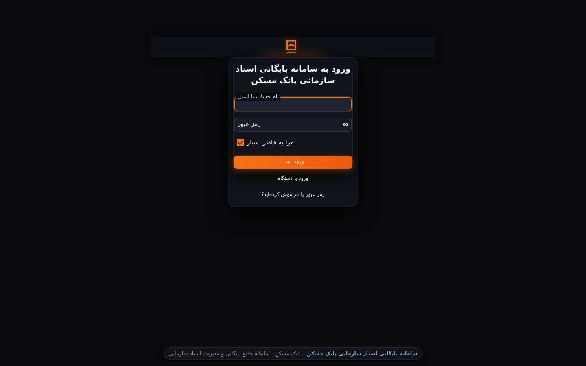
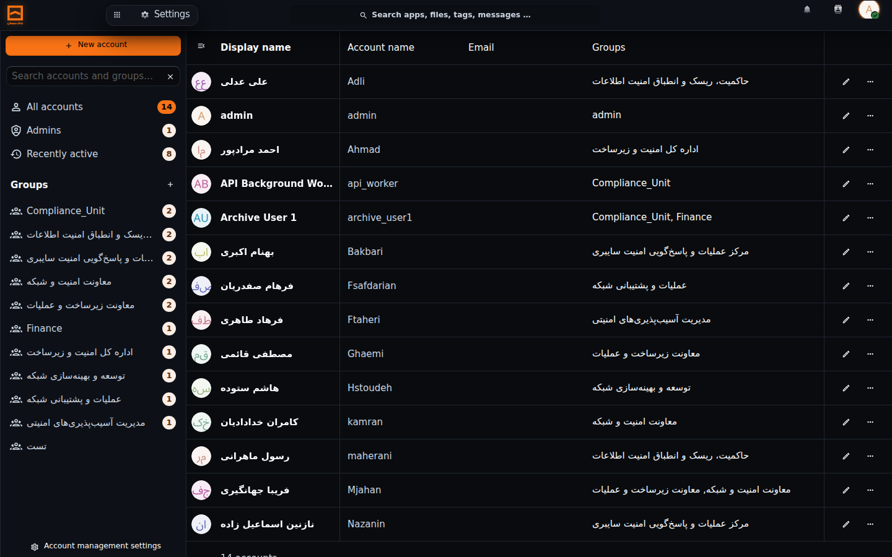
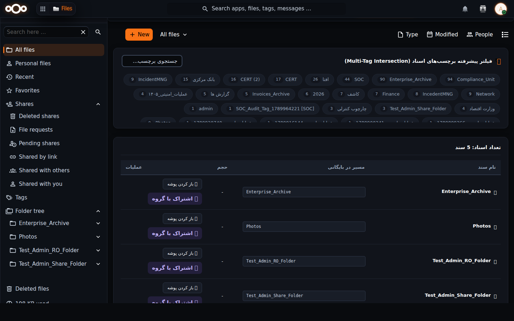
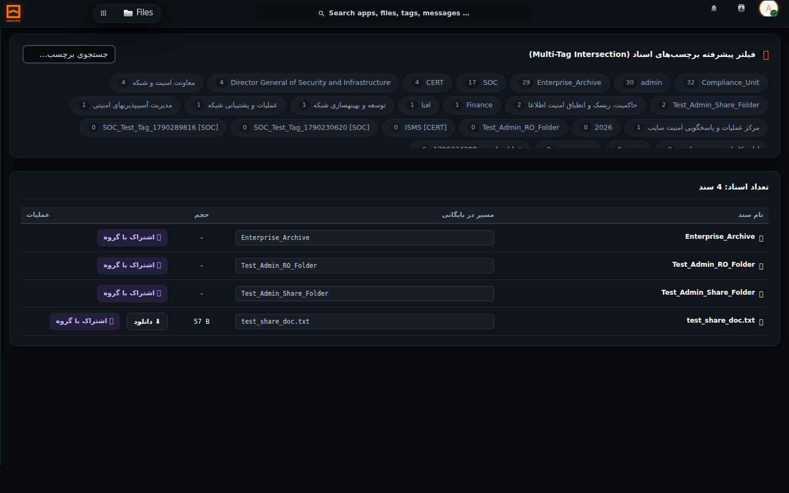
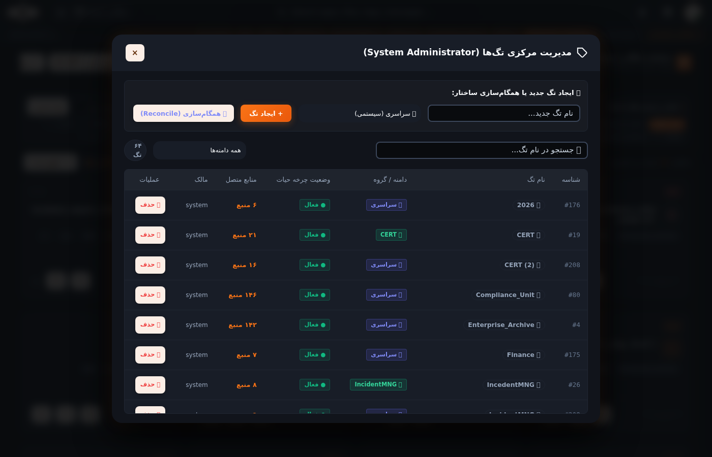
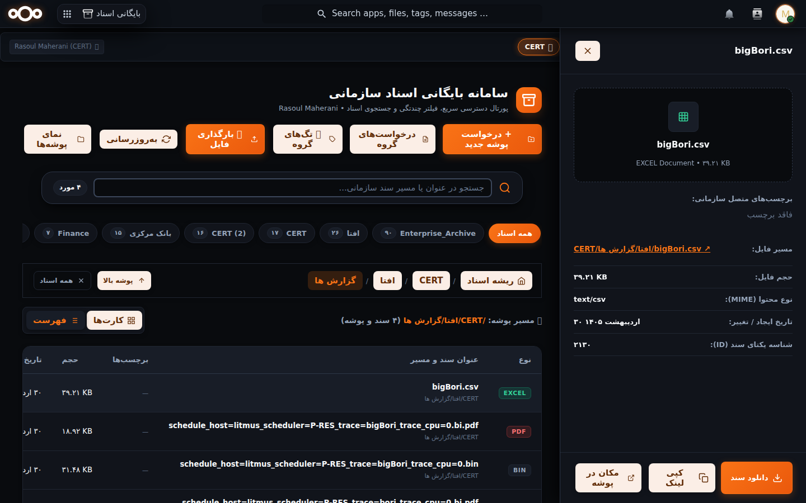
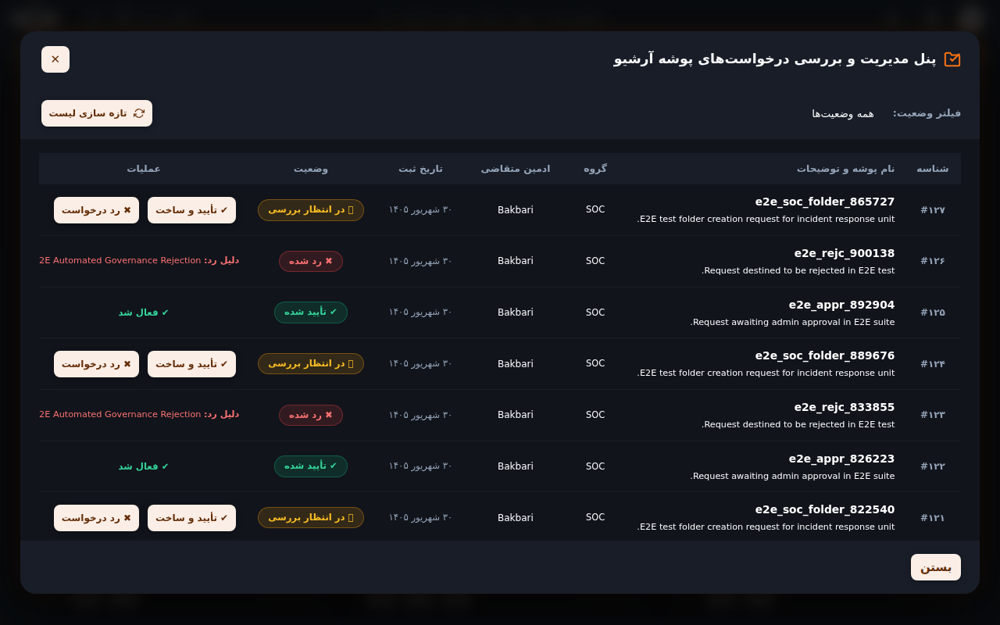
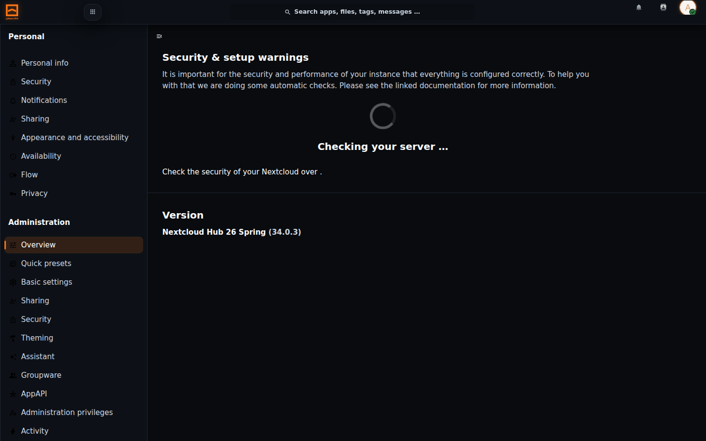
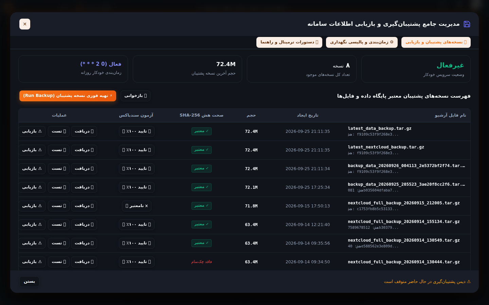
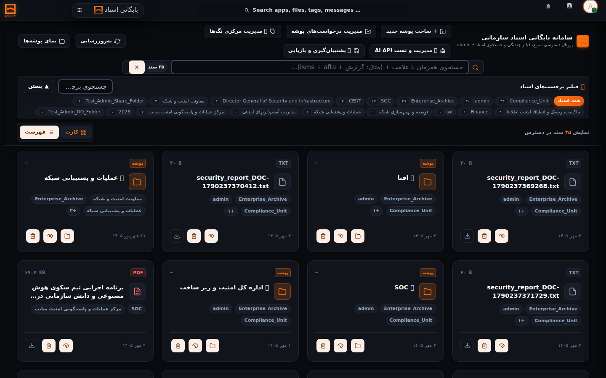

# راهنمای جامع کاربر ادمین سامانه آرشیو و مستندات سازمانی
## Enterprise Archive System — System Administrator User Guide

---

| مشخصه سند | مقدار |
|---|---|
| **عنوان سند** | راهنمای جامع کاربر ادمین سامانه آرشیو و مستندات سازمانی |
| **نام سامانه** | سامانه بایگانی اسناد سازمانی (Enterprise Archive System) |
| **نقش مخاطب** | مدیر ارشد سامانه (System Administrator / Admin) |
| **نگارش سامانه** | v2.9.0 |
| **نگارش راهنما** | v1.0.0 |
| **وضعیت سند** | سند زنده و عملیاتی (Living Document) |
| **تاریخ تدوین / آخرین بازبینی** | ۴ مهر ۱۴۰۵ (2026-09-26) |

---

> [!IMPORTANT]
> **بیانیه سند زنده (Living Documentation Policy):**  
> این راهنما مرجع رسمی و عملیاتی کاربران دارای نقش «ادمین سامانه» است. بر اساس استاندارد حاکمیت مستندات پروژه، **با اعمال هرگونه تغییر در منوها، دکمه‌ها، فرآیندها، سطوح دسترسی یا صفحات سامانه، این راهنما باید همگام و بلافاصله به‌روزرسانی شود.** نسخه حاضر کاملاً منطبق با نگارش عملیاتی v2.9.0 سامانه است و تمامی تصاویر و مراحل درج‌شده متعلق به همین محیط هستند.

---

## فهرست مطالب
1. [معرفی سامانه و نقش ادمین](#۱-معرفی-سامانه-و-نقش-ادمین)
2. [آشنایی با محیط سامانه و اجزای رابط کاربری](#۲-آشنایی-با-محیط-سامانه-و-اجزای-رابط-کاربری)
3. [ورود و خروج از سامانه](#۳-ورود-و-خروج-از-سامانه)
4. [مدیریت کاربران و حساب‌های کاربری](#۴-مدیریت-کاربران-و-حسابهای-کاربری)
5. [مدیریت گروه‌ها و مدیران گروه (Subadmin)](#۵-مدیریت-گروهها-و-مدیران-گروه-subadmin)
6. [مدیریت ساختار آرشیو و پوشه‌ها](#۶-مدیریت-ساختار-آرشیو-و-پوشهها)
7. [مدیریت دسترسی‌ها، مجوزها و اشتراک‌گذاری](#۷-مدیریت-دسترسیها-مجوزها-و-اشتراکگذاری)
8. [مدیریت متمرکز برچسب‌ها (Central Tag Management)](#۸-مدیریت-متمرکز-برچسبها-central-tag-management)
9. [مدیریت فراداده اسناد (Document Metadata)](#۹-مدیریت-فراداده-اسناد-document-metadata)
10. [مدیریت فرآیندها و کارتابل تایید درخواست‌ها](#۱۰-مدیریت-فرآیندها-و-کارتابل-تایید-درخواستها)
11. [گزارش‌ها، سوابق و ممیزی نفوذناپذیر](#۱۱-گزارشها-سوابق-و-ممیزی-نفوذناپذیر)
12. [مدیریت تنظیمات، پوسته و هویت بصری سامانه](#۱۲-مدیریت-تنظیمات-پوسته-و-هویت-بصری-سامانه)
13. [مدیریت جامع پشتیبان‌گیری و بازیابی اطلاعات](#۱۳-مدیریت-جامع-پشتیبانگیری-و-بازیابی-اطلاعات)
14. [استقرار و بازیابی سامانه در شرایط بحران (Runbook)](#۱۴-استقرار-و-بازیابی-سامانه-در-شرایط-بحران-runbook)
15. [عملیات مهم و سناریوهای متداول گام‌به‌گام](#۱۵-عملیات-مهم-و-سناریوهای-متداول-گامبهگام)
16. [خطاها، پیام‌های هشدار و راهکارهای رفع مشکل](#۱۶-خطاها-پیامهای-هشدار-و-راهکارهای-رفع-مشکل)
17. [نکات مهم امنیتی و انضباط اداری](#۱۷-نکات-مهم-امنیتی-و-انضباط-اداری)
18. [مرجع سریع عملیات پرکاربرد ادمین (Cheat Sheet)](#۱۸-مرجع-سریع-عملیات-پرکاربرد-ادمین-cheat-sheet)
19. [تاریخچه به‌روزرسانی راهنما](#۱۹-تاریخچه-بهروزرسانی-راهنما)

---

## ۱. معرفی سامانه و نقش ادمین

سامانه بایگانی اسناد سازمانی (Enterprise Archive System)، بستری امن، یکپارچه و با کارایی بالا برای ذخیره‌سازی، طبقه‌بندی هوشمند، مدیریت فراداده‌ها، اعمال سیاست‌های سخت‌گیرانه دسترسی و نگهداری بلندمدت اسناد رسمی سازمان است.

### مرزبندی نقش «ادمین سامانه» در برابر سایر نقش‌ها:
سامانه دارای مرزبندی سه‌سطحی صریح در مجوزهاست:
1. **مدیر ارشد سامانه (System Administrator - Admin):** بالاترین سطح اختیارات را در سامانه دارد. تنها این نقش می‌تواند حساب‌های کاربری را ایجاد یا حذف کند، پوشه‌های ریشه بایگانی را تعریف نماید، برچسب‌های سراسری بسازد، درخواست‌های ایجاد پوشه را در کارتابل تایید یا رد کند، نسخه پشتیبان تهیه یا بازیابی نماید، و تنظیمات کلان زیرساخت را تغییر دهد.
2. **مدیر گروه (Group Administrator / Subadmin):** اختیارات محدودی صرفاً در حوزه واحد یا اداره مربوط به خود (نظیر SOC، CERT یا امور مالی) دارد. می‌تواند اعضای گروه خود را مدیریت کند یا درخواست ایجاد پوشه به ادمین سامانه ارسال نماید؛ اما **حق حذف کاربر، حذف تگ‌های سیستمی، حذف پوشه ریشه یا دسترسی به کنسول پشتیبان‌گیری را ندارد.**
3. **کاربر عادی (Regular User):** تنها قادر به بارگذاری سند با فراداده الزامی در پوشه‌های مجاز، جستجو و مشاهده اسناد تاییدشده در محدوده دسترسی خود است و سهمیه فضای شخصی او صفر (`0 B`) تعیین شده است.

---

## ۲. آشنایی با محیط سامانه و اجزای رابط کاربری

پس از ورود به سامانه، صفحه اصلی پورتال آرشیو سازمانی با طراحی مدرن مشکی مات (Obsidian Dark Theme)، فونت یکپارچه وزیرمتن (Vazirmatn) و چیدمان کاملاً راست‌به‌چپ (RTL) نمایش داده می‌شود.


*شکل ۲ – نمای کلی پورتال بایگانی اسناد سازمانی و میز کار متمرکز مدیر ارشد*

### اجزای اصلی صفحه پورتال (مطابق شکل ۲):
1. **نوار ناوبری بالا (Top Header Bar):**
   - لوگوی سازمان و عنوان رسمی «سامانه بایگانی اسناد سازمانی».
   - آیکون وضعیت اتصال و منوی پروفایل کاربر ادمین در گوشه چپ.
2. **جعبه ابزار مدیریتی ادمین (Admin Action Bar):**
   دکمه‌های ویژه ادمین که منحصراً برای نقش `admin` نمایش داده می‌شوند:
   - **`[ 📁 ایجاد پوشه سازمانی ]`:** ساخت مستقیم پوشه در ساختار بایگانی.
   - **`[ 🏷️ مدیریت برچسب‌ها ]`:** باز کردن کنسول متمرکز مدیریت تگ‌های سیستمی و گروهی.
   - **`[ 📥 کارتابل درخواست‌ها ]`:** مشاهده و تعیین تکلیف درخواست‌های ساخت پوشه ارسال‌شده توسط مدیران گروه‌ها.
   - **`[ 🛡️ امنیت و هوش مصنوعی ]`:** ابزارهای ممیزی دسترسی و ارزیابی توکن‌های مجاز.
   - **`[ 💾 پشتیبان‌گیری و بازیابی ]`:** ورود به کنسول جامع پشتیبان‌گیری، زمان‌بندی و بازیابی در شرایط بحران.
3. **نوار پالایش و برچسب‌ها (Faceted Multi-Tag Bar):**
   - نمایش نشان‌های (Chips) برچسب‌های موجود همراه با شمارنده اسناد منتسب به هر برچسب.
   - فیلد جستجوی سریع در میان برچسب‌ها.
   - دکمه‌های انتخاب نما: نمای جدولی (Table View) و نمای کارتی (Grid/Card View).
4. **جدول اسناد بایگانی (Archive Document Table):**
   - جدول ۴ ستونه استاندارد شامل: **نام سند**، **مسیر پوشه**، **برچسب‌های منتسب**، و **تاریخ ثبت/حجم**.
   - امکان تغییر عرض ستون‌ها با ماوس توسط کاربر و ذخیره ابعاد در مرورگر.
   - کلیک بر روی هر سطر، دراور جانبی مشخصات و متادیتا را باز می‌کند.

---

## ۳. ورود و خروج از سامانه

### ۳.۱. مراحل ورود به سامانه
1. مرورگر وب خود (Chrome، Firefox یا Edge) را باز کرده و آدرس پورتال سامانه (به عنوان مثال `http://archive.corp.internal` یا آدرس IP سرور) را وارد نمایید.
2. صفحه اختصاصی ورود به سامانه نمایش داده می‌شود.


*شکل ۱ – صفحه ورود امن به سامانه با نشان سازمان*

3. مطابق **شکل ۱**:
   - در فیلد **نام کاربری یا ایمیل**، عبارت `admin` (یا نام کاربری اختصاصی ادمین خود) را وارد کنید.
   - در فیلد **رمز عبور**، کلمه عبور قوی ادمین را وارد نمایید.
4. بر روی دکمه **ورود** کلیک کرده یا کلید `Enter` را فشار دهید.
5. **نتیجه مورد انتظار:** احراز هویت با موفقیت انجام شده و شما مستقیماً به صفحه پورتال آرشیو سازمانی (شکل ۲) هدایت می‌شوید.

### ۳.۲. مراحل خروج امن از سامانه
1. در نوار بالای صفحه، بر روی آیکون تصویر پروفایل ادمین (دایره واقع در گوشه بالا سمت چپ) کلیک کنید.
2. از منوی بازشده، گزینه **خروج** (Log out) را انتخاب نمایید.
3. **نتیجه مورد انتظار:** سشن کاری شما خاتمه یافته، کوکی‌های امنیتی پاکسازی شده و به صفحه ورود (شکل ۱) بازگردانده می‌شوید.

---

## ۴. مدیریت کاربران و حساب‌های کاربری

مدیریت چرخه حیات کاربران (ایجاد، تخصیص به واحدها، تعیین سهمیه دیسک، و غیرفعال‌سازی) منحصراً در اختیار ادمین سامانه است. بر اساس الزامات امنیتی، **هیچ کاربری به جز System Administrator مجاز به حذف حساب کاربری نیست.**

### ۴.۱. مسیر دسترسی به صفحه مدیریت کاربران
- از طریق کلیک روی آیکون پروفایل در گوشه بالا سمت چپ ➔ انتخاب گزینه **کاربران** (Users).
- یا ورود مستقیم به آدرس: `/index.php/settings/users`.


*شکل ۳ – صفحه مدیریت کاربران، گروه‌ها و سهمیه‌های دیسک*

### ۴.۲. مراحل ایجاد کاربر جدید سازمانی
مطابق **شکل ۳**، مراحل زیر را طی نمایید:
1. در بالای جدول کاربران، بر روی فرم **کاربر جدید** (New user) کلیک کنید.
2. **شناسه کاربری (Username):** یک شناسه یکتا به زبان انگلیسی (مثلاً `m.rezaei`) وارد کنید.
3. **نام نمایشی (Display Name):** نام و نام خانوادگی کامل کاربر به زبان فارسی (مثلاً `محمد رضایی`) را تایپ کنید.
4. **رمز عبور (Password):** یک کلمه عبور موقت استاندارد تعیین نمایید یا به کاربر اجازه دهید از طریق ایمیل رمز خود را تنظیم کند.
5. **ایمیل (Email):** آدرس پست الکترونیکی سازمانی کاربر را درج نمایید.
6. **گروه‌ها (Groups):** گروه یا واحدهای سازمانی کاربر (مانند `SOC` یا `Compliance_Unit`) را تیک بزنید.
7. **سهمیه فضا (Quota):** بر اساس خط‌مشی سامانه، سهمیه فضای شخصی کاربران عادی باید روی **`0 B`** (صفر بایت) تنظیم شود تا کاربران نتوانند خارج از پوشه بایگانی سازمانی فایل شخصی بارگذاری کنند.
8. بر روی آیکون تیک سبز یا دکمه **ذخیره** کلیک کنید.
9. **نتیجه مورد انتظار:** حساب کاربر بلافاصله ایجاد شده و در جدول کاربران ظاهر می‌گردد.

### ۴.۳. غیرفعال‌سازی و تعلیق کاربر
1. در جدول کاربران (شکل ۳)، سطر کاربر مورد نظر را پیدا کنید.
2. بر روی منوی سه نقطه (`...`) در انتهای سطر کلیک کنید.
3. گزینه **غیرفعال‌سازی** (Disable) را انتخاب نمایید.
4. **نتیجه مورد انتظار:** دسترسی ورود کاربر به سامانه فوراً مسدود می‌شود، بدون آنکه اسناد بارگذاری‌شده یا سوابق ممیزی او حذف گردد.

---

## ۵. مدیریت گروه‌ها و مدیران گروه (Subadmin)

گروه‌ها در سامانه نمایانگر دپارتمان‌ها، ادارات و ساختار چارت سازمانی هستند.


*شکل ۴ – ساختار گروه‌های سازمانی و تخصیص نقش زیرمدیر (Subadmin)*

### ۵.۱. ایجاد گروه سازمانی جدید
1. در منوی سمت راست صفحه مدیریت کاربران (شکل ۴)، بر روی گزینه **افزودن گروه** (Add group) کلیک کنید.
2. نام گروه سازمانی را وارد نمایید (مانند `SOC` یا `امور مالی`).
3. کلید `Enter` را فشار دهید.
4. **نتیجه مورد انتظار:** گروه ساخته شده و در لیست گروه‌ها جهت عضویت کاربران در دسترس قرار می‌گیرد.

### ۵.۲. تعیین مدیر گروه (Group Admin / Subadmin)
1. در ستون **مدیر گروه برای** (Group Admin for)، نام کاربری را که می‌خواهید مسئولیت واحد را داشته باشد انتخاب کنید.
2. گروه مورد نظر را به عنوان محدوده نظارت او تیک بزنید.
3. **نتیجه مورد انتظار:** کاربر منتخب از این پس می‌تواند اعضای گروه خود را مدیریت کرده و برای گروه خود درخواست پوشه ثبت کند.

---

## ۶. مدیریت ساختار آرشیو و پوشه‌ها

تمامی اسناد سازمان درون یک دایرکتوری ریشه و یکپارچه به نام **`/Enterprise_Archive`** نگهداری می‌شوند. کاربران عادی به هیچ وجه اجازه ساخت پوشه در این فضا را ندارند و پوشه‌ها یا مستقیماً توسط ادمین ساخته می‌شوند یا از طریق تایید درخواست‌های کارتابل ایجاد می‌گردند.


*شکل ۵ – نمای پوشه‌های سازمانی و تگ‌گذاری خودکار دایرکتوری‌ها*

### ۶.۱. ایجاد پوشه سازمانی مستقیم توسط ادمین
1. از صفحه پورتال آرشیو (شکل ۲)، بر روی دکمه **`[ 📁 ایجاد پوشه سازمانی ]`** در نوار ابزار کلیک کنید.
2. در پنجره بازشده:
   - **نام پوشه:** عنوان پوشه سازمانی (مثلاً `مصوبات هیئت مدیره ۱۴۰۵`) را وارد کنید.
   - **مسیر والد:** مسیر مورد نظر را انتخاب نمایید (پیش‌فرض: `/Enterprise_Archive`).
   - **گروه مرتبط:** در صورت نیاز، گروه مالک پوشه را تعیین کنید.
3. بر روی دکمه **تایید و ایجاد پوشه** کلیک نمایید.
4. **نتیجه مورد انتظار:** پوشه بلافاصله ساخته شده، تگ سیستمی هم‌نام با پوشه تولید و به صورت خودکار به آن الصاق می‌شود و در جدول اسناد و ساختار درختی در دسترس قرار می‌گیرد.

---

## ۷. مدیریت دسترسی‌ها، مجوزها و اشتراک‌گذاری

سامانه از یک موتور رزولور متمرکز مجوزها (Central Permission Resolver) استفاده می‌کند که سطوح دسترسی را با مدل Fail-Closed (مسدودسازی پیش‌فرض) کنترل می‌نماید.

### ۷.۱. سطوح مجوزهای سامانه:
- **مجوز خواندن (READ = 1):** امکان مشاهده و دانلود سند.
- **مجوز به‌روزرسانی (UPDATE = 2):** ویرایش متادیتا یا بارگذاری نسخه جدید سند.
- **مجوز ایجاد (CREATE = 4):** بارگذاری سند جدید در داخل پوشه.
- **مجوز حذف (DELETE = 8):** حذف دائمی سند (منحصراً در اختیار ادمین کل).
- **مجوز اشتراک (SHARE = 16):** اشتراک‌گذاری سند با سایر واحدها.

### ۷.۲. نحوه اشتراک‌گذاری یک پوشه با یک گروه سازمانی
1. در پورتال آرشیو یا بخش فایل‌ها، بر روی سند یا پوشه مورد نظر کلیک کنید.
2. در دراور بازشده سمت چپ، گزینه **اشتراک‌گذاری** (Share) را انتخاب نمایید.
3. نام گروه هدف (مثلاً `Compliance_Unit`) را تایپ و انتخاب کنید.
4. سطح مجوزهای مجاز (خواندن / نوشتن) را تعیین فرمایید.
5. **نتیجه مورد انتظار:** کلیه اعضای گروه هدف بلافاصله به محتوای به اشتراک گذاشته‌شده دسترسی پیدا می‌کنند، در حالی که مجوز حذف همچنان برای آن‌ها غیرفعال است.

---

## ۸. مدیریت متمرکز برچسب‌ها (Central Tag Management)

برچسب‌ها ستون فقرات رده‌بندی، جستجو و تفکیک دسترسی در سامانه آرشیو هستند. ادمین سامانه اختیارات کامل و انحصاری برای مدیریت تگ‌های سراسری و نظارت بر تگ‌های گروهی دارد.


*شکل ۶ – کنسول متمرکز مدیریت برچسب‌ها ویژه مدیر ارشد سامانه*

### ۸.۱. ورود به کنسول مدیریت متمرکز تگ‌ها
- از نوار ابزار پورتال آرشیو (شکل ۲)، بر روی دکمه **`[ 🏷️ مدیریت برچسب‌ها ]`** کلیک کنید.
- پنجره متمرکز مدیریت برچسب‌ها مطابق **شکل ۶** باز می‌شود.

### ۸.۲. ایجاد برچسب سراسری جدید
1. در کنسول مدیریت برچسب‌ها (شکل ۶):
   - در فیلد **نام برچسب جدید**، عنوان تگ (مثلاً `محرمانه` یا `صورتجلسه`) را تایپ کنید.
   - از منوی **حوزه برچسب**، گزینه **سراسری (Global)** را انتخاب نمایید.
2. بر روی دکمه نارنجی **افزودن برچسب** کلیک کنید.
3. **نتیجه مورد انتظار:** برچسب با موفقیت ثبت شده و در نوار پالایش تمام کاربران مجاز نمایش داده می‌شود.

### ۸.۳. حذف ایمن برچسب (حفاظت در برابر ناهماهنگی)
1. در جدول تگ‌های کنسول (شکل ۶)، برچسب مورد نظر را پیدا کنید.
2. ستون **تعداد اسناد** را بررسی کنید.
3. اگر برچسب بر روی اسنادی الصاق شده باشد، سامانه بر اساس خط‌مشی حاکمیت داده اجازه حذف به شما نداده و خطای تضاد (Conflict 409) صادر می‌کند.
4. در صورت صفر بودن تعداد اسناد منتسب، بر روی آیکون سطل زباله قرمز کلیک کنید تا تگ بدون خطر حذف گردد.

### ۸.۴. همگام‌سازی و ترمیم تگ‌ها (Tag Reconciliation)
- در پایین کنسول تگ‌ها (شکل ۶)، دکمه **`[ 🔄 همگام‌سازی ساختار برچسب‌ها با پوشه‌ها ]`** قرار دارد.
- با کلیک بر روی این دکمه، سامانه به صورت خودکار تگ‌های معلق را پاکسازی کرده و برچسب‌های متناظر با پوشه‌های بایگانی را مجدداً تراز می‌سازد.

---

## ۹. مدیریت فراداده اسناد (Document Metadata)

برای تضمین استاندارد اسناد، بارگذاری هرگونه فایل در سامانه مشروط به ثبت فراداده‌های الزامی (Fail-Closed Document Metadata) است.


*شکل ۸ – دراور مشخصات کامل سند، متادیتای الزامی و ناوبری عمیق*

### ۹.۱. فیلدهای متادیتای الزامی اسناد:
- **موضوع سند (Subject):** خلاصه رسمی موضوع نامه یا سند (الزامی).
- **شماره سند (Document Number):** شماره اندیکاتور یا شناسه ثبتی سند.
- **تاریخ سند (Document Date):** تاریخ صدور نامه به تقویم خورشیدی.
- **واحد صادرکننده (Issuer Department):** اداره یا بخشی که سند را صادر کرده است.
- **سطح طبقه‌بندی (Confidentiality):** عادی، محرمانه، خیلی محرمانه، یا سری.
- **شرح / پیوست:** توضیحات تکمیلی پیرامون محتوای مدرک.

### ۹.۲. مشاهده و ویرایش فراداده توسط ادمین
1. در جدول اسناد پورتال (شکل ۲)، بر روی سطر هر سندی کلیک کنید.
2. دراور جانبی سند مطابق **شکل ۸** از سمت راست/چپ باز می‌شود.
3. در این دراور، تمامی فیلدهای متادیتا، برچسب‌های متصل، حجم فایل و تاریخ ثبت نمایش داده شده است.
4. ادمین می‌تواند فیلدها را بازبینی کرده یا با استفاده از دکمه **`[ 📍 مکان‌یابی در پوشه ]`** مستقیماً به دایرکتوری فیزیکی سند در ساختار درختی هدایت شود.

---

## ۱۰. مدیریت فرآیندها و کارتابل تایید درخواست‌ها

زمانی که مدیران گروه‌ها (Subadmins) نیاز به ایجاد پوشه جدید برای واحد خود دارند، نمی‌توانند مستقیماً پوشه بسازند؛ بلکه درخواستی ثبت می‌کنند که وارد **کارتابل ادمین کل** می‌شود.


*شکل ۹ – کارتابل متمرکز بررسی، تایید و رد درخواست‌های ساخت پوشه*

### ۱۰.۱. بررسی درخواست‌های واصله در کارتابل
1. از نوار ابزار پورتال، بر روی دکمه **`[ 📥 کارتابل درخواست‌ها ]`** کلیک کنید.
2. پنجره کارتابل مطابق **شکل ۹** نمایش داده می‌شود.
3. در این جدول:
   - **نام پوشه درخواستی**
   - **واحد متقاضی (گروه)**
   - **کاربر ثبت‌کننده**
   - **مسیر والد پیشنهادی**
   - **علت و شرح نیاز**
   - **وضعیت جاری (در انتظار / تایید شده / رد شده)** قابل مشاهده است.

### ۱۰.۲. تایید یا رد درخواست ساخت پوشه
1. برای تایید: بر روی دکمه سبز **تایید و ایجاد پوشه (Approve)** در سطر مربوطه کلیک کنید.
   - سامانه بلافاصله پوشه را در مسیر مشخص‌شده می‌سازد، تگ سازمانی را اعمال کرده و مجوزهای دسترسی واحد را به آن متصل می‌نماید.
2. برای رد: بر روی دکمه قرمز **رد درخواست (Reject)** کلیک کنید.
   - فرمی جهت درج دلیل رد درخواست باز می‌شود؛ پس از وارد کردن علت، متقاضی از نتیجه مطلع می‌گردد.

---

## ۱۱. گزارش‌ها، سوابق و ممیزی نفوذناپذیر

سامانه دارای لایه ممیزی پایدار و نفوذناپذیر (Reliable Audit Subsystem) است که تمامی تصمیمات امنیتی، بررسی‌های دسترسی، تلاش‌های غیرمجاز و رویدادهای فایل‌ها را ثبت می‌کند.

### ۱۱.۱. موارد ثبت‌شده در ممیزی ادمین:
- شناسه کاربری و آدرس IP متقاضی.
- نوع عمل درخواستی (دانلود، بارگذاری، حذف، ویرایش، انتساب تگ).
- تصمیم امنیتی سامانه (`ALLOW` یا `DENY`).
- دلیل تصمیم و سطح مجوز اعمال‌شده.
- زمان دقیق رخداد به همراه شناسه یکتای پیگیری.

### ۱۱.۲. پایش و بررسی لاگ‌های امنیتی
- ادمین می‌تواند از طریق دکمه **`[ 🛡️ امنیت و هوش مصنوعی ]`** وضعیت ممیزی، تعداد رکوردهای ثبت‌شده در جدول `oc_archive_permission_audit` و صف اضطراری (DLQ) را بررسی نماید.

---

## ۱۲. مدیریت تنظیمات، پوسته و هویت بصری سامانه


*شکل ۱۱ – داشبورد تنظیمات زیرساخت، سلامت سیستم و مشخصات سرور*

### ۱۲.۱. مسیر دسترسی به تنظیمات سرور
- کلیک روی آیکون پروفایل ادمین ➔ انتخاب **تنظیمات مدیریت** (Administration settings).
- یا ورود به آدرس: `/index.php/settings/admin/overview`.

### ۱۲.۲. پیکربندی‌های مجاز توسط ادمین در وب:
1. **بررسی سلامت سیستم (Overview):** پایش وضعیت به‌روز بودن نسخه‌ها، کش حافظه و اتصالات پایگاه داده (شکل ۱۱).
2. **شخصی‌سازی برندینگ (Theming):** مشاهده نام رسمی سازمان، شعار و رنگ پایه تیره ابسیدین (`#11141b`).
3. **گزارش رویدادها (Activity / Audit):** مرور آخرین لاگ‌های عمومی سامانه.

---

## ۱۳. مدیریت جامع پشتیبان‌گیری و بازیابی اطلاعات

به عنوان یکی از حیاتی‌ترین امکانات مدیریتی سامانه (نیازمندی ۲۹)، مدیر ارشد سیستم به کنسول دوگانه گرافیکی و خط فرمانی برای تهیه و بازیابی پشتیبان مجهز است.


*شکل ۱۰ – کنسول متمرکز وب برای پشتیبان‌گیری، زمان‌بندی و بازیابی در شرایط بحران*

### ۱۳.۱. ورود به کنسول پشتیبان‌گیری و بازیابی
- در پورتال آرشیو (شکل ۲)، بر روی دکمه **`[ 💾 پشتیبان‌گیری و بازیابی ]`** کلیک کنید.
- پنجره جامع پشتیبان‌گیری مطابق **شکل ۱۰** باز می‌شود.

### ۱۳.۲. تهیه نسخه پشتیبان فوری از طریق پنل وب
1. در کنسول پشتیبان‌گیری (شکل ۱۰)، بر روی دکمه سبز **تهیه نسخه پشتیبان فوری** کلیک کنید.
2. نوار وضعیت پیشرفت در بالای کنسول فعال شده و مراحل را نشان می‌دهد:
   - *آماده‌سازی ➔ دامپ دیتابیس PostgreSQL ➔ فشرده‌سازی فایل‌ها و کانفیگ ➔ محاسبه هش SHA-256*.
3. پس از پایان، نسخه جدید به جدول کاتالوگ پشتیبان‌ها اضافه شده و نشان `SUCCESS` دریافت می‌کند.

### ۱۳.۳. آزمون بازیابی در محیط ایزوله سندباکس (Test Restore)
برای اطمینان از سلامت فایل پشتیبان **بدون آنکه سیستم متوقف شود یا داده‌های زنده تغییر کنند**:
1. در جدول کاتالوگ پشتیبان‌ها، سطر فایل مورد نظر را پیدا کنید.
2. بر روی دکمه **تست** کلیک نمایید.
3. سامانه فایل را در یک شمای موقت پایگاه داده و دایرکتوری آزمایشی استخراج کرده و تمامیت آن را ارزیابی می‌کند.
4. پس از اتمام، مودال **گزارش جامع تست سندباکس** شامل تعداد کاربران سالم، تعداد گروه‌ها، تعداد تگ‌ها و زمان اجرای آزمون به شما نشان داده می‌شود و سیستم نشان `PASS` سبز ثبت می‌کند.

### ۱۳.۴. تنظیم زمان‌بندی خودکار و سیاست نگهداری (Retention)
1. در بخش پایینی فرم تنظیمات کنسول (شکل ۱۰):
   - تیک **فعال‌سازی پشتیبان‌گیری خودکار** را بزنید.
   - **عبارت زمان‌بندی (Cron):** فرمت زمان اجرای خودکار (مثلاً `0 2 * * *` برای ساعت ۲ بامداد) را تعیین کنید.
   - **سقف نگهداری نسخه‌ها (Retention Count):** حداکثر تعداد فایل‌های نگهداری‌شده (مثلاً `7` نسخه) را مشخص نمایید.
2. بر روی دکمه **ذخیره تنظیمات زمان‌بندی** کلیک کنید.

### ۱۳.۵. بازیابی اطلاعات در شرایط بحران از پنل وب (Disaster Recovery)
> [!CAUTION]
> **هشدار بحران:**  
> عملیات بازیابی (Restore)، کلیه اطلاعات، دیتابیس و اسناد جاری سامانه را بازنویسی کرده و به زمان تهیه نسخه پشتیبان بازمی‌گرداند. این اقدام تنها در شرایط خرابی حاد یا تخریب داده‌ها مجاز است.

1. در جدول بکاپ‌ها، نسخه پشتیبان سالم را انتخاب و بر روی دکمه قرمز **بازیابی** کلیک کنید.
2. پنجره هشدار بحران باز می‌شود.
3. عبارت تاییدیه امنیتی **`RESTORE-CONFIRM`** را در کادر متنی تایپ نمایید.
4. بر روی دکمه **شروع بازیابی اطلاعات** کلیک کنید.
5. سامانه وارد حالت تعمیرات شده، دیتابیس و فایل‌ها بازگردانی شده و پس از اتمام خودکار، شما به صفحه لاگین هدایت می‌شوید.

---

## ۱۴. استقرار و بازیابی سامانه در شرایط بحران (Runbook)

اگر کل سرور، سیستم‌عامل، یا ماشین مجازی از بین برود و نیاز به استقرار سامانه روی یک سرور خام جدید باشد:
- از راهنمای رسمی [DEPLOYMENT_RUNBOOK.md](DEPLOYMENT_RUNBOOK.md) که به عنوان سند زنده برای کارشناسان زیرساخت تدوین شده است استفاده نمایید.
- دو سناریوی استاندارد در آن راهنما مستند شده است:
  - **سناریوی الف (Rebuild + Restore):** اجرای اسکریپت `./deploy/restore_db.sh` برای بازگرداندن سیستم از روی فایل پشتیبان در سرور جدید.
  - **سناریوی ب (Fresh Deployment):** اجرای اسکریپت `./deploy/deploy_from_scratch.sh` برای استقرار کاملاً خودکار و خام سامانه در یک سازمان نو.

---

## ۱۵. عملیات مهم و سناریوهای متداول گام‌به‌گام

### سناریوی ۱: تعریف یک اداره جدید در سامانه از صفر تا صد
1. **ایجاد گروه:** به صفحه کاربران (شکل ۳) رفته و گروه جدید مثلاً `حسابرسی داخلی` را بسازید.
2. **ایجاد کاربر و تخصیص نقش:** کاربر رئیس اداره را ایجاد کرده و او را به عنوان `Subadmin` گروه تعیین نمایید.
3. **ایجاد پوشه بایگانی:** در پورتال آرشیو (شکل ۲)، با زدن دکمه `ایجاد پوشه سازمانی`، پوشه `/Enterprise_Archive/حسابرسی داخلی` را بسازید.
4. **اشتراک‌گذاری با دسترسی کامل:** پوشه را با گروه `حسابرسی داخلی` با دسترسی خواندن و نوشتن به اشتراک بگذارید.
5. **برچسب‌گذاری:** تگ سازمانی متناظر با واحد به طور خودکار به پوشه الصاق شده و کاربران آن اداره می‌توانند اسناد خود را بارگذاری کنند.

### سناریوی ۲: جستجوی پیشرفته چندبرچسبی در اسناد


*شکل ۷ – پالایش و جستجوی همپوشانی چندبرچسبی با منطق اشتراک ریاضی (AND)*

1. در نوار بالای پورتال (شکل ۷)، روی برچسب اول (مثلاً `SOC`) کلیک کنید.
2. جدول اسناد فیلتر شده و تنها اسناد حاوی تگ SOC را نشان می‌دهد.
3. روی برچسب دوم (مثلاً `گزارش حوادث`) کلیک کنید.
4. **نتیجه:** سامانه از منطق اشتراک منطقی (`AND`) استفاده کرده و منحصراً اسنادی را نمایش می‌دهد که **هر دو برچسب** را دارا باشند.

---

## ۱۶. خطاها، پیام‌های هشدار و راهکارهای رفع مشکل

| پیام خطای مشاهده‌شده | مفهوم و علت ریشه‌ای | اقدام مجاز و فوری ادمین سامانه |
|---|---|---|
| **خطای ۴۰۳ (عدم دسترسی / Forbidden)** | کاربر غیرادمین تلاش کرده به کنسول بکاپ یا ساخت پوشه دسترسی یابد. | طبیعی است؛ سامانه جلوی نقض دسترسی را گرفته است. نیازی به اقدام نیست. |
| **خطای ۴۰۹ (تضاد در حذف برچسب)** | ادمین قصد حذف تگی را دارد که هم‌اکنون به چندین سند الصاق شده است. | ابتدا برچسب را از اسناد منتسب لغو کنید یا از دکمه «همگام‌سازی برچسب‌ها» استفاده نمایید. |
| **خطای ۴۲۲ (متادیتای ناقص در بارگذاری)** | کاربر تلاش کرده فایلی را بدون تکمیل فیلد «موضوع سند» آپلود کند. | به کاربر اطلاع دهید که تکمیل عنوان و متادیتای الزامی قبل از آپلود اجباری است. |
| **خطای ۵۰۳ (سامانه در حالت تعمیرات)** | عملیات بازیابی بکاپ در حال اجراست یا پرچم تعمیرات روشن مانده است. | تا اتمام بازیابی صبور باشید؛ یا در خط فرمان دستور `occ maintenance:mode --off` را اجرا کنید. |
| **قفل موقت فایل‌ها (File is locked)** | قطع ناگهانی برق سرور در زمان نگارش فایل باعث قفل جدول شده است. | در کنسول خط فرمان دستور ریست قفل‌ها (`TRUNCATE oc_file_locks;`) را صادر کنید. |

---

## ۱۷. نکات مهم امنیتی و انضباط اداری

1. **حفاظت از کلمه عبور ادمین:** رمز عبور مدیر ارشد باید حداقل ۱۶ کاراکتر شامل حروف بزرگ، کوچک، اعداد و نمادها باشد و در اختیار هیچ پرسنل غیرمجازی قرار نگیرد.
2. **سهمیه فضای کاربران عادی:** همواره اطمینان حاصل کنید که سهمیه کاربران عادی روی `0 B` تنظیم شده باشد تا از پراکندگی فایل‌ها خارج از بایگانی ریشه ممانعت به عمل آید.
3. **آزمون‌های دوره‌ای سندباکس:** حداقل یک‌بار در ماه، دکمه **تست سندباکس** را در کنسول پشتیبان‌گیری اجرا کنید تا از سلامت بازگردانی دیتابیس و اسناد اطمینان حاصل فرمایید.
4. **عدم حذف کاربران:** به جای حذف حساب پرسنلی که سازمان را ترک کرده‌اند، آن‌ها را **غیرفعال (Disable)** کنید تا پیوستگی اسناد و سوابق ممیزی تاریخی حفظ شود.

---

## ۱۸. مرجع سریع عملیات پرکاربرد ادمین (Cheat Sheet)

```text
┌─────────────────────────────────────┬────────────────────────────────────────────────────────┐
│ عملیات مورد نظر                      │ مسیر دسترسی سریع در سامانه                              │
├─────────────────────────────────────┼────────────────────────────────────────────────────────┤
│ ورود به سامانه                      │ مرورگر: http://<IP_OR_DOMAIN>/index.php/login          │
│ میز کار پورتال آرشیو               │ پورتال: دکمه بایگانی در نوار بالا یا روت /apps/archive/│
│ ایجاد کاربر و گروه جدید            │ منوی کاربری ➔ کاربران (/settings/users)               │
│ ایجاد پوشه جدید در بایگانی         │ پورتال ➔ دکمه [ 📁 ایجاد پوشه سازمانی ]                 │
│ تعریف و مدیریت برچسب‌ها             │ پورتال ➔ دکمه [ 🏷️ مدیریت برچسب‌ها ]                   │
│ تعیین تکلیف درخواست‌های ساخت پوشه  │ پورتال ➔ دکمه [ 📥 کارتابل درخواست‌ها ]                 │
│ تهیه نسخه پشتیبان فوری             │ پورتال ➔ دکمه [ 💾 پشتیبان‌گیری ] ➔ دکمه سبز بکاپ      │
│ آزمون سلامت بکاپ در سندباکس         │ پورتال ➔ دکمه [ 💾 پشتیبان‌گیری ] ➔ دکمه تست در جدول   │
│ بازنشانی کش اسناد در ترمینال       │ ترمینال: docker exec -u 33 archive_app php occ files:scan│
│ بررسی سلامت کلی سیستم              │ ترمینال: ./deploy/check_health.sh                      │
└─────────────────────────────────────┴────────────────────────────────────────────────────────┘
```

---

## ۱۹. تاریخچه به‌روزرسانی راهنما (Living Document Changelog)

| نسخه راهنما | نسخه سامانه | تاریخ | شرح تغییرات و قابلیت‌های اضافه‌شده | بخش‌های اصلاح‌شده |
|---|---|---|---|---|
| **v1.0.0** | **v2.9.0** | ۱۴۰۵/۰۷/۰۴ | تدوین جامع نخستین راهنمای رسمی ادمین منطبق بر نسخه عملیاتی ۲.۹.۰ سامانه، ادغام نیازمندی‌های ۲۹ (کنسول بکاپ، بازیابی و آزمون سندباکس) و نیازمندی ۳۰ (Runbook استقرار)، درج تصاویر مستندات واقعی و طراحی استاندارد دکمه‌ها. | کل سند (ایجاد نسخه پایه) |
