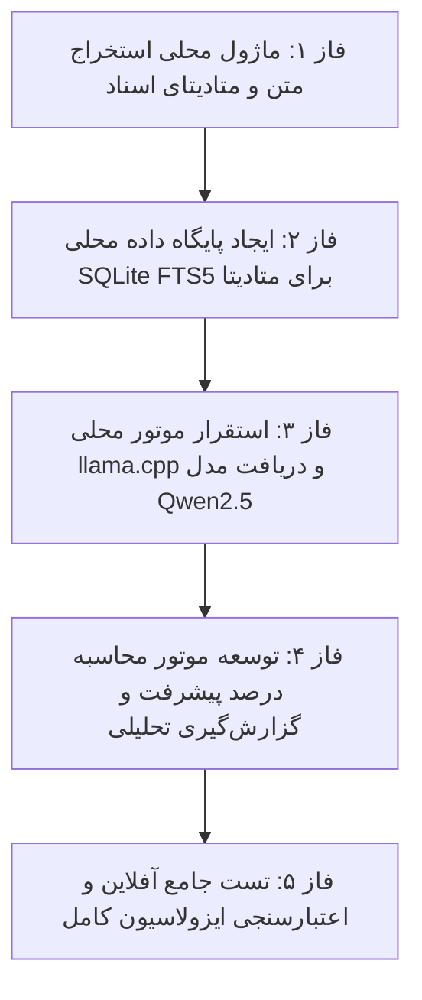

# طرح نهایی هوشمندسازی آرشیو ۱۰۰٪ محلی و ایزوله (Air-Gapped On-Premise AI Architecture)
# Completely Offline, Zero-GPU & Air-Gapped LLM Integration for Enterprise Banking

این طرح بر اساس **تایید مشخصات سرور و ملاحظات امنیتی سازمان** نهایی‌سازی شده است:
- **سخت‌افزار اختصاص‌یافته:** پردازنده قدرتمند نسل ۱۳ اینتل (Intel Core i7-1355U با ۱۲ هسته پردازشی و دستورات AVX2) با حافظه رم ۸ گیگابایت (بیش از ۵ گیگابایت آزاد).
- **سیاست امنیتی اینترنت:** امکان اتصال موقت به شبکه صرفاً برای دریافت پکیج‌های نصبی پایتون و فایل مدل GGUF در فاز راه‌اندازی؛ و پس از آن **قطع کامل هرگونه دسترسی اینترنتی در زمان عملیات و پردازش اسناد (Zero Data Egress)**.
- **هزینه سخت‌افزاری:** صفر (کاملاً بر روی سخت‌افزار موجود و بدون نیاز به GPU).

---

## تصمیم‌گیری‌های نهایی‌شده (Resolved Specifications)

| آیتم | وضعیت تصمیم | جزئیات فنی |
| :--- | :--- | :--- |
| **محل پردازش اسناد** | ۱۰۰٪ لوکال و On-Premise | هیچ سندی یا متنی از شبکه داخلی سازمان خارج نمی‌شود |
| **سخت‌افزار پردازشی** | CPU سرور (بدون GPU) | اجرای مدل کوانتیزه ۴-بیتی با `llama.cpp` روی ۱۲ هسته i7 نسل ۱۳ |
| **مدل زبانی پیشنهادی** | `Qwen2.5-1.5B-Instruct` (GGUF Q4_K_M) | حجم فایل مدل ~۱.۱ گیگابایت، مصرف رم ~۱.۵ گیگابایت، سرعت پاسخ‌دهی بالا به زبان فارسی |
| **موتور ذخیره متادیتا** | پایگاه داده محلی `SQLite FTS5` | جستجوی میلی‌ثانیه‌ای عبارات فارسی و متادیتا روی دیسک محلی |
| **اهداف تحلیلی اصلی** | درصد پیشرفت + گزارش‌های مدیریتی | محاسبه خودکار پیشرفت کارها و بررسی فاکتورها/اسناد تاییدشده |

---

## معماری سامانه هوشمند آرشیو (System Architecture)

```text
[ اسناد آرشیو Nextcloud ]
(پوشه‌ها، تگ‌های سلسله‌مراتبی، فاکتورها، گزارش‌ها)
                  │
                  ▼
[ ماژول استخراج متن روی CPU ] (ai_engine/extractor.py)
  - استخراج متون تمیز از PDF، Word، Excel و Text
  - نگاشت متادیتای پوشه (Finance -> 2026 -> Invoices_Archive)
                  │
                  ▼
[ پایگاه متادیتای محلی آفلاین ] (ai_engine/archive_kb.sqlite)
  - ذخیره متون، جداول و تگ‌ها در جداول FTS5
  - ایندکس محلی بدون نیاز به اتصال شبکه
                  │
                  ▼
[ موتور هوش مصنوعی محلی روی CPU ] (ai_engine/local_llm.py)
  - اجرای مدل Qwen2.5 GGUF با کتابخانه سبک llama-cpp-python
  - استفاده از هسته‌های AVX2 پردازنده Intel i7 (سرعت بیش از ۲۰ کلمه در ثانیه)
                  │
                  ▼
[ رابط گزارش‌گیری تحلیلی و درصد پیشرفت ] (ai_engine/analytics.py)
  - محاسبه درصد پیشرفت کارها و پروژه‌ها
  - استخراج سرجمع مبالغ و مغایرت‌های اسناد
  - پاسخ تحلیلی به پرسش‌های مدیران با استناد به شماره و نام سند
```

---

## فازبندی اجرایی و مراحل گام‌به‌گام



---

### فاز ۱: ماژول محلی استخراج متن و متادیتای اسناد (`ai_engine/extractor.py`)
- توسعه اسکریپت پایتونی درون `venv` برای خواندن فایل‌ها از پوشه آرشیو (`nextcloud/data/admin/files/Enterprise_Archive`).
- پشتیبانی از استخراج متون PDF (با `pypdf`/`pdfplumber`)، اکسل (`openpyxl`)، ورد (`python-docx`) و فایل‌های متنی.
- استخراج تگ‌های سلسله‌مراتبی از دیتابیس PostgreSQL و الصاق به هر سند.

### فاز ۲: پایگاه متادیتا و ایندکس محلی (`ai_engine/archive_kb.sqlite`)
- ایجاد پایگاه داده تک‌فایلی محلی با فعال‌سازی ماژول جستجوی تمام‌متن `FTS5`.
- ثبت شناسنامه اسناد (شامل: مسیر پوشه، نام فایل، تگ‌ها، تاریخ، حجم، وضعیت و متن کامل سند).
- تست عملکرد جستجوی فوق‌سریع عبارات و فیلتر بر اساس تگ‌ها.

### فاز ۳: استقرار موتور محلی LLaMA و مدل سبک زبانی (`ai_engine/local_llm.py`)
- نصب کتابخانه بهینه‌شده `llama-cpp-python` کامپایل‌شده برای معماری پردازنده سیستم شما.
- دانلود یک‌باره مدل فوق‌العاده باکیفیت و سریع `Qwen2.5-1.5B-Instruct-GGUF` (حجم تقریبی ۱.۱ گیگابایت).
- اعتبارسنجی سرعت پاسخ‌دهی و پردازش متون فارسی روی پردازنده Intel i7 سرور.

### فاز ۴: موتور محاسبه درصد پیشرفت و گزارش‌گیری سازمانی (`ai_engine/analytics.py`)
- پیاده‌سازی منطق محاسبه خودکار درصد پیشرفت بر اساس وضعیت مدارک یک پوشه:
  $$\text{Progress \%} = \frac{\text{تعداد اسناد تایید شده در پوشه}}{\text{کل اسناد پیش‌بینی‌شده برای پروژه}} \times 100$$
- طراحی پرامپت‌های مهندسی‌شده برای استخراج مبالغ فاکتورها، جمع هزینه‌ها، و تولید بولتن مدیریتی از وضعیت آرشیو.
- امکان پرسش و پاسخ متنی به زبان فارسی از کل محتوای آرشیو به صورت آفلاین.

### فاز ۵: تست جامع آفلاین و قطع کامل دسترسی اینترنت
- شبیه‌سازی قطع کامل اینترنت (Air-Gap Simulation) و تست اجرای کلیه عملیات‌های تحلیلی و گزارش‌گیری.
- اعتبارسنجی ۱۰۰٪ عدم خروج بسته اطلاعاتی از سرور.

---

## گام فوری بعدی:
شروع **فاز ۱ (پیاده‌سازی پکیج استخراج محلی متن و ساختار اسناد در دایرکتوری `ai_engine/`)**.
