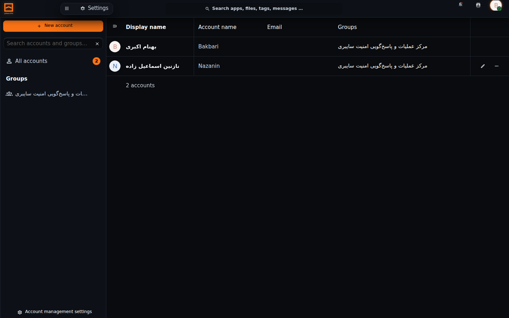
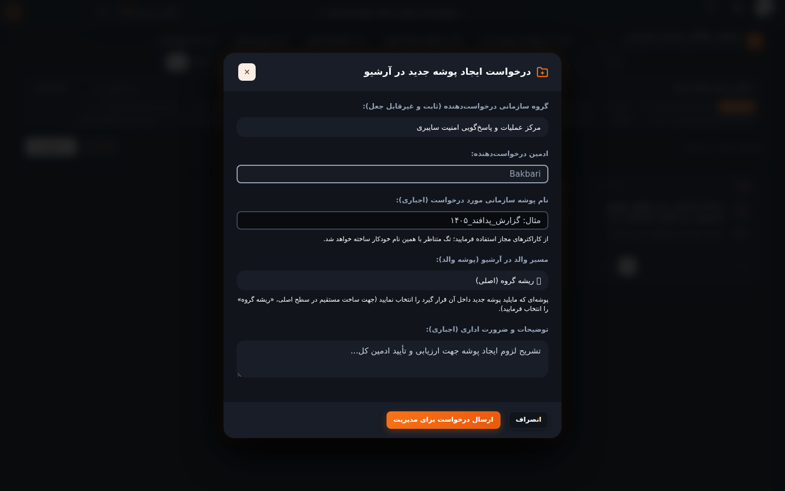
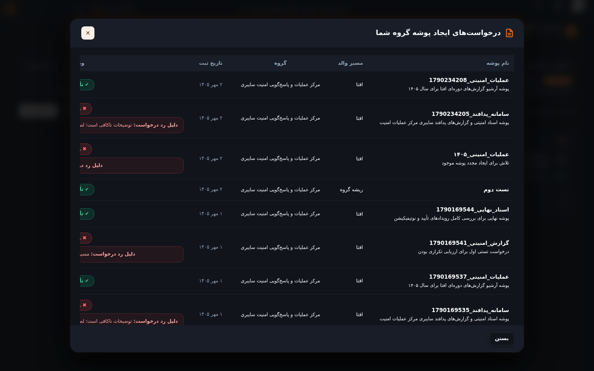
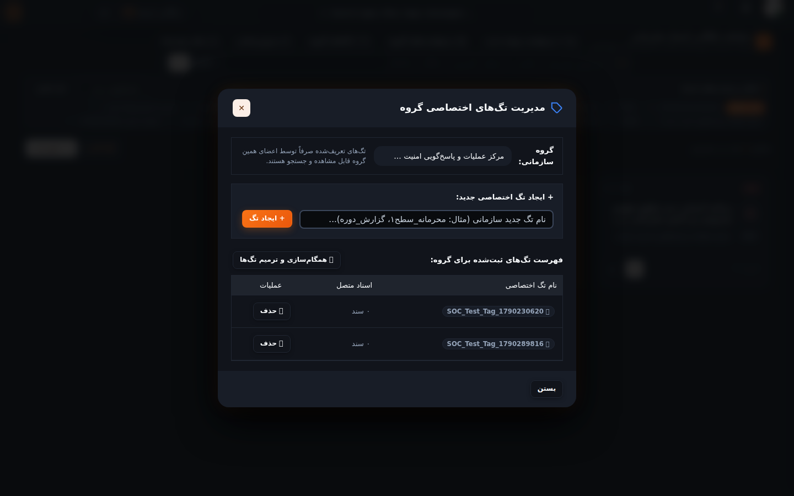
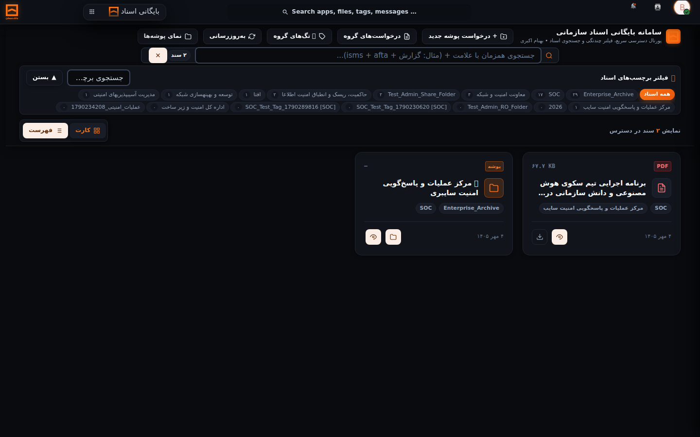

# راهنمای جامع کاربر ادمین گروه در سامانه آرشیو و مستندات سازمانی
## Enterprise Archive System — Group Administrator (Subadmin) User Guide

---

| مشخصه سند | مقدار |
|---|---|
| **عنوان سند** | راهنمای جامع کاربر ادمین گروه در سامانه آرشیو و مستندات سازمانی |
| **نام سامانه** | سامانه بایگانی اسناد سازمانی (Enterprise Archive System) |
| **نقش مخاطب** | ادمین گروه سازمانی (Group Administrator / Subadmin) |
| **نگارش سامانه** | v2.9.0 |
| **نگارش راهنما** | v1.0.0 |
| **وضعیت سند** | سند زنده و عملیاتی (Living Document) |
| **تاریخ تدوین / آخرین بازبینی** | ۴ مهر ۱۴۰۵ (2026-09-26) |

---

> [!IMPORTANT]
> **بیانیه سند زنده (Living Documentation Policy):**  
> این سند مرجع رسمی و اختصاصی کارشناسانی است که مسئولیت **مدیریت یک یا چند گروه سازمانی (Subadmin)** را بر عهده دارند.  
> بر اساس سیاست حاکمیت مستندات سامانه، **به‌ازای هرگونه تغییر در فرآیندها، منوها، دکمه‌ها یا اختیارات ادمین گروه در نگارش‌های آینده، این راهنما باید همگام و بلافاصله بازبینی و به‌روزرسانی شود.** کلیه تصاویر و دستورالعمل‌های این سند مستقیماً از نگارش عملیاتی v2.9.0 و از حساب واقعی ادمین گروه استخراج شده‌اند.

---

## فهرست مطالب
1. [معرفی نقش ادمین گروه و مرزبندی اختیارات](#۱-معرفی-نقش-ادمین-گروه-و-مرزبندی-اختیارات)
2. [آشنایی با محیط کاربری و میز کار ادمین گروه](#۲-آشنایی-با-محیط-کاربری-و-میز-کار-ادمین-گروه)
3. [ورود به سامانه و دسترسی به محدوده گروه](#۳-ورود-به-سامانه-و-دسترسی-به-محدوده-گروه)
4. [مدیریت اعضای گروه سازمانی](#۴-مدیریت-اعضای-گروه-سازمانی)
5. [مدیریت پوشه‌ها و ساختار دپارتمان](#۵-مدیریت-پوشهها-و-ساختار-دپارتمان)
6. [فرآیند ثبت درخواست ایجاد پوشه جدید](#۶-فرآیند-ثبت-درخواست-ایجاد-پوشه-جدید)
7. [پیگیری وضعیت درخواست‌های پوشه در کارتابل واحد](#۷-پیگیری-وضعیت-درخواستهای-پوشه-در-کارتابل-واحد)
8. [مدیریت برچسب‌های اختصاصی گروه (Group Tags)](#۸-مدیریت-برچسبهای-اختصاصی-گروه-group-tags)
9. [بارگذاری اسناد و مدیریت فراداده‌های الزامی](#۹-بارگذاری-اسناد-و-مدیریت-فرادادههای-الزامی)
10. [پالایش چندبرچسبی و جستجوی اسناد واحد](#۱۰-پالایش-چندبرچسبی-و-جستجوی-اسناد-واحد)
11. [مدیریت دسترسی‌ها و اشتراک‌گذاری درون‌واحدی](#۱۱-مدیریت-دسترسیها-و-اشتراکگذاری-درونواحدی)
12. [مشاهده سوابق و رویدادهای گروه](#۱۲-مشاهده-سوابق-و-رویدادهای-گروه)
13. [سناریوهای متداول گام‌به‌گام](#۱۳-سناریوهای-متداول-گامبهگام)
14. [خطاها، پیام‌های هشدار و راهکارهای رفع مشکل](#۱۴-خطاها-پیامهای-هشدار-و-راهکارهای-رفع-مشکل)
15. [محدودیت‌های ادمین گروه و مراجع به ادمین کل](#۱۵-محدودیتهای-ادمین-گروه-و-مراجع-به-ادمین-کل)
16. [چک‌لیست عملیات پرکاربرد ادمین گروه](#۱۶-چکلیست-عملیات-پرکاربرد-ادمین-گروه)
17. [تاریخچه به‌روزرسانی راهنما](#۱۷-تاریخچه-بهروزرسانی-راهنما)

---

## ۱. معرفی نقش ادمین گروه و مرزبندی اختیارات

در سامانه بایگانی اسناد سازمانی، «ادمین گروه» (Group Administrator یا Subadmin)، کاربری معتمد در سطح یک دپارتمان یا اداره (نظیر مرکز عملیات امنیت SOC، تیم CERT، امور مالی، یا اداره حقوقی) است که وظیفه راهبری اسناد و نظارت بر اعضای همان واحد را بر عهده دارد.

> [!WARNING]
> **اصل بنیادین: ادمین گروه، ادمین کل سامانه نیست!**  
> دامنه اختیارات ادمین گروه به صورت سخت‌گیرانه **محدود به اعضا، پوشه‌ها، اسناد و برچسب‌های اختصاصی همان گروه** است و هیچ دسترسی به تنظیمات زیرساختی، کنسول پشتیبان‌گیری یا داده‌های سایر ادارات سازمان ندارد.

### ماتریس تفکیک اختیارات سه‌گانه:

| عمل / قابلیت در سامانه | ادمین سامانه (System Admin) | ادمین گروه (Subadmin) | عضو عادی گروه (Member) |
|---|:---:|:---:|:---:|
| **ورود به کنسول پشتیبان‌گیری و بازیابی (بکاپ)** | ✔️ مجاز کامل | ❌ مسدود (پنهان) | ❌ مسدود (پنهان) |
| **ایجاد مستقیم پوشه در ریشه بایگانی** | ✔️ مجاز مستقیم | ❌ فقط با ثبت درخواست | ❌ مسدود |
| **ثبت درخواست ایجاد پوشه سازمانی** | ✔️ نیازی ندارد | ✔️ مجاز برای واحد خود | ❌ مسدود |
| **تایید یا رد درخواست‌های ایجاد پوشه** | ✔️ در کارتابل کل | ❌ فقط مشاهده وضعیت | ❌ مسدود |
| **ایجاد برچسب‌های سراسری (Global Tags)** | ✔️ مجاز کامل | ❌ مسدود | ❌ مسدود |
| **ایجاد برچسب‌های اختصاصی گروه (`[Group] ...`)** | ✔️ مجاز کامل | ✔️ مجاز برای گروه خود | ❌ مسدود |
| **حذف برچسب‌های سیستمی و پوشه‌ای** | ✔️ با شرایط ایمن | ❌ اکیداً مسدود (🔒) | ❌ مسدود |
| **تعریف کاربر جدید در محدوده گروه** | ✔️ در کل سامانه | ✔️ فقط در گروه خود | ❌ مسدود |
| **حذف حساب کاربری** | ✔️ منحصراً ادمین کل | ❌ **اکیداً ممنوع (403)** | ❌ مسدود |
| **بارگذاری سند با فراداده الزامی** | ✔️ مجاز | ✔️ مجاز | ✔️ مجاز |
| **حذف دائم اسناد (DELETE=8)** | ✔️ منحصراً ادمین کل | ❌ مسدود | ❌ مسدود |

---

## ۲. آشنایی با محیط کاربری و میز کار ادمین گروه

هنگامی که با حساب ادمین گروه وارد سامانه می‌شوید، پورتال آرشیو به صورت هوشمند اختیارات شما را تشخیص داده و میز کار اختصاصی متناسب با واحد شما را با پوسته مات Obsidian و فونت خوانای وزیرمتن نمایش می‌دهد.


*شکل ۱ – میز کار پورتال آرشیو برای ادمین گروه (توجه: دکمه‌های سطح ادمین کل نظیر پشتیبان‌گیری مخفی هستند)*

### اجزای اصلی نوار ابزار ادمین گروه (مطابق شکل ۱):
1. **دکمه `[ 📁 درخواست ایجاد پوشه ]` (Folder Request):**
   - جهت ارسال پیشنهاد ساخت دایرکتوری جدید در ساختار بایگانی به مدیر ارشد سیستم.
2. **دکمه `[ 🏷️ برچسب‌های گروه ]` (Manage Group Tags):**
   - کنسول اختصاصی تعریف، مشاهده و مدیریت برچسب‌های مربوط به همان گروه اداری.
3. **دکمه `[ 📥 پیگیری درخواست‌ها ]` (Track Requests):**
   - کارتابل پیگیری لحظه‌ای وضعیت درخواست‌های ثبت‌شده واحد (تاییدشده، ردشده یا در انتظار بررسی).
4. **نوار پالایش برچسب‌ها (Tag Filter Bar):**
   - تراشه‌های برچسب‌های سازمانی و گروهی همراه با تعداد اسناد منتسب.
5. **جدول اسناد بایگانی:**
   - جدول ۴ ستونه شفاف شامل نام سند، مسیر پوشه، برچسب‌ها و حجم/تاریخ ثبت، ویژه اسناد مجاز واحد.

---

## ۳. ورود به سامانه و دسترسی به محدوده گروه

### ۳.۱. مراحل ورود
1. آدرس پورتال آرشیو را در مرورگر باز کنید.
2. نام کاربری ادمین گروه خود (مثلاً `Bakbari`) و رمز عبور را وارد نمایید.
3. بر روی دکمه **ورود** کلیک کنید.
4. **نتیجه مورد انتظار:** وارد میز کار پورتال (شکل ۱) می‌شوید. در بالای صفحه نام شما به همراه گروه تحت مدیریت نمایش داده می‌شود.

---

## ۴. مدیریت اعضای گروه سازمانی

ادمین گروه می‌تواند همکاران واحد خود را در سامانه تعریف کرده یا اطلاعات آن‌ها را ویرایش کند.


*شکل ۲ – کنسول مدیریت کاربران برای ادمین گروه (محدود به اعضای گروه تحت مدیریت)*

### ۴.۱. مسیر دسترسی:
- کلیک روی آیکون پروفایل در گوشه بالا سمت چپ ➔ انتخاب گزینه **کاربران** (Users).
- یا ورود به آدرس: `/index.php/settings/users`.

### ۴.۲. مراحل ایجاد کاربر جدید در گروه:
1. در بالای جدول کاربران (شکل ۲)، فرم **کاربر جدید** را باز کنید.
2. **شناسه کاربری (Username):** شناسه انگلیسی کارمند را وارد کنید (مثلاً `n.esmaili`).
3. **نام نمایشی (Display Name):** نام و نام خانوادگی رسمی کاربر را تایپ کنید.
4. **رمز عبور (Password):** یک رمز عبور اولیه معتبر تعیین نمایید.
5. **گروه:** به صورت خودکار گروه شما (مثلاً `SOC`) انتخاب شده است و امکان افزودن کاربر به سایر گروه‌ها وجود ندارد.
6. **سهمیه دیسک (Quota):** سهمیه شخصی باید الزاماً روی **`0 B`** بماند.
7. بر روی دکمه ذخیره کلیک کنید.
8. **نتیجه مورد انتظار:** کاربر عضو گروه شده و بلافاصله می‌تواند به اسناد و پوشه‌های اشتراکی واحد دسترسی داشته باشد.

> [!CAUTION]
> **قانون امنیتی عدم حذف کاربر:**  
> سامانه بر اساس خط‌مشی ممیزی، اجازه **حذف حساب کاربری** را به ادمین گروه نمی‌دهد. در صورت تلاش برای حذف، با خطای امنیتی **۴۰۳ (Forbidden)** مواجه خواهید شد. در صورت جابه‌جایی یا خروج پرسنل، تنها مجاز به **غیرفعال‌سازی (Disable)** حساب کاربر هستید. برای حذف دائم، باید مراتب به ادمین سامانه اعلام گردد.

---

## ۵. مدیریت پوشه‌ها و ساختار دپارتمان

تمامی پوشه‌های واحد شما در مسیر `/Enterprise_Archive/<نام_گروه>` قرار دارند.
- به عنوان ادمین گروه، شما و اعضای گروهتان حق مشاهده و بارگذاری فایل در این پوشه‌ها را دارید.
- اما جهت رعایت نظم سازمانی و پیشگیری از ایجاد ساختارهای سلیقه‌ای، ساخت پوشه جدید باید از طریق **فرآیند رسمی درخواست** انجام گیرد.

---

## ۶. فرآیند ثبت درخواست ایجاد پوشه جدید

هنگامی که برای یک پروژه یا موضوع جدید در واحد خود به یک پوشه مجزا نیاز دارید، مراحل زیر را طی کنید:


*شکل ۳ – فرم رسمی ثبت درخواست پوشه همراه با مشخصات و علت نیاز*

### گام‌های ثبت درخواست:
1. در پورتال آرشیو (شکل ۱)، بر روی دکمه **`[ 📁 درخواست ایجاد پوشه ]`** کلیک کنید.
2. پنجره درخواست مطابق **شکل ۳** باز می‌شود:
   - **نام پوشه درخواستی:** عنوان دقیق و استاندارد پوشه (مثلاً `گزارش‌های حوادث زمستان ۱۴۰۵`) را وارد کنید.
   - **مسیر والد:** مسیر والد مربوط به گروه خود (مثلاً `/Enterprise_Archive/SOC`) را انتخاب فرمایید.
   - **واحد متقاضی:** نام گروه شما به صورت خودکار درج شده است.
   - **علت و ضرورت ایجاد پوشه:** توضیح مختصری از هدف اداری ساخت پوشه برای بررسی ادمین سامانه بنویسید.
3. بر روی دکمه نارنجی **ارسال درخواست به مدیر ارشد** کلیک کنید.
4. **نتیجه مورد انتظار:** درخواست ثبت شده و پیامی با رنگ سبز مبنی بر ارسال موفقیت‌آمیز به کارتابل ادمین سامانه نمایش داده می‌شود.

---

## ۷. پیگیری وضعیت درخواست‌های پوشه در کارتابل واحد

برای این که بدانید درخواست ارسالی شما در چه وضعیتی قرار دارد:


*شکل ۴ – جدول پیگیری درخواست‌های گروه و وضعیت تایید/رد توسط ادمین کل*

### مراحل پیگیری:
1. در نوار ابزار پورتال، بر روی دکمه **`[ 📥 پیگیری درخواست‌ها ]`** کلیک کنید.
2. جدول تاریخچه درخواست‌های واحد شما باز می‌شود (شکل ۴):
   - **در انتظار بررسی (Pending):** درخواست به دست ادمین کل رسیده و هنوز تصمیم‌گیری نشده است.
   - **تایید شده (Approved):** ادمین کل درخواست را تایید کرده و پوشه بلافاصله در ساختار بایگانی فعال و آماده استفاده است.
   - **رد شده (Rejected):** ادمین کل درخواست را رد کرده است؛ با بردن ماوس روی وضعیت، **علت رد درخواست** که توسط ادمین کل نوشته شده قابل مشاهده است.

---

## ۸. مدیریت برچسب‌های اختصاصی گروه (Group Tags)

ادمین گروه می‌تواند برای دسته‌بندی دقیق‌تر اسناد دپارتمان خود، برچسب‌های سفارشی بسازد.


*شکل ۵ – کنسول مدیریت برچسب‌های گروه و محافظت از تگ‌های سیستمی*

### ۸.۱. نحوه ساخت برچسب جدید برای گروه:
1. بر روی دکمه **`[ 🏷️ برچسب‌های گروه ]`** در پورتال کلیک کنید.
2. در پنجره بازشده (شکل ۵):
   - در کادر **نام برچسب جدید**، عنوان مورد نظر را وارد کنید (مثلاً `حوادث بحرانی`).
3. بر روی دکمه **افزودن برچسب گروهی** کلیک کنید.
4. **نتیجه مورد انتظار:** برچسب با پیشوند گروه شما (مثلاً `[SOC] حوادث بحرانی`) ذخیره شده و اعضای گروه در زمان بارگذاری یا جستجو می‌توانند از آن استفاده کنند.

### ۸.۲. خط‌مشی ایمنی در حذف برچسب‌ها:
- برچسب‌هایی که نماد **قفل 🔒 (تگ سیستمی)** دارند یا توسط ادمین کل ساخته شده‌اند، توسط ادمین گروه **غیرقابل حذف** هستند.
- شما تنها می‌توانید برچسب‌های دست‌ساز گروه خود را که در حال حاضر به سندی الصاق نشده‌اند حذف کنید.

---

## ۹. بارگذاری اسناد و مدیریت فراداده‌های الزامی

هنگام بارگذاری هرگونه سند در پوشه‌های گروه، تکمیل مشخصات شناسنامه‌ای سند اجباری است.


*شکل ۶ – دراور مشخصات کامل سند، متادیتای الزامی و امکان مکان‌یابی*

### مراحل بارگذاری استاندارد سند:
1. در پوشه مورد نظر، بر روی دکمه **`[ ⇪ بارگذاری فایل ]`** کلیک کنید.
2. فایل سند (PDF، Word، تصویر یا فشرده) را از رایانه خود انتخاب نمایید.
3. پنجره **ثبت فراداده‌های الزامی** باز می‌شود:
   - **موضوع سند (Subject):** خلاصه رسمی عنوان نامه یا مدرک (الزامی).
   - **شماره سند:** شماره اندیکاتور یا شناسه نامه اداری.
   - **تاریخ سند:** تاریخ صدور بر اساس تقویم شمسی.
   - **سطح محرمانگی:** عادی، محرمانه یا خیلی محرمانه.
   - **برچسب‌های منتسب:** انتخاب تگ‌های مرتبط با موضوع.
4. بر روی دکمه **تایید و ارسال به بایگانی** کلیک کنید.
5. **نتیجه مورد انتظار:** سند بارگذاری شده، متادیتا در دیتابیس ثبت گردیده و در جدول اسناد واحد نمایش داده می‌شود.

---

## ۱۰. پالایش چندبرچسبی و جستجوی اسناد واحد

برای یافتن سریع اسناد اداری در میان صدها فایل:


*شکل ۷ – فیلتر همپوشانی چندبرچسبی و جستجوی آنی اسناد در پورتال*

1. در نوار بالای پورتال، روی برچسب اول کلیک کنید (مثلاً `SOC`).
2. سپس بر روی برچسب دوم کلیک کنید (مثلاً `گزارش‌های دوره‌ای`).
3. **نتیجه:** جدول اسناد بر اساس **اشتراک منطقی (AND)** فیلتر شده و منحصراً مدارکی را نشان می‌دهد که هر دو برچسب را دارا باشند.

---

## ۱۱. مدیریت دسترسی‌ها و اشتراک‌گذاری درون‌واحدی

- پوشه‌های گروه به صورت خودکار دارای مجوز **خواندن (Read)** و **ایجاد/نوشتن (Create/Update)** برای تمامی اعضای رسمی آن گروه هستند.
- در صورت نیاز به اشتراک‌گذاری یک سند با فردی خاص در داخل واحد، می‌توانید از گزینه **اشتراک‌گذاری** در دراور سند (شکل ۶) استفاده کنید.
- اشتراک‌گذاری با ادارات دیگر خارج از واحد، باید با هماهنگی و توسط ادمین کل سامانه انجام پذیرد.

---

## ۱۲. مشاهده سوابق و رویدادهای گروه

ادمین گروه می‌تواند جریان فعالیت‌های اعضای خود (چه کسی، در چه تاریخی، چه فایلی را بارگذاری یا ویرایش کرده است) را از طریق زبانه **فعالیت‌ها (Activity)** در منوی کاربری پایش کند تا از صحت عملکرد فرآیندهای دپارتمان اطمینان حاصل نماید.

---

## ۱۳. سناریوهای متداول گام‌به‌گام

### سناریوی ۱: پذیرش و راه‌اندازی کارمند جدید در اداره
1. ورود به بخش **کاربران** از منوی پروفایل (شکل ۲).
2. ثبت نام کاربری، نام فارسی و رمز عبور کارمند.
3. اطمینان از قرار داشتن سهمیه کاربر روی `0 B`.
4. اتمام ثبت‌نام؛ اکنون کارمند جدید بلافاصله پس از لاگین به تمامی پوشه‌ها و اسناد مجاز واحد دسترسی دارد.

### سناریوی ۲: ایجاد ساختار برای یک پروژه امنیتی جدید
1. کلیک روی دکمه **`[ 🏷️ برچسب‌های گروه ]`** و ایجاد تگ `پروژه سپهر`.
2. کلیک روی دکمه **`[ 📁 درخواست ایجاد پوشه ]`** و درخواست ساخت پوشه `پروژه سپهر` در مسیر گروه.
3. پیگیری از دکمه **`[ 📥 پیگیری درخواست‌ها ]`** تا زمان تایید توسط ادمین کل.
4. پس از تایید، بارگذاری کلیه مستندات پروژه در پوشه جدید با تگ اختصاصی ساخته‌شده.

---

## ۱۴. خطاها، پیام‌های هشدار و راهکارهای رفع مشکل

| پیام خطا یا موقعیت | علت ریشه‌ای | راهکار و اقدام مجاز توسط ادمین گروه |
|---|---|---|
| **خطای ۴۰۳ هنگام تلاش برای حذف کاربر** | ادمین گروه مجاز به حذف اکانت نیست. | کاربر را به جای حذف، **غیرفعال (Disable)** کنید. |
| **خطای ۴۰۳ هنگام حذف تگ سیستمی** | برچسب دارای نماد قفل بوده و متعلق به کل سازمان است. | برچسب‌های سیستمی فقط توسط ادمین کل قابل مدیریت هستند؛ از تگ‌های گروهی خود استفاده کنید. |
| **خطای ۴۲۲ در زمان بارگذاری فایل** | فیلد الزامی «موضوع سند» خالی مانده است. | عنوان و موضوع مدرک را در فرم متادیتا تکمیل و مجدداً ارسال نمایید. |
| **درخواست پوشه رد شد (Rejected)** | نام پوشه با استانداردهای سازمانی مغایرت داشته است. | در پنجره پیگیری درخواست‌ها، علت رد را مطالعه کرده و درخواست اصلاح‌شده ارسال کنید. |
| **عدم مشاهده دکمه پشتیبان‌گیری در نوار ابزار** | این دکمه منحصراً ویژه ادمین کل سامانه است. | طبیعی است؛ امور بکاپ و زیرساخت توسط تیم فناوری مرکزی اداره می‌شود. |

---

## ۱۵. محدودیت‌های ادمین گروه و مراجع به ادمین کل

در موارد زیر ادمین گروه اختیاری نداشته و باید با **مدیر ارشد سامانه (System Administrator)** هماهنگی نماید:

1. **حذف قطعی یک سند یا پوشه:** جهت پیشگیری از امحای سهوی مدارک ثبتی، حذف نهایی فقط توسط ادمین کل مقدور است.
2. **تغییر سهمیه کلی ذخیره‌سازی واحد:** افزایش ظرفیت استوریج نیاز به درخواست رسمی از ادمین زیرساخت دارد.
3. **اشتراک اسناد با سایر ادارات کل سازمان:** تعریف اشتراک‌های بین‌دپارتمانی در حیطه ادمین کل است.
4. **بازیابی اسناد از نسخه‌های پشتیبان تاریخی:** ریکاوری سرور و داده‌ها در صلاحیت انحصاری ادمین کل است.

---

## ۱۶. چک‌لیست عملیات پرکاربرد ادمین گروه (Cheat Sheet)

```text
┌──────────────────────────────────────┬────────────────────────────────────────────────────────┐
│ عملیات مورد نظر                       │ مسیر اقدام سریع در سامانه                              │
├──────────────────────────────────────┼────────────────────────────────────────────────────────┤
│ افزودن کارشناس جدید به اداره         │ منوی پروفایل ➔ کاربران (/settings/users)               │
│ تعلیق یا غیرفعال‌سازی همکار سابق      │ منوی کاربران ➔ سه نقطه کنار نام کاربر ➔ غیرفعال‌سازی   │
│ ثبت تقاضای پوشه جدید برای واحد        │ پورتال آرشیو ➔ دکمه [ 📁 درخواست ایجاد پوشه ]          │
│ مشاهده نتیجه بررسی پوشه توسط ادمین کل│ پورتال آرشیو ➔ دکمه [ 📥 پیگیری درخواست‌ها ]           │
│ ساخت برچسب جدید برای اسناد واحد      │ پورتال آرشیو ➔ دکمه [ 🏷️ برچسب‌های گروه ]              │
│ بارگذاری سند جدید به همراه متادیتا   │ رفتن به پوشه ➔ دکمه [ ⇪ بارگذاری فایل ]                │
│ فیلتر چندگانه اسناد با برچسب‌ها      │ کلیک همزمان روی دو یا چند نشان برچسب در بالای صفحه    │
│ مشاهده شناسنامه و متادیتای یک سند    │ کلیک روی سطر سند در جدول ➔ مشاهده دراور بازشده         │
└──────────────────────────────────────┴────────────────────────────────────────────────────────┘
```

---

## ۱۷. تاریخچه به‌روزرسانی راهنما (Living Document Changelog)

| نسخه راهنما | نسخه سامانه | تاریخ | شرح تغییرات و قابلیت‌های اضافه‌شده | بخش‌های اصلاح‌شده |
|---|---|---|---|---|
| **v1.0.0** | **v2.9.0** | ۱۴۰۵/۰۷/۰۴ | تدوین جامع نخستین راهنمای رسمی ویژه ادمین‌های گروه (Subadmin) منطبق بر نسخه عملیاتی ۲.۹.۰ سامانه، تبیین مرزبندی صریح با ادمین کل، راهنمای کارتابل درخواست پوشه، مدیریت اعضا، تگ‌های گروهی و درج تصاویر واقعی حساب ادمین گروه. | کل سند (نسخه پایه) |
