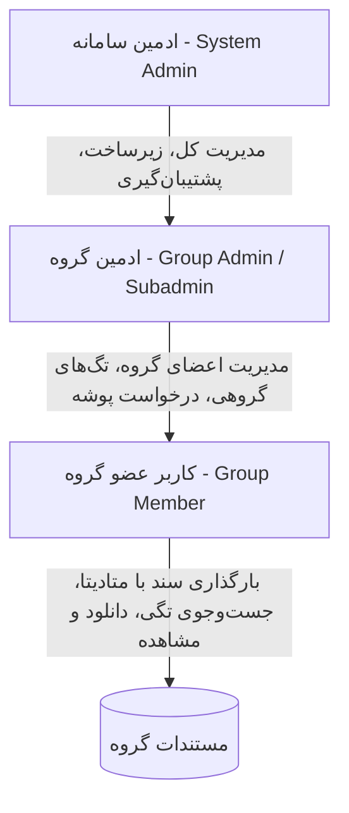
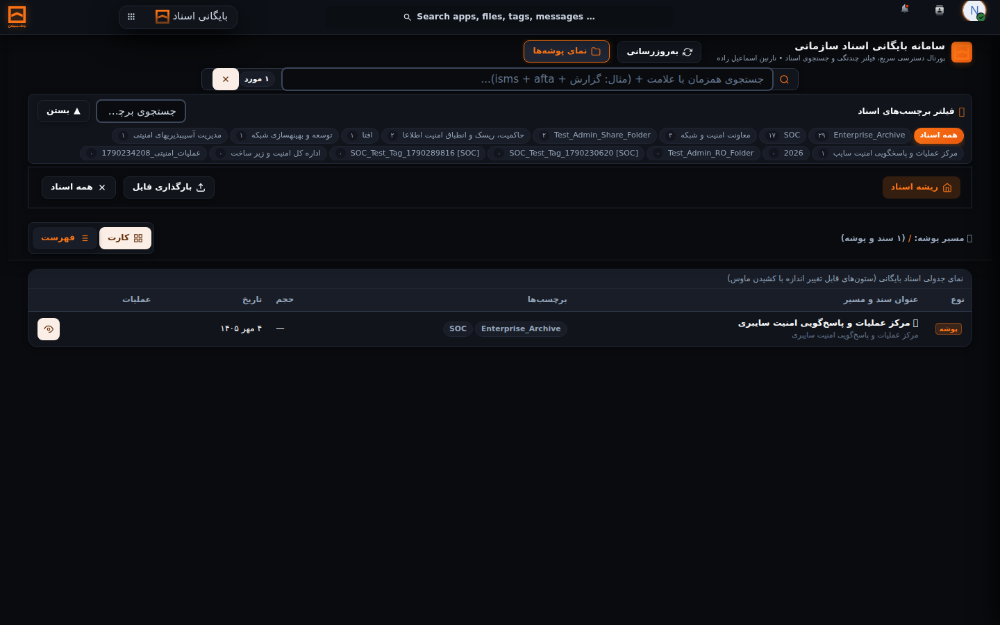
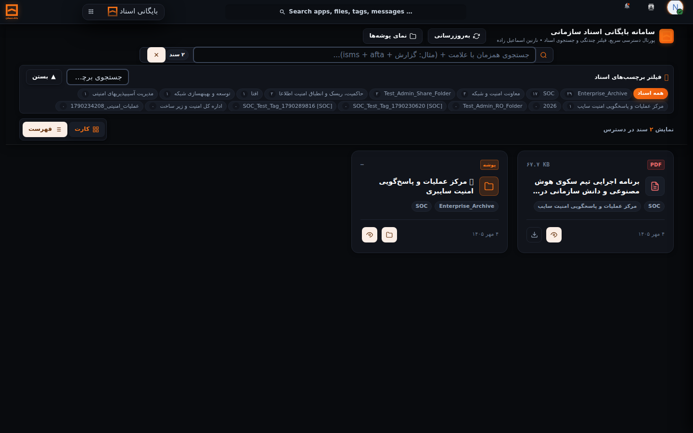
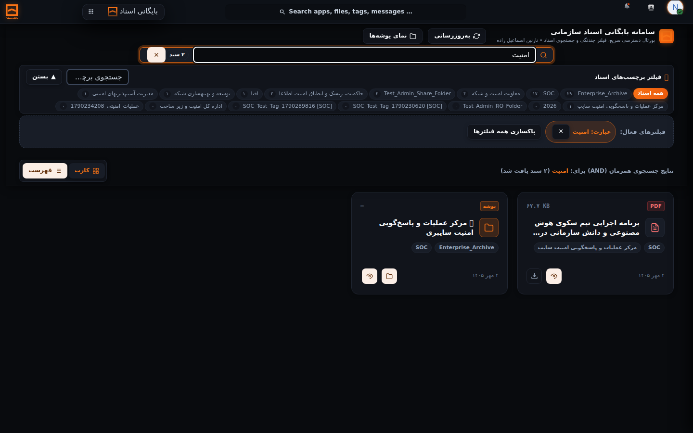
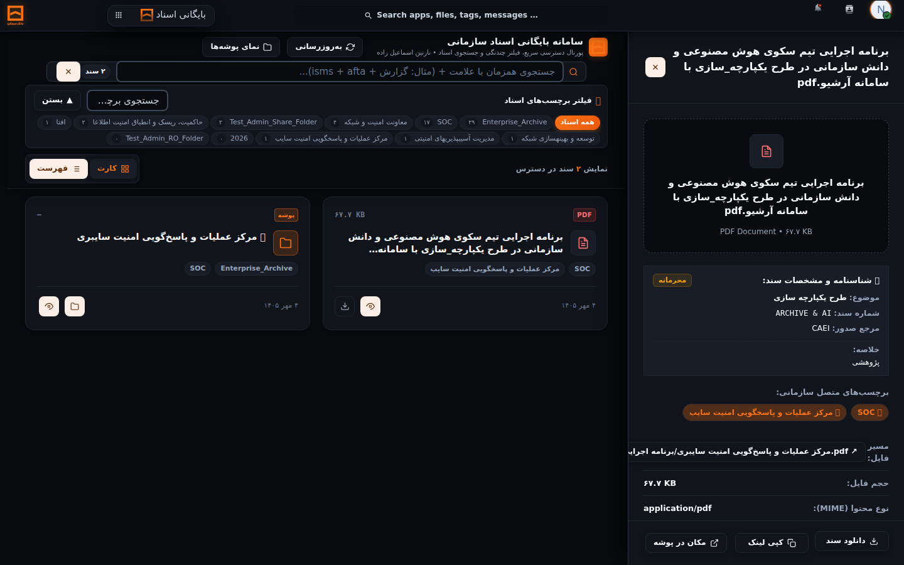
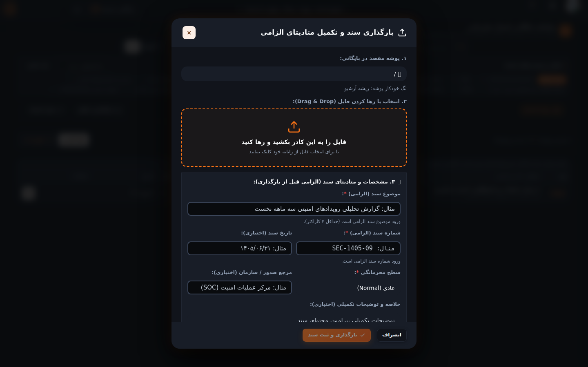
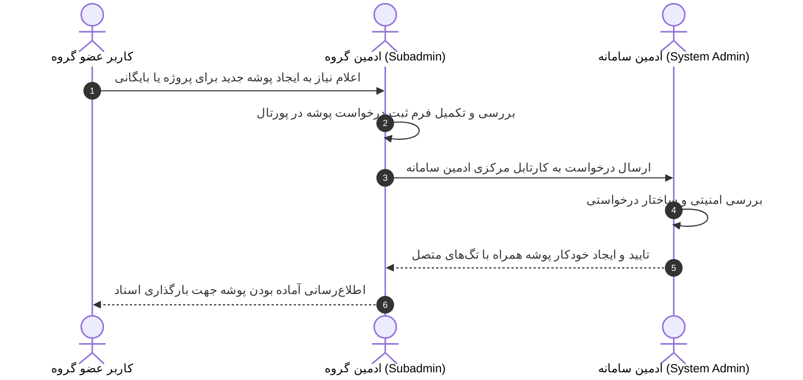

# راهنمای کاربر عضو گروه در سامانه آرشیو و مستندات سازمانی
**سامانه بایگانی اسناد سازمانی بانک مسکن**

---

| مشخصه سند | مقدار |
| :--- | :--- |
| **عنوان سند** | راهنمای رسمی کاربر عضو گروه (Regular Member User Guide) |
| **نقش مخاطب** | کاربر عضو گروه سازمانی (Group Member) |
| **نسخه سامانه** | v2.9.0 (عملیاتی) |
| **نسخه راهنما** | v1.0.0 (سند زنده - Living Document) |
| **تاریخ آخرین به‌روزرسانی** | ۵ مهر ۱۴۰۵ (2026-09-26) |
| **وضعیت سند** | رسمی و مصوب |

---

## خط‌مشی سند زنده (Living Document Policy)
> [!IMPORTANT]
> این راهنما یک **سند زنده و پویا** است. با هرگونه توسعه نرم‌افزاری، تغییر در گردش‌کارهای دسترسی، بازطراحی صفحات رابط کاربری، افزودن فیلترها، تغییر قوانین متادیتا یا ارتقای نسخه سامانه بایگانی اسناد، این راهنما باید بلافاصله توسط تیم مهندسی نرم‌افزار و راهبری فرآیندها به‌روزرسانی شده و تصاویر صفحات با نسخه عملیاتی فعال همگام گردد. هرگونه قابلیت فرضی که در نسخه فعال سامانه وجود نداشته باشد، اکیداً از این سند حذف می‌گردد.

---

## فهرست مطالب
1. [معرفی سامانه](#۱-معرفی-سامانه)
2. [نقش کاربر عضو گروه (اختیارات و محدودیت‌ها)](#۲-نقش-کاربر-عضو-گروه-اختیارات-و-محدودیتها)
3. [ورود به سامانه و مدیریت نشست کاربری](#۳-ورود-به-سامانه-و-مدیریت-نشست-کاربری)
4. [آشنایی با صفحه اصلی و فضای کاری پورتال](#۴-آشنایی-با-صفحه-اصلی-و-فضای-کاری-پورتال)
5. [مشاهده پوشه‌ها و ساختار درختی بایگانی](#۵-مشاهده-پوشهها-و-ساختار-درختی-بایگانی)
6. [جست‌وجوی اسناد و فیلترهای پیشرفته](#۶-جستوجوی-اسناد-و-فیلترهای-پیشرفته)
7. [مشاهده، پیش‌نمایش و دریافت اسناد](#۷-مشاهده-پیشنمایش-و-دریافت-اسناد)
8. [بارگذاری فایل و ثبت متادیتای الزامی](#۸-بارگذاری-فایل-و-ثبت-متادیتای-الزامی)
9. [ایجاد یا مدیریت پوشه‌ها](#۹-ایجاد-یا-مدیریت-پوشهها)
10. [استفاده از برچسب‌ها (تگ‌های اسناد)](#۱۰-استفاده-از-برچسبها-تگهای-اسناد)
11. [مشاهده شناسنامه و فراداده سند](#۱۱-مشاهده-شناسنامه-و-فراداده-سند)
12. [اشتراک‌گذاری و مجوزهای دسترسی به اسناد](#۱۲-اشتراکگذاری-و-مجوزهای-دسترسی-به-اسناد)
13. [فرآیند درخواست‌ها و هماهنگی با ادمین گروه](#۱۳-فرآیند-درخواستها-و-هماهنگی-با-ادمین-گروه)
14. [امکانات هوشمند و رده‌بندی خودکار](#۱۴-امکانات-هوشمند-و-ردهبندی-خودکار)
15. [خطاها و مشکلات متداول کاربران](#۱۵-خطاها-و-مشکلات-متداول-کاربران)
16. [نکات امنیتی حفاظت از اطلاعات](#۱۶-نکات-امنیتی-حفاظت-از-اطلاعات)
17. [سناریوهای کاربردی روزمره](#۱۷-سناریوهای-کاربردی-روزمره)
18. [تاریخچه به‌روزرسانی راهنما](#۱۸-تاریخچه-بهروزرسانی-راهنما)
19. [راهنمای سریع کاربر (چک‌لیست عملیات روزمره)](#۱۹-راهنمای-سریع-کاربر-چکلیست-عملیات-روزمره)

---

## ۱. معرفی سامانه
«سامانه بایگانی اسناد سازمانی» یک بستر مدرن، یکپارچه، امن و مبتنی بر استانداردهای حاکمیت داده سازمانی است که به‌منظور تمرکززدایی از ذخیره‌سازی جزیره‌ای و ایجاد یک محیط امن برای نگهداری، رده‌بندی، جست‌وجوی فوق‌سریع و بازیابی اسناد دیجیتال سازمان (بانک مسکن) طراحی شده است.

این سامانه به اعضای هر واحد و دپارتمان سازمانی اجازه می‌دهد تا بدون پیچیدگی‌های فنی، اسناد و گزارش‌های اداری و عملیاتی خود را بارگذاری کرده، آن‌ها را با فراداده‌های استاندارد (متادیتا) ثبت نمایند، از مزیت تگ‌گذاری خودکار بهره‌مند شوند و در هر لحظه با ترکیب برچسب‌ها و واژه‌های کلیدی، اسناد مورد نظر خود را در کسری از ثانیه بیابند.

---

## ۲. نقش کاربر عضو گروه (اختیارات و محدودیت‌ها)

در معماری امنیتی سه سطحی سامانه، مرزبندی شفافی میان اختیارات و وظایف تعریف شده است:

### ماتریس مقایسه اختیارات سه سطح کاربری

| عملیات و سطح دسترسی | ادمین سامانه (System Admin) | ادمین گروه (Group Admin) | کاربر عضو گروه (Group Member) |
| :--- | :---: | :---: | :---: |
| ورود به سامانه و تغییر مشخصات فردی | ✅ | ✅ | ✅ |
| مشاهده اسناد و پوشه‌های گروه متبوع | ✅ | ✅ | ✅ |
| بارگذاری اسناد با متادیتای الزامی | ✅ | ✅ | ✅ |
| پیش‌نمایش و دانلود اسناد مجاز | ✅ | ✅ | ✅ |
| جست‌وجوی پیشرفته با عملگر `+` | ✅ | ✅ | ✅ |
| فیلتر چندتگی اسناد (Multi-Tag Filter) | ✅ | ✅ | ✅ |
| ساخت مستقیم پوشه سازمانی در ریشه | ✅ | ❌ | ❌ |
| ثبت درخواست ایجاد پوشه سازمانی | ❌ (مستقیم می‌سازد) | ✅ | ❌ (از طریق ادمین گروه) |
| ایجاد و حذف تگ‌های اختصاصی گروه | ✅ | ✅ | ❌ |
| مدیریت کاربران گروه (افزودن عضو، تخصیص سهمیه) | ✅ | ✅ | ❌ |
| مدیریت سراسری تگ‌های امنیتی (🔒) | ✅ | ❌ | ❌ |
| دسترسی به کنسول پشتیبان‌گیری و بازیابی | ✅ | ❌ (خطای ۴۰۳) | ❌ (خطای ۴۰۳) |
| دسترسی به کنسول امنیتی AI API | ✅ | ❌ (خطای ۴۰۳) | ❌ (خطای ۴۰۳) |

### اختیارات عضو گروه:
1. مشاهده کلیه اسناد و پوشه‌های به اشتراک گذاشته شده با گروه سازمانی خود (مثلاً واحد SOC).
2. فیلتر همزمان اسناد با کلیک بر روی برچسب‌های عمومی و اختصاصی گروه.
3. جست‌وجوی کلیدواژه‌ای اسناد با عملگر تفکیک‌کننده `+` (منطق اشتراک / AND).
4. مشاهده کشوی شناسنامه و فراداده هر سند (سطح محرمانگی، شماره سند، تاریخ، مرجع صدور و برچسب‌ها).
5. دریافت (دانلود) مستقیم اسناد و پیش‌نمایش برخط در مرورگر.
6. بارگذاری اسناد در پوشه‌های مجاز گروه با تکمیل فرم متادیتای الزامی و استفاده از تگ‌گذاری خودکار سلسله‌مراتبی.
7. جابه‌جایی در ساختار درختی پوشه‌های آرشیو با استفاده از نوار مسیرنما (Breadcrumbs).

### محدودیت‌های عضو گروه:
1. **عدم امکان مدیریت کاربران:** عضو گروه به منوی تنظیمات کاربران (`/settings/users`) دسترسی ندارد.
2. **عدم امکان دستکاری برچسب‌ها:** عضو عادی نمی‌تواند تگ‌های سامانه یا گروه را حذف، ویرایش یا بازتعریف کند.
3. **عدم امکان ایجاد پوشه در ریشه:** ساختار کلان بایگانی حاکمیتی است و تعریف پوشه‌های جدید صرفاً با درخواست ادمین گروه و تایید ادمین سامانه انجام می‌شود.
4. **عدم دسترسی به بخش‌های مدیریتی:** بخش‌های پشتیبان‌گیری، کارتابل تایید پوشه، لاگ‌های امنیتی و تنظیمات هوش مصنوعی از دید کاربر عادی کاملاً پنهان و مسدود است.

---

## ۳. ورود به سامانه و مدیریت نشست کاربری

### ۳.۱. مراحل ورود به سامانه
برای ورود به سامانه، از مرورگر استاندارد سازمان (Chrome، Firefox یا Edge) استفاده کنید:

* **مسیر دسترسی:** `http://[IP_OR_DOMAIN]/index.php/login`

**مرحله ۱:** آدرس سامانه را در نوار آدرس مرورگر وارد نمایید تا صفحه ورود امن ظاهر شود.

**مرحله ۲:** در کادر اول، «نام کاربری سازمانی» خود را وارد کنید (به عنوان مثال: `Nazanin`).

**مرحله ۳:** در کادر دوم، «گذرواژه» حساب کاربری خود را تایپ نمایید.

**مرحله ۴:** بر روی دکمه آبی‌رنگ «ورود به سیستم» کلیک کنید (یا کلید Enter را بفشارید).

**نتیجه:** در صورت صحت اطلاعات، نشست کاری شما ایجاد شده و مستقیماً به صفحه پورتال اسناد هدایت می‌شوید.

*شکل ۱: صفحه ورود امن به سامانه با نشان رسمی بانک مسکن و کادرهای ورود شناسه کاربری و گذرواژه.*

### ۳.۲. خروج امن از سامانه (Logout)
> [!CAUTION]
> هنگام ترک میز کار یا پایان شیفت کاری، حتماً از حساب کاربری خود خارج شوید تا از دسترسی غیرمجاز به اسناد سازمانی جلوگیری شود.

1. بر روی آیکون دایره‌ای حساب کاربری خود در گوشه بالای صفحه کلیک کنید.
2. از منوی بازشده، گزینه **«خروج» (Log out)** را انتخاب نمایید.
3. بلافاصله به صفحه ورود بازگردانده می‌شوید و نشست امنیتی شما ابطال می‌گردد.

---

## ۴. آشنایی با صفحه اصلی و فضای کاری پورتال

پس از ورود به سامانه، پورتال اختصاصی بایگانی اسناد نمایش داده می‌شود. این صفحه متناسب با نقش کاربر عضو گروه بهینه‌سازی شده و المان‌های اضافه مدیریتی در آن پنهان هستند.

*شکل ۲: نمای کامل پورتال بایگانی اسناد شامل هدر، کادر جست‌وجوی هوشمند، نوار ابری تگ‌ها، نوار کنترل نما و کارت‌های اسناد.*

### اجزای اصلی صفحه پورتال:

1. **نوار سربرگ (Header):**
   - نشان رسمی و عنوان «سامانه بایگانی اسناد سازمانی».
   - درج نام و نام خانوادگی کاربر در زیرعنوان (مثال: `نازنین اسماعیل زاده`).
   - دکمه **«به‌روزرسانی» (Refresh):** جهت همگام‌سازی و تازه‌سازی آخرین تغییرات اسناد.
   - دکمه **«نمای پوشه‌ها»:** تغییر وضعیت صفحه به ساختار درختی و سلسله‌مراتبی پوشه‌ها.
2. **کادر جست‌وجوی هوشمند (Search Hero):**
   - دارای قابلیت جست‌وجوی ترکیبی همزمان با عملگر `+`.
   - نشانگر پویای تعداد کل اسناد در دسترس (مثال: `۲ سند`).
   - دکمه پاک‌سازی جست‌وجو (✕) برای بازنشانی سریع.
3. **نوار ابری برچسب‌ها (Tag Cloud Bar):**
   - نمایش تمام برچسب‌های عمومی سامانه و تگ‌های اختصاصی گروه شما.
   - امکان فعال‌سازی یا غیرفعال‌سازی تگ‌ها با یک کلیک.
4. **نوار وضعیت فیلترها و آمار (Controls Bar):**
   - گزارش متنی تعداد اسناد نمایش‌داده‌شده متناسب با فیلترهای فعال.
   - دکمه تغییر نما بین حالت **«کارت» (Grid View)** و **«فهرست» (Table View)**.
5. **فضای کاری اسناد (Document Workspace):**
   - نمایش کارت‌های گرافیکی یا ردیف‌های جدولی اسناد با آیکون نوع فایل (PDF, Word, Excel, Image و ...)، نام سند، حجم، تاریخ تغییر و برچسب‌های منتسب.

---

## ۵. مشاهده پوشه‌ها و ساختار درختی بایگانی

کاربر عضو گروه علاوه بر نمای جست‌وجوی برچسب‌محور، می‌تواند ساختار بایگانی پوشه‌ها را مرور نماید.

* **مسیر دسترسی:** پورتال اسناد -> دکمه «نمای پوشه‌ها» در سربرگ بالا سمت چپ.

**مرحله ۱:** در بالای صفحه، بر روی دکمه **«نمای پوشه‌ها»** کلیک کنید.

**مرحله ۲:** صفحه پورتال به حالت مرور درختی تبدیل می‌شود و پوشه‌های اختصاصی گروه شما (مانند پوشه گروه SOC) نمایش می‌یابند.

**مرحله ۳:** برای ورود به هر پوشه، بر روی کارت یا نام پوشه کلیک نمایید.

**مرحله ۴:** در بالای اسناد، **نوار مسیرنما (Breadcrumbs)** مسیر جاری را نشان می‌دهد (مانند: `ریشه آرشیو / SOC`). با کلیک روی هر بخش از این مسیر، می‌توانید مستقیماً به پوشه‌های بالاتر بازگردید.

**مرحله ۵:** برای بازگشت به حالت جست‌وجوی تگی، بر روی دکمه **«بازگشت به جستجوی تگی»** در ابتدای نوار مسیرنما کلیک کنید.

*شکل ۳: مرور درختی پوشه‌ها در پورتال همراه با نوار مسیرنما و دکمه بازگشت به حالت فیلتر تگی.*

---

## ۶. جست‌وجوی اسناد و فیلترهای پیشرفته

سامانه بایگانی از دو مکانیسم فوق‌العاده سریع و دقیق برای یافتن اسناد بهره می‌برد:

### ۶.۱. فیلتر پیشرفته چندتگی (Faceted Multi-Tag Filter)
تمام اسناد موجود در سامانه بر اساس پوشه و موضوع، دارای برچسب‌های کلیدی هستند.

**مرحله ۱:** به نوار ابری تگ‌ها در بالای صفحه نگاه کنید.

**مرحله ۲:** بر روی اولین تگ مورد نظر خود کلیک کنید (مثلاً `امنیت`). بلافاصله رنگ تگ برجسته شده و اسناد فیلتر می‌شوند.

**مرحله ۳:** در صورت تمایل، بر روی تگ دوم نیز کلیک نمایید (مثلاً `گزارش`).

**مرحله ۴:** سامانه به صورت خودکار منطق اشتراک (AND) را اعمال کرده و فقط اسنادی را نمایش می‌دهد که **هر دو تگ** را به صورت همزمان داشته باشند.

**مرحله ۵:** در نوار فیلترهای فعال (Active Filters Ribbon)، برچسب‌های انتخابی نمایش داده می‌شوند. برای حذف هر برچسب، کافی است بر روی علامت ضربدر (✕) کنار آن کلیک کنید.

*شکل ۵: انتخاب همزمان چند برچسب و نمایش اسناد منطبق با منطق اشتراک در نوار ابری تگ‌ها.*

### ۶.۲. جست‌وجوی کلیدواژه‌ای با عملگر تفکیک‌کننده `+`
> [!NOTE]
> در موتور جست‌وجوی سامانه بایگانی، عملگر تفکیک کلمات کاراکتر **`+`** است (نه فاصله خالی). این طراحی استاندارد به کاربر اجازه می‌دهد عبارات ترکیبی چندکلمه‌ای را بدون خطا جست‌وجو نماید.

**مرحله ۱:** مکان‌نما را در کادر متنی جست‌وجو در میانه بالای صفحه قرار دهید.

**مرحله ۲:** کلمات کلیدی مورد نظر را با درج علامت `+` در میان آن‌ها تایپ کنید.
* *مثال معتبر:* `امنیت + گزارش` یا `afta + SOC`
* *الگوی نادرست:* `امنیت گزارش` (فاصله بدون علامت + موجب نمایش پیام راهنما خواهد شد).

**مرحله ۳:** به محض تایپ، اسناد بلافاصله فیلتر شده و شمارنده تعداد نتایج در سمت چپ کادر جست‌وجو به‌روزرسانی می‌شود.

**مرحله ۴:** با فشردن آیکون ضربدر (✕) در سمت چپ کادر، عبارت جست‌وجو پاک شده و فهرست کامل اسناد بازمی‌گردد.

*شکل ۶: جست‌وجوی سریع با کلیدواژه در کادر جست‌وجو و فیلتر آنی نتایج همراه با به‌روزرسانی شمارنده اسناد.*

---

## ۷. مشاهده، پیش‌نمایش و دریافت اسناد

کاربر عضو گروه برای مشاهده جزئیات یا دانلود هر سند، از ابزار کشوی سریع (Quick View Drawer) استفاده می‌کند.

**مرحله ۱:** در فضای کاری، بر روی کارت یا سطر سند مورد نظر کلیک نمایید.

**مرحله ۲:** پنل کشویی اطلاعات سند از سمت راست صفحه به آرامی باز می‌شود.

**مرحله ۳:** اطلاعات کامل سند شامل عنوان، برچسب‌های متصل، مشخصات متادیتا و حجم فایل قابل مشاهده است.

**مرحله ۴:** در پایین پنل کشویی، گزینه‌های عملیاتی زیر در دسترس قرار دارد:
* **دریافت فایل (Download):** با کلیک بر روی دکمه دریافت، فایل اصلی مستقیماً بر روی رایانه شما دانلود می‌شود.
* **پیش‌نمایش آنلاین:** در صورت پشتیبانی مرورگر (فایل‌های PDF، متنی و تصاویر)، پیش‌نمایش آنی سند در صفحه نمایش داده می‌شود.
* **مشاهده در فایل‌ها:** هدایت مستقیم به موقعیت قرارگیری فایل در برنامه مدیریت فایل‌های استاندارد.

**مرحله ۵:** برای بستن کشوی اطلاعات، روی دکمه ضربدر (✕) بالای پنل کشو کلیک کنید یا کلید `Escape` صفحه کلید را فشار دهید.

*شکل ۷: پنل بازشونده مشخصات سند شامل کارت متادیتا، وضعیت محرمانگی، برچسب‌های منتسب و دکمه دریافت فایل.*

---

## ۸. بارگذاری فایل و ثبت متادیتای الزامی

بر اساس الزام شماره ۲۵ معماری سامانه (Requirement 25)، هیچ فایلی بدون تکمیل فراداده (متادیتا) در سامانه ذخیره نمی‌شود. این ویژگی ضامن انضباط، شفافیت و رده‌بندی امنیتی دقیق اسناد سازمان است.

### ۸.۱. باز کردن پنجره بارگذاری
شما می‌توانید به دو روش پنجره بارگذاری را فعال کنید:
1. **روش اول (کشیدن و رها کردن / Drag & Drop):** فایل مورد نظر را از روی میزکار (دسکتاپ) یا پوشه‌های رایانه خود کشیده و در هر کجای صفحه پورتال بایگانی رها کنید.
2. **روش دوم (از طریق نمای پوشه‌ها):** به منوی «نمای پوشه‌ها» رفته و بر روی دکمه **«بارگذاری در این پوشه»** کلیک نمایید.

### ۸.۲. مراحل گام‌به‌گام تکمیل فرم بارگذاری:

**مرحله ۱: انتخاب پوشه مقصد در بایگانی**
از فهرست کشویی «۱. پوشه مقصد در بایگانی»، پوشه هدف گروه خود را انتخاب نمایید. بلافاصله در کادر پایین آن، «تگ‌های پوشه مقصد» که به صورت خودکار به این سند الحاق خواهند شد، به نمایش درمی‌آیند.

**مرحله ۲: انتخاب یا تایید فایل**
در صورت استفاده از دکمه، فایل را با کلیک روی کادر Drag & Drop انتخاب کنید. نام و حجم فایل نمایش داده می‌شود.

**مرحله ۳: تکمیل مشخصات و متادیتای الزامی سند**
* **موضوع سند (الزامی) `*`:** شرح خلاصه و گویای موضوع سند (حداقل ۲ کاراکتر)؛ مثال: `گزارش ارزیابی آسیب‌پذیری‌های فصلی شبکه`.
* **شماره سند (الزامی) `*`:** شماره ثبت دبیرخانه یا کد رهگیری سازمانی سند؛ مثال: `SEC-1405-102`.
* **تاریخ سند (اختیاری):** تاریخ صدور یا نگارش سند؛ مثال: `۱۴۰۵/۰۶/۲۶`.
* **سطح محرمانگی (الزامی) `*`:** انتخاب یکی از سه رده امنیتی:
  * **عادی (Normal):** اسناد عمومی و گردش‌کارهای متداول اداری.
  * **محرمانه (Confidential):** مستندات فنی و گزارش‌های حساس درون‌گروهی.
  * **سری (Secret):** داده‌های فوق‌امنیتی با حساسیت بحرانی.
* **مرجع صدور / سازمان (اختیاری):** نام واحد، اداره یا شخص صادرکننده؛ مثال: `مرکز عملیات امنیت (SOC)`.
* **خلاصه و توضیحات تکمیلی (اختیاری):** یادداشت‌ها یا توضیحات مرتبط با سند.

**مرحله ۴: ثبت نهایی و بارگذاری**
بر روی دکمه آبی‌رنگ **«شروع بارگذاری و ثبت متادیتا»** کلیک کنید. نوار پیشرفت ارسال فعال شده و پس از رسیدن به ۱۰۰٪، پیام موفقیت‌آمیز بودن بارگذاری نمایش داده می‌شود.

**نتیجه:** سند در پوشه سازمانی ذخیره شده، فراداده در شناسنامه سند ثبت می‌گردد و تگ‌های سلسله‌مراتبی والد به صورت آنی به آن الصاق می‌شوند.

*شکل ۴: فرم هوشمند بارگذاری سند شامل انتخاب پوشه مقصد، کادر کشیدن و رها کردن فایل، فیلدهای متادیتای الزامی و اطلاعیه تگ‌گذاری خودکار.*

---

## ۹. ایجاد یا مدیریت پوشه‌ها

یکی از مهم‌ترین اصول امنیت و نظم داده در سامانه، حاکمیت ساختار پوشه‌ها است:

1. **پوشه‌های ریشه و اصلی سازمانی:**
   * اعضای عادی گروه اختیار ایجاد، تغییر نام یا حذف پوشه‌های سازمانی در ریشه آرشیو را **ندارند**.
   * این محدودیت به منظور جلوگیری از آشفتگی، ایجاد پوشه‌های تکراری و نقض ساختار استاندارد بایگانی وضع شده است.
2. **نیاز به ساختار پوشه جدید:**
   * چنانچه برای پروژه، فرآیند یا فعالیت جدیدی در گروه خود نیاز به ایجاد پوشه جدید دارید، این موضوع را به **«ادمین گروه»** خود منعکس نمایید.
   * ادمین گروه فرم درخواست پوشه را با متادیتای لازم ثبت کرده و پس از بازبینی و تایید ادمین کل سامانه، پوشه همراه با سیاست‌های تگ‌گذاری اختصاصی برای شما و سایر اعضای گروه فعال می‌گردد.
3. **محیط برنامه فایل‌های استاندارد (Files App):**
   * در برنامه فایل‌های سازمانی، چنانچه ادمین گروه مجوز نوشتن (Write) را بر روی پوشه مشخصی به شما داده باشد، می‌توانید زیرپوشه‌های داخلی مورد نیاز پرونده‌های جاری را ایجاد کنید.

*شکل ۸: محیط استاندارد مدیریت فایل‌ها و پوشه‌های مجاز گروه در برنامه Files.*

---

## ۱۰. استفاده از برچسب‌ها (تگ‌های اسناد)

برچسب‌ها کلید اصلی دسته‌بندی و دسترسی چندبعدی به اسناد در این سامانه هستند.

### ۱۰.۱. انواع برچسب‌ها در سامانه
1. **برچسب‌های حاکمیتی و سیستمی (System Tags):**
   * برچسب‌های کلان سازمانی که توسط ادمین سامانه تعریف شده‌اند (مانند: `اسناد مالی`, `بخشنامه‌ها`, `سیاست‌های امنیتی`).
2. **برچسب‌های اختصاصی گروه (Group Tags):**
   * برچسب‌هایی که مختص واحد شما بوده و توسط ادمین گروه ایجاد و راهبری می‌شوند (مانند: `SOC_رویدادها`, `SOC_گزارش_فصلی`).

### ۱۰.۲. تگ‌گذاری خودکار سلسله‌مراتبی
شما به عنوان عضو عادی نیازی به تگ‌گذاری دستی تک‌تک اسناد ندارید! سیستم در زمان بارگذاری فایل در هر پوشه، بر اساس ساختار درختی بایگانی، برچسب‌های والد مربوطه را به صورت هوشمند و خودکار به سند منتسب می‌کند.

### ۱۰.۳. محدودیت حاکمیتی برچسب‌ها
> [!NOTE]
> حذف یا ویرایش برچسب‌های رسمی سامانه از سطح اختیارات عضو عادی گروه خارج است تا یکپارچگی شاخص‌های بازیابی اسناد در سطح سازمان تضمین شود.

---

## ۱۱. مشاهده فراداده و اطلاعات سند

فراداده (متادیتا) هویت و شناسنامه رسمی هر سند در سامانه است. 

### نحوه مشاهده متادیتا:
1. در پورتال اسناد، روی هر فایل کلیک کنید تا کشوی جانبی باز شود.
2. در بخش «📋 شناسنامه و مشخصات سند»، اطلاعات زیر به صورت تفکیک‌شده نمایش می‌یابد:
   * **برچسب سطح محرمانگی:** با برچسب‌های رنگی (عادی: سبز، محرمانه: زرد، سری: قرمز).
   * **موضوع سند:** عنوان ثبت‌شده رسمی فایل.
   * **شماره سند:** کد اختصاصی رهگیری مدرک.
   * **تاریخ سند:** تاریخ شمسی ثبت‌شده.
   * **مرجع صدور:** واحد یا اداره متولی مدرک.
   * **خلاصه سند:** شرح محتوای مندرج در فایل.
   * **برچسب‌های منتسب:** نمادهای `🏷️` با عنوان تگ‌های سیستمی و گروهی.

---

## ۱۲. اشتراک‌گذاری و مجوزهای دسترسی به اسناد

سامانه بایگانی اسناد بر پایه اصل «دسترسی بر مبنای نقش و گروه» (Role-Based Access Control) عمل می‌کند:

* **دسترسی‌های پیش‌فرض گروهی:** تمامی اعضای تاییدشده گروه (مثلاً اعضای SOC) به اسناد موجود در محدوده کاری همان گروه دسترسی مجاز دارند.
* **عدم نشت داده میان واحدها:** اسناد مربوط به سایر مدیریت‌ها و گروه‌ها (مانند منابع انسانی یا بازرسی) به هیچ عنوان برای اعضای گروه‌های دیگر قابل مشاهده یا جست‌وجو نیست.
* **اشتراک‌گذاری داخلی:** چنانچه فایلی در برنامه استاندارد Files به اشتراک گذاشته شود، وضعیت دسترسی آن صرفاً در چارچوب سیاست‌های تعیین‌شده توسط ادمین گروه و ادمین سامانه معتبر خواهد بود.

---

## ۱۳. فرآیند درخواست‌ها و هماهنگی با ادمین گروه

عضو عادی گروه در صورتی که نیاز به تغییرات ساختاری در بایگانی داشته باشد، فرآیند زیر را طی می‌کند:

1. **ارتباط با ادمین گروه:** نیاز کاری خود (عنوان پوشه پیشنهادی، موضوع اسناد و سطح محرمانگی) را به ادمین گروه خود تحویل دهید.
2. **پیگیری:** ادمین گروه از طریق دکمه «درخواست‌های گروه» در پورتال وضعیت تایید یا رد درخواست توسط ادمین سامانه را رصد می‌کند.
3. **بهره‌برداری:** به محض تایید توسط ادمین سامانه، پوشه در نمای پوشه‌ها و منوی بارگذاری برای تمامی اعضای گروه در دسترس قرار می‌گیرد.

---

## ۱۴. امکانات هوشمند و رده‌بندی خودکار

سامانه به مجموعه‌ای از فناوری‌های هوشمند مجهز است که بار کاری روزمره کاربران را به حداقل می‌رساند:

1. **تگ‌گذاری خودکار سلسله‌مراتبی (Hierarchical Auto-Tagging):**
   * به محض بارگذاری یک سند در هر زیرپوشه، سامانه مسیر پوشه را تحلیل کرده و بدون نیاز به ورود دستی، تمام برچسب‌های والد را به سند الصاق می‌کند.
2. **موتور جست‌وجوی اشتراکی فوق‌سریع (High-Performance Faceted Search):**
   * تلفیق آنی فیلترهای چندتگی با منطق اشتراک عملگر `+`، به شما اجازه می‌دهد در میان هزاران سند سازمانی، فایل دقیق مورد نظر را در کسری از ثانیه پیدا کنید.
3. **یکپارچگی با سرویس‌های هوش مصنوعی (AI Ready):**
   * در صورت پیکربندی سرویس‌های پردازش متن توسط ادمین سامانه، مستندات متنی به صورت خودکار قابلیت نمایه‌سازی معنایی و استخراج فراداده را دارا می‌باشند.

---

## ۱۵. خطاها و مشکلات متداول کاربران

جدول زیر راه‌حل‌های سریع برای رفع خطاهای پرتکرار را ارائه می‌دهد:

| شرح مشکل / پیام خطا | علت احتمالی | راهکار مجاز کاربر |
| :--- | :--- | :--- |
| **خروج ناگهانی به صفحه ورود** | انقضای زمان نشست امنیتی به دلیل عدم فعالیت | مجدداً نام کاربری و گذرواژه خود را وارد کرده و وارد سامانه شوید. |
| **عدم نمایش نتایج جست‌وجو** | استفاده از فاصله معمولی به جای علامت `+` | کلمات کلیدی را با درج کاراکتر `+` از هم جدا کنید (مثال: `امنیت + گزارش`). |
| **غیرفعال بودن دکمه شروع بارگذاری** | عدم تکمیل فیلدهای ستاره‌دار متادیتا | فیلدهای «موضوع سند» و «شماره سند» را با دقت تکمیل کنید. |
| **خطای محدودیت سهمیه (Quota Exceeded)** | پر شدن سهمیه ذخیره‌سازی اختصاص‌یافته به کاربر یا گروه | فایل‌های موقت اضافی را پاک کنید یا به ادمین گروه جهت افزایش سهمیه اطلاع دهید. |
| **خطای عدم دسترسی (۴۰۳ Forbidden)** | تلاش برای دسترسی به بخش‌های مدیریتی یا اسناد خارج از گروه | این بخش‌ها در اختیارات عضو عادی نیست؛ به صفحه اصلی بازگردید. |
| **عدم مشاهده پوشه مورد انتظار** | پوشه هنوز توسط ادمین سامانه تایید و ایجاد نشده است | با ادمین گروه خود جهت بررسی وضعیت درخواست هماهنگ کنید. |

---

## ۱۶. نکات امنیتی حفاظت از اطلاعات

رعایت اصول امنیتی زیر برای تمامی اعضای سازمان الزامی است:

1. **محرمانگی گذرواژه:** گذرواژه حساب کاربری خود را هرگز در اختیار همکاران قرار ندهید و آن را بر روی برچسب‌های فیزیکی یادداشت نکنید.
2. **انتخاب صحیح سطح محرمانگی:** در زمان بارگذاری اسناد، سطح محرمانگی (عادی / محرمانه / سری) را با دقت و بر اساس آیین‌نامه‌های حراست و امنیت سازمان انتخاب نمایید.
3. **عدم بارگذاری اسناد نامعتبر:** از بارگذاری فایل‌های اجرایی (`.exe`, `.bat`)، فایل‌های ناشناخته، یا اسناد فاقد شماره معتبر خودداری فرمایید.
4. **خروج امن (Log out):** در پایان ساعات اداری یا هنگام ترک موقت میز کار، خروج امن از سامانه را الزامی بدانید.

---

## ۱۷. سناریوهای کاربردی روزمره

### سناریوی ۱: بارگذاری گزارش امنیتی روزانه در پوشه اختصاصی گروه
* **گام ۱:** ورود به سامانه با نام کاربری و گذرواژه فردی.
* **گام ۲:** کلیک روی دکمه «نمای پوشه‌ها» و کلیک روی پوشه گروه (مثلاً `SOC`).
* **گام ۳:** کلیک روی دکمه «بارگذاری در این پوشه» در نوار مسیرنما.
* **گام ۴:** انتخاب فایل گزارش (`Daily_Security_Report.pdf`) از رایانه.
* **گام ۵:** ثبت موضوع: `گزارش پایش روزانه رویدادهای امنیتی` و شماره سند: `SOC-1405-24`.
* **گام ۶:** تنظیم سطح محرمانگی روی «محرمانه (Confidential)».
* **گام ۷:** کلیک بر روی دکمه «شروع بارگذاری و ثبت متادیتا».
* **نتیجه:** فایل در کمتر از ۳ ثانیه ذخیره شده و تگ‌های واحد SOC به آن منتسب می‌گردند.

### سناریوی ۲: یافتن و دانلود آخرین بخشنامه یا سند محرمانه با فیلتر چندتگی
* **گام ۱:** باز کردن صفحه پورتال اسناد (`/apps/archive_autotag/`).
* **گام ۲:** کلیک روی برچسب `SOC` در نوار ابری تگ‌ها.
* **گام ۳:** کلیک روی برچسب `گزارش` برای باریک‌تر کردن دایره جست‌وجو.
* **گام ۴:** کلیک بر روی کارت سند مورد نظر در فضای کاری.
* **گام ۵:** بررسی مشخصات و شماره سند در کشوی جانبی بازشده.
* **گام ۶:** کلیک بر روی دکمه «دریافت فایل» و ذخیره فایل بر روی رایانه.

---

## ۱۸. تاریخچه به‌روزرسانی راهنما

این جدول کلیه بازبینی‌ها و به‌روزرسانی‌های همگام با سامانه را مستند می‌سازد:

| نسخه سامانه | نسخه راهنما | تاریخ به‌روزرسانی | شرح قابلیت‌های جدید | بخش‌های اصلاح‌شده |
| :---: | :---: | :---: | :--- | :--- |
| **v2.9.0** | **v1.0.0** | ۱۴۰۵/۰۷/۰۵ | نگارش نسخه نخستین و جامع راهنمای عضو گروه منطبق بر پورتال بومی، فرم بارگذاری با متادیتای الزامی، فیلتر چندتگی، جست‌وجوی عملگری و تصاویر زنده | کل سند بر اساس نسخه فعال عملیاتی تدوین شد |

---

## ۱۹. راهنمای سریع کاربر (چک‌لیست عملیات روزمره)

| عملیات مورد نظر | مسیر دسترسی سریع | کلید میانبر / دکمه اصلی |
| :--- | :--- | :--- |
| **ورود به سامانه** | آدرس `/index.php/login` | وارد کردن کاربری و کلید `Enter` |
| **جست‌وجوی ترکیبی اسناد** | کادر بالای پورتال بایگانی | درج عبارت با کاراکتر `+` |
| **فیلتر بر اساس تگ‌ها** | نوار ابری بالای صفحه | کلیک روی برچسب‌های مورد نظر |
| **مشاهده شناسنامه سند** | کلیک روی کارت یا سطر فایل | پنل کشویی خودکار از سمت راست |
| **بستن کشوی اطلاعات** | دکمه ✕ بالای کشو | فشردن کلید `Escape` |
| **دانلود سند** | پایین کشوی اطلاعات سند | دکمه «دریافت فایل» |
| **بارگذاری با متادیتا** | کشیدن و رها کردن فایل در صفحه | دکمه «شروع بارگذاری و ثبت متادیتا» |
| **مرور درختی پوشه‌ها** | سربرگ پورتال اسناد | دکمه «نمای پوشه‌ها» |
| **خروج امن از سیستم** | آیکون پروفایل کاربر (بالا راست) | گزینه «خروج» (Log out) |

---
*تهیه شده توسط تیم طراحی مستندات و تضمین کیفیت سامانه‌های سازمانی بانک مسکن • پاییز ۱۴۰۵*
