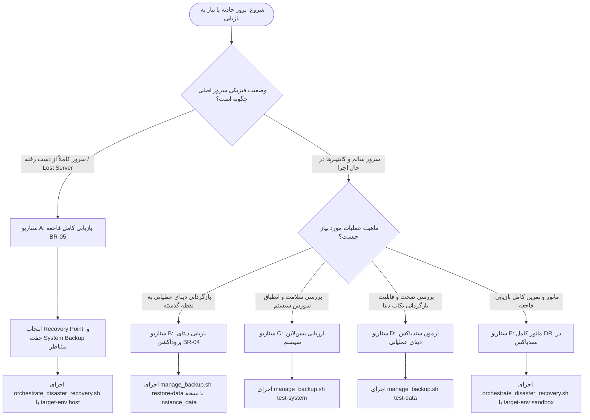

# راهنمای جامع عملیاتی پشتیبان‌گیری و بازیابی اطلاعات در شرایط بحران (Disaster Recovery SOP)
**سامانه آرشیو و بایگانی اسناد سازمانی • نگارش جامع بر مبنای استانداردهای BR-01 تا BR-05**

> [!IMPORTANT]
> **محدوده عملکرد این سند:**
> این سند، دستورالعمل استاندارد عملیاتی (SOP) راهبران ارشد سامانه در مواجهه با حوادث، بازگردانی داده‌های عملیاتی، و بازیابی کامل در شرایط فاجعه (Disaster Recovery) بر روی سرور جدید یا مفقودشده است.
> راهبر سامانه بر اساس این راهنما می‌تواند **بدون نیاز به تحلیل کد سورس**، نوع رخداد را تشخیص داده، بسته پشتیبان صحیح را انتخاب نماید و عملیات بازیابی را با اطمینان کامل به سرانجام برساند.

---

## ۱. درخت تصمیم‌گیری راهبر سامانه (Operator Decision Tree)

در هنگام بروز هرگونه اختلال، حادثه، آسیب به داده یا از دست رفتن سرور، راهبر سامانه **الزاماً** باید فرآیند را از درخت تصمیم‌گیری زیر آغاز نماید:

```text
                               ┌──────────────────────────────────────────────┐
                               │       آیا سرور فعلی سالم و در دسترس است؟      │
                               └──────────────────────┬───────────────────────┘
                                                      │
                       ┌──────────────────────────────┴──────────────────────────────┐
                       ▼ YES                                                         ▼ NO
       ┌────────────────────────────────────────┐                   ┌────────────────────────────────────────┐
       │ آیا فقط داده‌های عملیاتی دچار آسیب یا  │                   │ سرور اصلی به طور کامل از دست رفته است  │
       │ مغایرت شده‌اند؟                        │                   │ (Lost Server / Hardware / Host Down)   │
       └───────────────────┬────────────────────┘                   └───────────────────┬────────────────────┘
                           │                                                            │
              ┌────────────┴────────────┐                                               │
              ▼ YES                     ▼ NO                                            ▼
┌─────────────────────────────┐ ┌─────────────────────────────┐           ┌─────────────────────────────┐
│ سناریو B: بازگردانی داده    │ │ سناریو C یا D: اعتبارسنجی   │           │ سناریو A: بازیابی کامل فاجعه │
│ (Production Restore)        │ │ و تمرین پشتیبان             │           │ (Full Disaster Recovery)    │
│ فرآیند: BR-04               │ │ فرآیند: BR-01 / BR-03       │           │ فرآیند: BR-05               │
│ بکاپ: instance_data         │ │ بکاپ: system_only یا data   │           │ بکاپ: system_only           │
│ ابزار: manage_backup.sh     │ │ ابزار: test-system یا       │           │       + paired instance_data│
│        restore-data         │ │        test-data            │           │ ابزار: orchestrate_dr.sh    │
│ سرور: Production جاری       │ │ سرور: Sandbox ایزوله        │           │ سرور: New / Recovery Host   │
└─────────────────────────────┘ └─────────────────────────────┘           └─────────────────────────────┘
```

### نمودار تفصیلی جریان تصمیم‌گیری (Mermaid Workflow):



---

## ۲. ماتریس سناریوهای هفت‌گانه عملیاتی (Scenarios A through G)

| کد سناریو | عنوان رخداد / وضعیت عملیاتی | فرآیند حاکم | نوع نسخه پشتیبان مجاز | وضعیت سرور و محیط اجرا | خروجی نهایی مورد انتظار |
| :---: | :--- | :---: | :--- | :--- | :--- |
| **A** | **از دست رفتن کامل سرور (Lost Server)** | **BR-05** | `system_only` + `instance_data` متناظر | سرور جدید (Recovery Host) | `OPERATIONAL` |
| **B** | **بازگردانی دیتای عملیاتی روی سرور سالم** | **BR-04** | فقط `instance_data` | سرور پروداکشن جاری | `SUCCESS` |
| **C** | **بررسی صحت و تمامیت بیس‌لاین سیستم** | **BR-01** | فقط `system_only` | محیط جاری (بدون تغییر دیتا) | `SYSTEM_BASE_VALID` |
| **D** | **آزمون و اعتبارسنجی بکاپ دیتای عملیاتی** | **BR-03** | فقط `instance_data` | دیتابیس سندباکس موقت | `SANDBOX_VERIFIED` |
| **E** | **تمرین مانور بازیابی فاجعه (DR Drill)** | **BR-05** | جفت `system_only` + `instance_data` | سندباکس ایزوله (پورت ۸۰۸۵) | `DRILL_PASSED` |
| **F** | **انتخاب نقطه بازیابی (RPO Selection)** | **ممیزی** | مانیفست و هش نسخه‌های موجود | تحلیل متادیتا در بکاپ‌ها | تعیین $T_0$ منجمد |
| **G** | **آرشیو ترکیبی سازمانی (`full_instance`)** | **Legacy** | تک‌فایل `full_instance` | سرور خام / ابزار کلاسیک | بازسازی پایه سیستم |

---

## ۳. شرح دقیق سناریوها و دستورات خط فرمان اجرایی

### سناریوی A: از دست رفتن کامل سرور اصلی (Lost Server / Complete Server Loss — BR-05)
* **شرایط و شواهد رخداد:** سرور سخت‌افزاری اصلی سوخته، سرقت شده، یا مرکز داده به کلی غیرقابل دسترس است. یک سرور جدید (Recovery Host) با سیستم‌عامل تمیز لینوکس و داکر در اختیار است.
* **نسخه‌های پشتیبان مورد نیاز:**
  1. یک نسخه پشتیبان سیستم (`system_only`) که **الزاماً باید شامل آرتیفکت تغییرناپذیر `repository.bundle` گیت** باشد.
  2. یک نسخه پشتیبان داده‌های عملیاتی (`instance_data`) که الزاماً به نسخه سیستم فوق متصل و جفت (`paired`) باشد.
* **الزامات تغییرناپذیری ایمیج‌ها (Immutable Image Baseline):**
  - هویت کانتینرها در فایل Recovery Compose منحصراً باید از رفرنس دقیق و پین‌شده دایجست (`repository@sha256:<digest>`) تأمین شود.
  - استفاده از تگ‌های تغییرپذیر مانند `:latest` یا بیس‌لاین فقط-تگ اکیداً ممنوع بوده و با شکست فوری (Fail-Closed) متوقف می‌شود.
* **قوانین قطعی توقف و شکست امن (Fail-Closed Rules):**
  - **Missing exact baseline = Stop:** در صورت عدم دسترسی به `repository.bundle` یا مغایرت هش SHA-256 یا عدم تطابق کامیت گیت، عملیات بلافاصله متوقف می‌شود.
  - **Missing custom apps = Stop:** فایل `custom_apps.tar.gz` جزء اجزای الزامی بکاپ است؛ فقدان فایل، خطای استخراج یا عدم تطابق نسخه افزونه `archive_autotag` مستقیماً منجر به وضعیت `FAILED` می‌گردد (هیچ نادیده‌گرفتن یا `|| true` وجود ندارد).
  - **حذف کامل هرگونه Fallback به Working Tree:** هیچ مسیری در بازیابی عملیاتی مجاز به استفاده از فایل‌های دایرکتوری جاری هاست (`$PROJECT_DIR`) نیست و تمامی فایل‌ها (از جمله کانفیگ Nginx و کدهای برنامه) منحصراً از Git Baseline استخراج‌شده از bundle بازیابی می‌شوند.
* **نسخه‌های غیرمجاز:** هرگز از نسخه‌های سیستم تکی، دیتای جفت‌نشده، یا سوئیچ‌های تضعیف‌کننده استفاده نشود.
* **پیش‌شرط‌های اجرا:**
  - داکر و داکر کامپوز بر روی Recovery Host نصب باشد.
  - ایمیج‌های داکر با دایجست مشخص در مخزن محلی بارگذاری شده باشند.
* **دستور قطعی اجرا:**
  ```bash
  ./deploy/orchestrate_disaster_recovery.sh       --data-backup deploy/backups/backup_instance_data_20261003_182411_0f4c13fd02f0.tar.gz       --system-backup deploy/backups/backup_system_20261003_182403_2228c4d6a11f.tar.gz       --target-env host       --target-port 80       --requested-by "admin_soc"
  ```
* **خروجی‌های طبیعی در هر مرحله:**
  - مرحله ۱: `[STATE: PREPARED]` انجماد Recovery Set و بررسی SHA-256.
  - مرحله ۲: `[STATE: BACKUPS_VALIDATED]` تایید عدم وجود دیتای عملیاتی در بکاپ سیستم و عدم وجود فایل‌های سیستمی در بکاپ دیتا.
  - مرحله ۳: `[STATE: PAIRING_VALIDATED]` تایید برابری `system_backup_id` و کامیت گیت.
  - مرحله ۴: `[STATE: BASELINE_ACQUIRED]` استخراج دقیق کامیت گیت در دایرکتوری ایزوله و احراز هویت دایجست ایمیج‌های داکر.
  - مرحله ۵: `[STATE: RECOVERY_TARGET_CREATED]` استقرار کانتینرهای ایزوله و بازگردانی کلیدهای رمزنگاری (`instanceid`, `passwordsalt`, `secret`).
  - مرحله ۶: `[STATE: SYSTEM_GATE_PASS]` عبور از گیت سیستم (تایید هویت بدون حضور دیتای زودرس).
  - مرحله ۷: `[STATE: DATA_RESTORED]` ایمپورت کامل دیتابیس با `ON_ERROR_STOP=1` و فایل‌های کاربران از طریق Shared Restore Core.
  - مرحله ۸: `[STATE: STRUCTURAL_VALIDATION_PASS]` ممیزی دوطرفه DB <-> Files.
  - مرحله ۹: `[STATE: FUNCTIONAL_VALIDATION_PASS]` اعتبارسنجی احراز هویت، جستجوی اسناد، تگ‌ها و دسترسی‌ها.
  - مرحله ۱۰: `[STATE: NETWORK_DISCONNECTED]` قطع فیزیکی Egress اینترنت و آزمون مسدودی شبکه خارج.
  - مرحله ۱۱: `[STATE: FINAL_HEALTH_PASS]` موفقیت ۱۰۰ درصدی آزمون سلامت و خروج از حالت تعمیرات.
  - مرحله ۱۲: `[STATE: OPERATIONAL]` ثبت لاگ ممیزی و اعلام سامانه به عنوان کاملاً عملیاتی.
* **نحوه تایید نهایی:**
  ```bash
  ./deploy/check_health.sh
  tail -n 1 deploy/backups/disaster_recovery_audit.jsonl | jq .
  ```
* **اقدامات در صورت بروز خطا:** در صورت مواجهه با `[FATAL ERROR]`:
  1. به پیام ثبت‌شده در خط فرمان و لاگ `deploy/backups/disaster_recovery_audit.jsonl` رجوع کنید.
  2. علت شکست (مثلاً عدم تطابق چک‌سام، مغایرت نسخه یا خرابی فایل) را برطرف نمایید.
  3. به هیچ وجه سرور اصلی قبلی را Rollback نکنید.
  4. پس از اصلاح فایل یا پارامتر، عملیات را مجدداً آغاز فرمایید.

---

### سناریوی B: بازگردانی دیتای عملیاتی روی سرور سالم (Production Instance Data Restore — BR-04)
* **شرایط و شواهد رخداد:** سرور کاملاً سالم و آنلاین است اما پایگاه داده آسیب دیده، داده‌های اشتباه توسط کاربر وارد شده یا حمله باج‌افزاری به پوشه اسناد رخ داده و باید سیستم به یک ساعت یا روز قبل بازگردد.
* **نسخه پشتیبان مورد نیاز:** صرفاً یک فایل `instance_data` معتبر (`backup_instance_data_*.tar.gz`).
* **نسخه‌های غیرمجاز:** استفاده از بکاپ `system_only` در این فرآیند **اکیداً ممنوع و از نظر ساختاری مردود (Fail-Closed)** است.
* **پیش‌شرط‌های اجرا:** سرور در وضعیت Healthy باشد، فایل `.env` حاضر باشد.
* **دستور قطعی اجرا:**
  ```bash
  # اجرا با تعیین صریح نسخه
  ./deploy/manage_backup.sh restore-data deploy/backups/backup_instance_data_20261003_182411_0f4c13fd02f0.tar.gz

  # یا اجرای مستقیم اسکریپت هسته با احراز هویت درخواست‌کننده
  RESTORE_REQUESTED_BY="operator_ali" ./deploy/restore_instance_data.sh deploy/backups/backup_instance_data_20261003_182411_0f4c13fd02f0.tar.gz
  ```
* **رفتار امنیتی Pre-Restore Safety Backup:**
  پیش از اعمال هرگونه تغییر یا فعال‌سازی Maintenance Mode، سیستم به صورت کاملاً خودکار یک پیش‌پشتیبان ایمنی تحت عنوان `backup_instance_data_pre_restore_*.tar.gz` تهیه و اعتبارسنجی می‌کند تا در صورت بروز هرگونه قطعی برق یا شکست در حین ایمپورت، امکان بازگشت کامل به وضعیت پیش از شروع عملیات میسر باشد.

---

### سناریوی C: بررسی صحت و تمامیت بیس‌لاین سیستم (System Baseline Validation — BR-01)
* **شرایط و کاربرد:** اطمینان از سلامت پکیج نرم‌افزاری، کلیدهای هویتی و تنظیمات نکست‌کلاد بدون اعمال هیچ‌گونه دستکاری در پایگاه داده یا فایل‌های کاربران.
* **دستور قطعی اجرا:**
  ```bash
  ./deploy/manage_backup.sh test-system deploy/backups/latest_system_backup.tar.gz
  ```
* **خروجی مورد انتظار:** بررسی صحت امضای دیجیتال SHA-256، حضور فایل‌های `config.tar.gz`، `config_keys.json`، `software_info.json` و ثبت گزارش موفقیت در لاگ.

---

### سناریوی D: آزمون و اعتبارسنجی دیتای عملیاتی در سندباکس (Instance Data Sandbox Test — BR-03)
* **شرایط و کاربرد:** ممیزی ادواری و اطمینان از قابلیت Restore شدن بکاپ دیتابیس بدون وقفه در کارکرد سامانه عملیاتی و بدون قطعی کاربران.
* **دستور قطعی اجرا:**
  ```bash
  ./deploy/manage_backup.sh test-data deploy/backups/latest_instance_data_backup.tar.gz
  ```
* **رفتار سیستم:** ایجاد یک پایگاه داده موقت و ایزوله در PostgreSQL با نام `nextcloud_restore_sandbox_$$`، ایمپورت کامل ساختار با `ON_ERROR_STOP=1`، ارزیابی تعداد رکوردهای اسناد و متادیتا، و سپس حذف کامل دیتابیس سندباکس. سامانه اصلی ۱۰۰٪ بدون تغییر باقی می‌ماند.

---

### سناریوی E: تمرین و مانور کامل Disaster Recovery در محیط ایزوله (DR Sandbox Drill)
* **شرایط و کاربرد:** برگزاری مانور بحران دوره‌ای سازمان جهت محاسبه RTO واقعی و ارزیابی آمادگی تیم عملیات بدون کوچک‌ترین اثرگذاری بر سامانه فعال پروداکشن.
* **دستور قطعی اجرا:**
  ```bash
  ./deploy/orchestrate_disaster_recovery.sh       --data-backup deploy/backups/latest_instance_data_backup.tar.gz       --target-env sandbox       --target-port 8085
  ```
* **تفاوت کلیدی معنایی با وضعیت عملیاتی:**
  - در پایان مانور سندباکس، وضعیت نهایی ثبت‌شده برابر **`DRILL_PASSED`** است (هرگز ادعای کاذب `OPERATIONAL` برای یک محیط موقت آزمایشی ثبت نمی‌شود).
  - کلیه کانتینرها و منابع شبکه موقت پس از اتمام آزمون به طور خودکار پاکسازی (Cleanup) می‌گردند.
  - ابزار `fingerprint_production.sh` ثبات و دست‌نخوردگی سامانه اصلی پروداکشن را تایید می‌کند.

---

### سناریوی F: نحوه انتخاب نقطه بازیابی (RPO Resolution Procedure)
هنگامی که چند نسخه پشتیبان در پوشه `deploy/backups/` موجود است، راهبر موظف است بر اساس گام‌های زیر نقطه بازیابی بهینه ($T_0$) را استخراج نماید:

1. **مشاهده فهرست نسخه‌ها به همراه تاریخ و Recovery Point:**
   ```bash
   ./deploy/manage_backup.sh list
   ```
2. **استخراج مانیفست نسخه مورد نظر:**
   ```bash
   tar -xzf deploy/backups/backup_instance_data_20261003_182411_0f4c13fd02f0.tar.gz -O manifest.json | jq .
   ```
3. **مشاهده شناسه جفت سیستمی متناظر:**
   درون خروجی، بخش `system_baseline.system_backup_id` و `system_baseline.git_commit` را یادداشت فرمایید:
   ```json
   "system_baseline": {
     "system_backup_id": "bk-sys-20261003_182403-2228c4d6a11f",
     "git_commit": "bb7695a60557f413402824281b8d9105b7d8b91b"
   }
   ```
4. **بررسی صحت امضای دیجیتال فایل‌های جفت‌شده:**
   ```bash
   sha256sum -c deploy/backups/backup_instance_data_20261003_182411_0f4c13fd02f0.tar.gz.sha256
   sha256sum -c deploy/backups/backup_system_20261003_182403_2228c4d6a11f.tar.gz.sha256
   ```
5. **شروع عملیات با مشخص کردن هر دو فایل در دستور.**

---

### سناریوی G: بسته پشتیبان ترکیبی جامع (`full_instance`)
* **تعریف:** بسته سنتی و تجمیعی سامانه که تمامی لایه‌های دیتابیس، فایل‌های کاربران، تنظیمات هسته، برنامه‌های جانبی و کلیدهای هویتی را در یک فایل واحد فشرده ذخیره می‌کند.
* **تفاوت ساختاری با BR-01 و BR-02:**
  - در معماری مدرن BR-01/02، لایه نرم‌افزار و تنظیمات از لایه داده‌های متغیر تفکیک شده تا حجم بکاپ‌های مداوم کاهش یافته و اتصال مستقیم به Git Commit تضمین شود.
  - بسته `full_instance` خوداتکا (Self-Contained) بوده و برای سناریوهایی که دسترسی به مخزن گیت مقدور نیست یا استقرار کاملاً یکپارچه مدنظر است کاربرد دارد.
* **دستور ایجاد و بازیابی:**
  ```bash
  # ایجاد بسته جامع
  ./deploy/manage_backup.sh run

  # آزمون در سندباکس
  ./deploy/manage_backup.sh test
  ```

---

## ۴. سیاست تفکیک شبکه و الزامات پدافند غیرعامل (Air-Gap & Isolation Policy)

مطابق سیاست‌های امنیتی سازمان:
1. **وضعیت عملیاتی عادی (Normal Runtime):** کلیه ارتباطات سامانه با اینترنت خارجی الزاماً قطع است (`Air-Gapped`).
2. **پنجره بازیابی (Recovery Window):** دسترسی موقت به اینترنت صرفاً در صورت نیاز جهت دریافت یا اعتبارسنجی ایمیج‌های داکر باز شده و زمان شروع و پایان آن در لاگ ممیزی ثبت می‌شود.
3. **قطع پس از بازیابی (Post-Recovery Disconnect Gate):** ارکستراتور پیش از اعلام وضعیت عملیاتی، در گیت `NETWORK_DISCONNECTED` مسیر خروجی پیش‌فرض (Default Gateway) را از کانتینرهای بازیابی حذف کرده و با ارسال پروب واقعی به آی‌پی‌های خارجی اطمینان حاصل می‌کند که هیچ ارتباطی به خارج برقرار نیست.
4. **قانون غیرقابل مذاکره:** استفاده از سوئیچ `--skip-internet-gate` در بازیابی عملیاتی واقعی (Host Environment) **اکیداً ممنوع** است و تنها برای تست‌های لوکال بدون کارت شبکه در نظر گرفته شده است.

---

## ۵. راهنمای گام‌به‌گام ممیزی و بازرسی پس از بازیابی (Post-Recovery Audit)

پس از اعلام موفقیت عملیات، راهبر سامانه اقدامات کنترلی زیر را به ترتیب انجام می‌دهد:

1. **بررسی لاگ ممیزی و تایید عدم افشای رمزها:**
   ```bash
   tail -n 1 deploy/backups/disaster_recovery_audit.jsonl | jq .
   ```
   *باید اطمینان حاصل شود فیلد `final_result` برابر `SUCCESS`، وضعیت `failure_reason` خالی، و مقادیر کلمات عبور به صورت `[REDACTED]` باشند.*

2. **بررسی عدم دستکاری سامانه پروداکشن (DR-18 Verification):**
   ```bash
   ./deploy/fingerprint_production.sh verify /tmp/prod_fp_before_*.json /tmp/prod_fp_after_*.json
   ```
   *باید پیام `Zero modification confirmed` مشاهده گردد.*

3. **آزمون ورود کاربر واقعی و رد رمز عبور اشتباه:**
   - ورود با کاربر `admin` و رمز عبور معتبر قبل از بحران باید موفق باشد.
   - ورود با هرگونه رمز اشتباه باید خطای `401 Unauthorized` دریافت نماید.

4. **تأیید بازیابی متادیتا و اسناد به خط فارسی:**
   - اسناد دارای شماره سند و عناوین فارسی در پورتال یا از طریق جستجو قابل بازیابی و مشاهده باشند.

---

## ۶. فهرست کارهایی که راهبر هرگز نباید انجام دهد (Never-Do List)

> [!CAUTION]
> **اقدامات اکیداً ممنوع برای راهبر سامانه:**
> 1. **هرگز** از نسخه `latest_system_backup.tar.gz` به عنوان حدس یا جایگزین پشتیبان جفت‌شده در بازیابی بحران استفاده نکنید.
> 2. **هرگز** دستورات گیت شامل `git reset --hard`، `git clean -fd` یا `git checkout` مخرب را بر روی سرور اجرا نکنید.
> 3. **هرگز** فایل‌های با پسوند `.sha256` را به صورت دستی دستکاری یا تولید مجدد نکنید مگر این‌که فرآیند قانونی تایید هش طی شده باشد.
> 4. **هرگز** بکاپ دیتای یک شاخه یا نسخه نرم‌افزاری متفاوت را بر روی سیستمی با نسخه دیگر بازگردانی نکنید (مخالفت با اصل Baseline Compatibility).
> 5. **هرگز** در هنگام وقوع خطا در دیتابیس، سوئیچ‌های نادیده‌گیرنده خطا مانند `|| true` یا حذف `ON_ERROR_STOP=1` را به کار نگیرید.
> 6. **هرگز** کانتینرهای پروداکشن فعال را پیش از اطمینان از آمادگی کامل سرور Recovery متوقف یا حذف نکنید.
