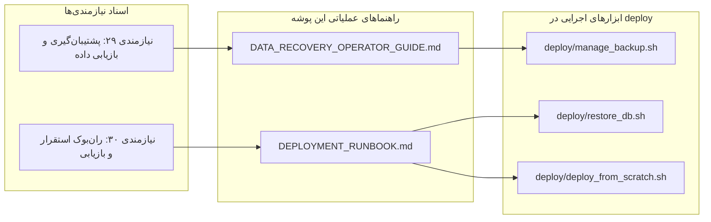

# مستندات و راهنماهای عملیاتی پشتیبان‌گیری و بازیابی سامانه
**سامانه بایگانی اسناد سازمانی بانک مسکن • نگارش v2.9.0**

این پوشه شامل کلیه راهنماهای فنی، اجرایی و عملیاتی استاندارد (SOP) مرتبط با چرخه حیات داده، پشتیبان‌گیری و بازیابی اطلاعات در سناریوهای بحران و استقرار است:

---

## فهرست مستندات مرجع این بخش

| سند عملیاتی | موضوع و محدوده عملکرد | مخاطبان هدف | پیوند مستقیم |
| :--- | :--- | :--- | :---: |
| **راهنمای جامع بازیابی اطلاعات در بحران (Disaster Recovery SOP)** | دستورالعمل گام‌به‌گام بازیابی اطلاعات سامانه فعال از نسخه‌های پشتیبان معتبر با ابزار وب و ترمینال (`manage_backup.sh restore`) | مدیران سیستم (SysAdmins) و اپراتورهای ارشد | [DATA_RECOVERY_OPERATOR_GUIDE.md](DATA_RECOVERY_OPERATOR_GUIDE.md) |
| **ران‌بوک جامع استقرار و بازیابی در سرور جدید (System Deployment & Recovery)** | دستورالعمل بازتولید کل سامانه روی سرور جدید (سناریوی A: بازسازی سامانه + ریستور داده‌های قبلی / سناریوی B: استقرار از صفر) | کارشناسان DevOps و مهندسان زیرساخت | [DEPLOYMENT_RUNBOOK.md](DEPLOYMENT_RUNBOOK.md) |

---

## ارتباط با نیازمندی‌های مصوب و ابزارهای اجرایی

---

## خط‌مشی اسناد زنده (Living Documentation Policy)
تمامی اسناد این پوشه به صورت کاملاً همگام با اسکریپت‌های اجرایی پوشه `deploy/` نگهداری می‌شوند. هرگونه تغییر در متغیرهای محیطی، سیاست‌های نگهداری (Retention) یا نسخه‌های کانتینرها مستلزم به‌روزرسانی آنی این اسناد است.
