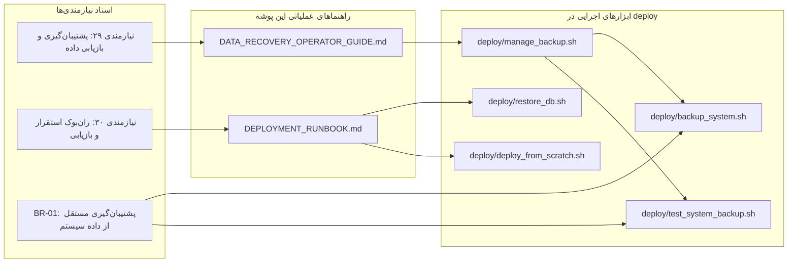

# مستندات و راهنماهای عملیاتی پشتیبان‌گیری و بازیابی سامانه
**سامانه بایگانی اسناد سازمانی بانک مسکن • نگارش v2.9.0**

این پوشه شامل کلیه راهنماهای فنی، اجرایی و عملیاتی استاندارد (SOP) مرتبط با چرخه حیات داده، پشتیبان‌گیری و بازیابی اطلاعات در سناریوهای بحران و استقرار است:

---

## تفکیک بنیادین سطوح پشتیبان‌گیری (Backup Tiers)

در معماری جدید سامانه، پشتیبان‌گیری به سطوح کاملاً تفکیک‌شده طبقه‌بندی شده است:

```text
┌────────────────────────────────────────────────────────────────────────────────────────┐
│                              سطوح پشتیبان‌گیری در سامانه                               │
├──────────────────────────┬─────────────────────────────────────────────────────────────┤
│ پشتیبان سیستم             │ Software State + Required Configuration + Identity Keys     │
│ (system_only - BR-01)    │ • سورس‌کد، کامیت گیت، داکر و کانفیگ لبه وب Nginx           │
│                          │ • تنظیمات هسته (config.php) و کلیدهای هویتی (salt, secret) │
│                          │ • اکیداً فاقد داده دیتابیس و اسناد کاربران (حجم ~250KB)    │
├──────────────────────────┼─────────────────────────────────────────────────────────────┤
│ پشتیبان داده‌های سازمانی │ Operational Database + User Data + Instance State           │
│ (instance_data - BR-02)  │ • کل دیتابیس اتمیک PostgreSQL + اسناد کاربران (data.tar.gz) │
│                          │ • اتصال شفاف به System Baseline (شناسه و کامیت سیستم مرجع) │
│                          │ • فاقد تکرار کدهای برنامه و کانفیگ سیستم (عدم ذخیره مجدد) │
├──────────────────────────┼─────────────────────────────────────────────────────────────┤
│ پشتیبان جامع سازمانی     │ Legacy/Compatibility Package (Combined Disaster Recovery)   │
│ (full_instance)          │ • بسته ترکیبی تک‌فایلی شامل دیتابیس، اسناد، کدهای سفارشی و   │
│                          │   کانفیگ کل سیستم جهت سازگاری و ریکاوری یکپارچه گذشته        │
└──────────────────────────┴─────────────────────────────────────────────────────────────┘
```

### معماری نهایی تفکیک پشتیبان و چرخه بازیابی (DR Architecture)

```text
       ┌────────────────────────┐
       │     System Backup      │  (Software + Required Config + Identity Keys)
       │    (system_only)       │  ID: SYS-123 | Git: ABCDEF
       └───────────┬────────────┘
                   │
                   ▼ (System Baseline Binding Reference)
       ┌────────────────────────┐
       │  Instance Data Backup  │  (PostgreSQL Database Dump + User Data Files)
       │    (instance_data)     │  ID: DATA-456 | Baseline Ref: SYS-123
       └───────────┬────────────┘  Recovery Point: 2026-10-02T15:00
                   │
                   ▼
       ┌────────────────────────┐
       │   Disaster Recovery    │  قابلیت کامل بازگردانی سامانه بر پایه
       │   (BR-03 Roadmap)      │  System Baseline منطبق + Instance Data Point
       └────────────────────────┘
```

---

## فهرست مستندات مرجع این بخش

| سند عملیاتی | موضوع و محدوده عملکرد | مخاطبان هدف | پیوند مستقیم |
| :--- | :--- | :--- | :---: |
| **راهنمای جامع بازیابی اطلاعات در بحران (Disaster Recovery SOP)** | دستورالعمل گام‌به‌گام پشتیبان‌گیری و بازیابی (شامل System Backup و Full Instance) با ابزار وب و ترمینال (`manage_backup.sh`) | مدیران سیستم (SysAdmins) و اپراتورهای ارشد | [DATA_RECOVERY_OPERATOR_GUIDE.md](DATA_RECOVERY_OPERATOR_GUIDE.md) |
| **ران‌بوک جامع استقرار و بازیابی در سرور جدید (System Deployment & Recovery)** | دستورالعمل بازتولید کل سامانه روی سرور جدید (سناریوی A: بازسازی سامانه + ریستور / سناریوی B: استقرار از صفر) | کارشناسان DevOps و مهندسان زیرساخت | [DEPLOYMENT_RUNBOOK.md](DEPLOYMENT_RUNBOOK.md) |

---

## ارتباط با نیازمندی‌های مصوب و ابزارهای اجرایی


```mermaid
graph LR
    subgraph Requirements [اسناد نیازمندی‌ها]
        R29[نیازمندی ۲۹: پشتیبان‌گیری و بازیابی داده]
        R30[نیازمندی ۳۰: ران‌بوک استقرار و بازیابی]
        BR01[BR-01: پشتیبان‌گیری مستقل از داده سیستم]
    end

    subgraph SOPs [راهنماهای عملیاتی این پوشه]
        DRG[DATA_RECOVERY_OPERATOR_GUIDE.md]
        RUN[DEPLOYMENT_RUNBOOK.md]
    end

    subgraph Executables [ابزارهای اجرایی در deploy]
        MB[deploy/manage_backup.sh]
        BS[deploy/backup_system.sh]
        TS[deploy/test_system_backup.sh]
        RST[deploy/restore_db.sh]
        DPS[deploy/deploy_from_scratch.sh]
    end

    R29 --> DRG
    R30 --> RUN
    BR01 --> BS
    BR01 --> TS
    DRG --> MB
    RUN --> RST
    RUN --> DPS
    MB --> BS
    MB --> TS
```

---

## خط‌مشی اسناد زنده (Living Documentation Policy)
تمامی اسناد این پوشه به صورت کاملاً همگام با اسکریپت‌های اجرایی پوشه `deploy/` نگهداری می‌شوند. هرگونه تغییر در متغیرهای محیطی، سیاست‌های نگهداری (Retention) یا نسخه‌های کانتینرها مستلزم به‌روزرسانی آنی این اسناد است.
