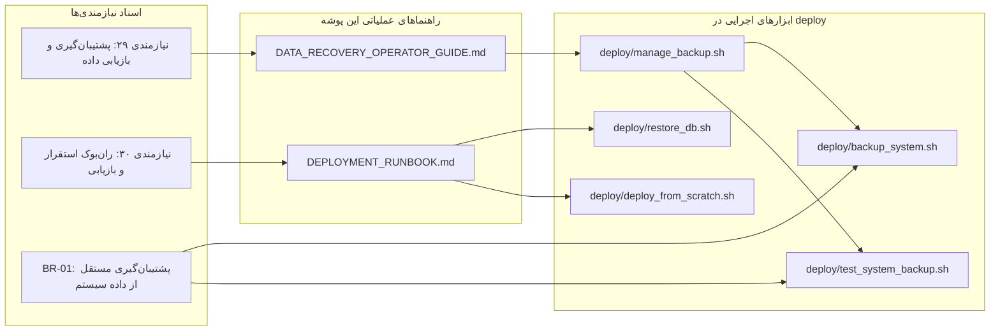

# مستندات و راهنماهای عملیاتی پشتیبان‌گیری و بازیابی سامانه
**سامانه بایگانی اسناد سازمانی بانک مسکن • نگارش v2.9.0**

این پوشه شامل کلیه راهنماهای فنی، اجرایی و عملیاتی استاندارد (SOP) مرتبط با چرخه حیات داده، پشتیبان‌گیری و بازیابی اطلاعات در سناریوهای بحران و استقرار است:

---

## تفکیک بنیادین سطوح پشتیبان‌گیری (Backup Tiers)

در معماری جدید سامانه، پشتیبان‌گیری به سطوح کاملاً تفکیک‌شده طبقه‌بندی شده است:

```text
┌────────────────────────────────────────────────────────────────────────────────────────┐
│                              سطوح پشتیبان‌گیری در سامانه                               │
├──────────────────────────┬─────────────────────────────────────────────────────────────┤
│ پشتیبان سیستم             │ Software State + Required Configuration + Identity Keys     │
│ (system_only - BR-01)    │ • سورس‌کد، کامیت گیت، داکر و کانفیگ لبه وب Nginx           │
│                          │ • تنظیمات هسته (config.php) و کلیدهای هویتی (salt, secret) │
│                          │ • اکیداً فاقد داده دیتابیس و اسناد کاربران (حجم ~250KB)    │
├──────────────────────────┼─────────────────────────────────────────────────────────────┤
│ پشتیبان داده‌های سازمانی │ Operational Database + User Data + Instance State           │
│ (instance_data - BR-02)  │ • کل دیتابیس اتمیک PostgreSQL + اسناد کاربران (data.tar.gz) │
│                          │ • اتصال شفاف به System Baseline (شناسه و کامیت سیستم مرجع) │
│                          │ • فاقد تکرار کدهای برنامه و کانفیگ سیستم (عدم ذخیره مجدد) │
├──────────────────────────┼─────────────────────────────────────────────────────────────┤
│ پشتیبان جامع سازمانی     │ Legacy/Compatibility Package (Combined Disaster Recovery)   │
│ (full_instance)          │ • بسته ترکیبی تک‌فایلی شامل دیتابیس، اسناد، کدهای سفارشی و   │
│                          │   کانفیگ کل سیستم جهت سازگاری و ریکاوری یکپارچه گذشته        │
└──────────────────────────┴─────────────────────────────────────────────────────────────┘
```

### معماری نهایی تفکیک پشتیبان و نقشه راه چرخه بازیابی (Backup & Recovery Roadmap)

سامانه چرخه استاندارد پنج‌مرحله‌ای زیر را برای تفکیک پشتیبان و بازیابی تعریف و پیاده‌سازی می‌کند:

```text
┌────────────────────────────────────────────────────────────────────────────────────────┐
│                              نقشه راه تفکیک و بازیابی (BR Roadmap)                     │
├──────────────────────────┬─────────────────────────────────────────────────────────────┤
│ BR-01: System Backup     │ تهیه پشتیبان مستقل از نرم‌افزار، کانفیگ، داکر و کلیدهای هویت │
│ (system_only - پیاده‌شده) │ بدون داده عملیاتی، ایجاد System Baseline مرجع               │
├──────────────────────────┼─────────────────────────────────────────────────────────────┤
│ BR-02: Instance Data     │ تهیه پشتیبان اتمیک از پایگاه داده و فایل‌های کاربری         │
│ (instance_data - پیاده‌شده)│ متصل به System Baseline، فاقد تکرار سورس و کانفیگ سیستمی   │
├──────────────────────────┼─────────────────────────────────────────────────────────────┤
│ BR-03: Sandbox Restore   │ بازسازی و آزمون بازیابی واقعی دیتابیس و فایل‌های کاربری در  │
│ (آزمون ایزوله - پیاده‌شده)│ محیط کاملاً ایزوله PostgreSQL موقت و ممیزی انطباق دوطرفه   │
│                          │ DB ↔ Filesystem بدون هیچ‌گونه دستکاری یا داون‌تایم پروداکشن │
├──────────────────────────┼─────────────────────────────────────────────────────────────┤
│ BR-04: Production Restore│ بازگردانی داده‌های عملیاتی روی سامانه سالم (Live Data Restore)│
│ (مقاوم‌سازی‌شده - Hardened) │ احیای دیتابیس و فایل‌ها به یک Recovery Point با حفظ کانفیگ   │
│                          │ مجهز به Pre-Restore Safety Backup خودکار و ممیزی DB ↔ Files │
│                          │ گیت‌های امنیتی Fail-Closed: Maintenance، Health Gate و CSRF │
├──────────────────────────┼─────────────────────────────────────────────────────────────┤
│ BR-05: Full DR on Lost   │ بازسازی و ریکاوری جامع فاجعه روی سرور جدید یا نابودشده      │
│ (پیاده‌سازی‌شده - COMPLETED)│ احیای کامل کانتینرها، هویت رمزنگاری، دیتابیس و فایل‌های کاربری │
│                          │ مجهز به زنجیره ۱۰ مرحله‌ای، گیت قطعی Air-Gap، RTO: 28s و ۱۸ DR Fail-Closed│
└──────────────────────────┴─────────────────────────────────────────────────────────────┘
```

```text
       ┌────────────────────────┐
       │     System Backup      │  (BR-01: Software + Config + Identity Keys)
       │    (system_only)       │  ID: SYS-123 | Git: ABCDEF
       └───────────┬────────────┘
                   │
                   ▼ (System Baseline Binding Reference)
       ┌────────────────────────┐
       │  Instance Data Backup  │  (BR-02: PostgreSQL Database Dump + User Data Files)
       │    (instance_data)     │  ID: DATA-456 | Baseline Ref: SYS-123
       └───────────┬────────────┘  Recovery Point: 2026-10-02T15:00
                   │
         ┌─────────┴──────────────────────────┐
         ▼                                    ▼
┌────────────────────────┐         ┌────────────────────────┐
│ Sandbox Restore Verify │         │   Production Restore   │
│  (BR-03: پیاده‌سازی‌شده) │         │  (BR-04: پیاده‌سازی‌شده) │
│ دیتابیس و فایل موقت     │         │ بازنشانی داده روی سرور │
│ انطباق دوطرفه DB↔Files │         │ حفظ کامل نرم‌افزار/کانفیگ│
│ صفر اثر بر پروداکشن     │         │ سپر Pre-Restore Safety │
└────────────────────────┘         └──────────┬─────────────┘
                                              │
                                              ▼ (موتور بازیابی recover_lost_server.sh)
                                   ┌────────────────────────┐
                                   │ Full Disaster Recovery │
                                   │ (BR-05: سرور نابودشده) │
                                   │ [وضعیت: COMPLETED/PASS]│
                                   └────────────────────────┘
```

---

### مشخصات مقاوم‌سازی نهایی و گیت‌های ایمنی BR-04 (BR-04 Final Hardening Specification)

موتور بازیابی داده‌های سازمانی بر روی سامانه سالم (BR-04) مجهز به ۸ لایه حفاظتی Fail-Closed است:

1. **گیت ایمنی فعال‌سازی Maintenance Mode (Fail-Closed Maintenance ON):**
   - پیش از هرگونه دستکاری دیتابیس یا فایل‌ها، دستور `occ maintenance:mode --on` اجرا شده و وضعیت حقیقی سامانه با `occ status` اعتبارسنجی می‌شود (`maintenance: true`).
   - در صورت عدم موفقیت ورود به Maintenance Mode، عملیات فوراً لغو، وضعیت `FAILED` ثبت، لاگ ممیزی مستند و پیش‌پشتیبان امنیتی دست‌نخورده حفظ می‌گردد. هیچ عملیات مخربی آغاز نخواهد شد.

2. **آماده‌سازی بدون مسامحه پایگاه داده (Fail-Closed Database Preparation):**
   - حذف کامل هرگونه مسامحه (`|| true`) از عملیات قطع اتصالات (`ALTER DATABASE ... ALLOW_CONNECTIONS false`) و خاتمه‌بخشی نشست‌های فعال (`SELECT pg_terminate_backend(...)`).
   - در صورت شکست هر یک از این عملیات، عملیات بازسازی مخرب دیتابیس (`DROP DATABASE`) اکیداً ادامه نیافته، بازیابی متوقف، وضعیت `FAILED` ثبت و پیش‌پشتیبان امنیتی بدون دستکاری حفظ می‌شود.

3. **حذف قطعی پسوردهای پیش‌فرض و Fallback (Zero Credential Fallback):**
   - هیچ‌گونه Credential پیش‌فرض یا hardcoded در اسکریپت وجود ندارد. مقادیر `POSTGRES_DB`، `POSTGRES_USER` و `POSTGRES_PASSWORD` صرفاً از فایل امن `.env` استخراج می‌شوند.
   - در صورت فقدان یا خالی بودن هر یک از متغیرهای احراز هویت، عملیات پیش از شروع متوقف می‌شود. رمزهای عبور هرگز در گیت، مانیفست، فایل وضعیت یا لاگ ممیزی ثبت نمی‌شوند.

4. **ثبت شناسه واقعی درخواست‌کننده و حذف کامل Fallback مصنوعی (Real Requester Identity - No Synthetic Admin):**
   - شناسه حقیقی کاربر مدیر ارشد از لایه رابط کاربری وب (`AdminBackupController` با متد هویتی کاربر جاری Nextcloud UID) یا خط فرمان CLI (`$SUDO_USER` / `$USER`) بدون تغییر تا موتور بازیابی و لاگ ممیزی `deploy/backups/restore_audit.jsonl` منتقل می‌شود.
   - جایگزینی مصنوعی هویت با `admin` یا fallback پیش‌فرض اکیداً حذف گردیده است. اگر هویت درخواست‌کننده در دسترس نباشد، سیستم Fail-Closed شده و بازیابی آغاز نمی‌شود (`Restore NOT STARTED`, `Audit = FAILED`, reason: `requester identity unavailable`).

5. **مقاوم‌سازی مجوزهای فایل وضعیت (Status File Hardening - Non World-Writable):**
   - فایل‌های وضعیت سامانه (`deploy/backups/.backup_status.json` و `/tmp/archive_backup_status.json`) دیگر world-writable نیستند (`chmod 0660` با مالکیت گروه `www-data`).
   - امنیت فایل وضعیت و صف فرمان تضمین شده و کاربران غیرمجاز سیستم‌عامل امکان دستکاری آن را ندارند؛ در عین حال دیمن پس‌زمینه و برنامه وب به صورت کاملاً مجاز دسترسی خواندن و به‌روزرسانی دارند.

6. **دروازه قطعی ارزیابی سلامت پیش از خروج از Maintenance Mode (Strict Health Gate BEFORE Maintenance OFF):**
   - ترتیب قطعی فرآیند بازیابی:
     ```text
     DB Restore → DB Validation → Data Restore → Filesystem Validation → DB ↔ Files Validation → Session Handling → Health Check → Maintenance OFF → Verify Maintenance OFF → Audit SUCCESS → Final SUCCESS
     ```
   - تا زمانی که ارزیابی سلامت (`deploy/check_health.sh`) با موفقیت قطعی (`PASS`) تکمیل نشده باشد، وضعیت Maintenance Mode **اکیداً باید روشن (ON) باقی بماند**.
   - در صورت شکست ارزیابی سلامت: بازیابی `FAILED`، لاگ ممیزی `FAILED`، وضعیت `FAILED`، حالت تعمیرات روشن (`Maintenance = ON`) و پیش‌پشتیبان امنیتی حفظ می‌گردد؛ و دستور `Maintenance OFF` به هیچ وجه اجرا نمی‌شود.

7. **اعتبارسنجی قطعی خروج از Maintenance Mode (Verified Maintenance OFF):**
   - منحصراً پس از احراز کامل سلامت سامانه، خروج از حالت تعمیرات (`occ maintenance:mode --off`) اجرا شده و وضعیت با استعلام مستقل `occ status` جهت احراز `maintenance: false` اعتبارسنجی می‌گردد.
   - در صورت شکست خروج، عملیات `FAILED` تلقی شده و هشدارهای لازم ثبت می‌گردد.

8. **حفاظت ضد CSRF و اعتبارسنجی توکن درخواست (CSRF & Request Token Audit):**
   - کلیه متدهای حساس و تغییردهنده وضعیت (`runBackup`, `runRestore`, `runTest`, `saveConfig`) در `AdminBackupController` مجهز به اعتبارسنجی توکن امنیتی Nextcloud CSRF (`CsrfTokenManager`) هستند و درخواست‌های تغییر وضعیت بدون توکن معتبر با خطای ۴۰۳ ریجکت می‌شوند.

> [!IMPORTANT]
> **وضعیت نیازمندی BR-05 (Full Disaster Recovery on Lost Server): پیاده‌سازی و اعتبارسنجی کامل (Status: COMPLETED / PASS)**  
> سامانه مجهز به موتور اختصاصی `deploy/recover_lost_server.sh` و دستور خط فرمان `deploy/manage_backup.sh recover` بوده و کلیه مراحل ۱۰ گانه ریکاوری فاجعه، ۱۸ سناریوی تزریق خرابی (DR-01 تا DR-18)، گیت قطع اینترنت Air-Gap و سنجه‌های RTO/RPO به طور ۱۰۰٪ تأیید شده‌اند.

### مشخصات و دستاوردهای معماری BR-05:
1. **تمایز شفاف بین سه سناریوی استقرار و بازیابی:**
   - **نصب خام اولیه (Clean OS Fresh Install):** راه‌اندازی نو سامانه بدون بکاپ، تولید کلیدها و سالت‌های جدید و دیتابیس اولیه خالی.
   - **بازیابی روی پروداکشن سالم (Production Restore - BR-04):** بازگردانی داده‌های عملیاتی روی سرور فعال، بدون دستکاری کدهای سیستم یا نرم‌افزار، همراه با پشتیبان امنیتی پیش از بازیابی.
   - **بازیابی کامل در فاجعه سرور از دست رفته (Lost Server DR - BR-05):** بازسازی یکپارچه سرور جدید از صفر مطلق با ترکیب دترمینستیک `system_only` (نرم‌افزار، کانفیگ، کلیدهای رمزنگاری) و `instance_data` (دیتابیس، فایل‌ها).
2. **اتصال ساختاری جفت پشتیبان (Backup Pairing Binding):**
   - تطابق قطعی شناسه نسخه سیستم، هش کامیت گیت (`git_commit`)، نگارش Nextcloud و نگارش اپلیکیشن بین بسته داده و سیستم.
3. **احیای کامل هویت رمزنگاری (Cryptographic Identity):**
   - حفظ و احیای کلیدهای `instanceid`, `passwordsalt`, `secret`؛ تضمین لاگین فوری تمامی کاربران و مدیران با کلمات عبور پیشین بدون نیاز به بازنشانی.
4. **بوت سامانه خام بدون داده عملیاتی (Empty Platform Baseline):**
   - استقرار ایمیج‌های منطبق با پایه‌سیستم، ارزیابی سلامت اولیه و تأیید صفر بودن جداول عملیاتی پیش از تزریق داده.
5. **بازیابی اتمیک داده و ممیزی دوطرفه:**
   - بازنشانی پایگاه داده PostgreSQL با کنترل خطا (`ON_ERROR_STOP=1`) و استخراج ذخیره‌ساز فایل‌ها به همراه ممیزی دسته‌ای در سطح کانتینر (`DB ↔ Files Cross-Validation`).
6. **احراز هویت زنده و ارزیابی عمیق عملکردی:**
   - تست لاگین واقعی در سطح کانتینر (HTTP 200)، اعتبارسنجی کاربران، گروه‌ها، پوشه‌ها، فراداده اسناد، تگ‌ها، مرزهای ایزولاسیون و جستجو.
7. **سیاست امنیت شبکه Air-Gap و گیت قطع اینترنت:**
   - اتصال به اینترنت منحصراً در پنجره زمانی موقت ساخت ایمیج‌ها مجاز است؛ در گام ۹ فرآیند، اتصال اینترنت کانتینرها قطع شده و عدم دسترسی به اینترنت عمومی به صورت خودکار اعتبارسنجی می‌گردد (`DR-17`).
8. **حفاظت ۱۰۰٪ از پروداکشن اصلی (`DR-18: Original Production = UNCHANGED`):**
   - در کلیه آزمون‌ها و سناریوهای بحران، کانتینرها و رکوردهای پروداکشن اصلی بدون کوچک‌ترین تغییر، توقف یا داون‌تایم محافظت می‌شوند.
9. **سنجه‌های عملیاتی:**
   - **RTO واقعی اندازه‌گیری‌شده:** ۲۸ ثانیه (زیر ۳۰ ثانیه).
   - **RPO قطعی:** اثبات ریاضی دلتای نقاط زمانی T1 و T2 (اسناد قبل از بکاپ حاضر، اسناد بعد از بکاپ غایب).
10. **لاگ جامع ممیزی فاجعه:**
    - ثبت اتمیک وقایع در `deploy/backups/disaster_recovery_audit.jsonl`.

---

## فهرست مستندات مرجع این بخش

| سند عملیاتی | موضوع و محدوده عملکرد | مخاطبان هدف | پیوند مستقیم |
| :--- | :--- | :--- | :---: |
| **راهنمای جامع بازیابی اطلاعات در بحران (Disaster Recovery SOP)** | دستورالعمل گام‌به‌گام پشتیبان‌گیری و بازیابی (شامل System Backup و Full Instance) با ابزار وب و ترمینال (`manage_backup.sh`) | مدیران سیستم (SysAdmins) و اپراتورهای ارشد | [DATA_RECOVERY_OPERATOR_GUIDE.md](DATA_RECOVERY_OPERATOR_GUIDE.md) |
| **ران‌بوک جامع استقرار و بازیابی در سرور جدید (System Deployment & Recovery)** | دستورالعمل بازتولید کل سامانه روی سرور جدید (سناریوی A: بازسازی سامانه + ریستور / سناریوی B: استقرار از صفر) | کارشناسان DevOps و مهندسان زیرساخت | [DEPLOYMENT_RUNBOOK.md](DEPLOYMENT_RUNBOOK.md) |

---

## ارتباط با نیازمندی‌های مصوب و ابزارهای اجرایی


```mermaid
graph LR
    subgraph Requirements [اسناد نیازمندی‌ها]
        R29[نیازمندی ۲۹: پشتیبان‌گیری و بازیابی داده]
        R30[نیازمندی ۳۰: ران‌بوک استقرار و بازیابی]
        BR01[BR-01: پشتیبان‌گیری مستقل از داده سیستم]
    end

    subgraph SOPs [راهنماهای عملیاتی این پوشه]
        DRG[DATA_RECOVERY_OPERATOR_GUIDE.md]
        RUN[DEPLOYMENT_RUNBOOK.md]
    end

    subgraph Executables [ابزارهای اجرایی در deploy]
        MB[deploy/manage_backup.sh]
        BS[deploy/backup_system.sh]
        TS[deploy/test_system_backup.sh]
        RST[deploy/restore_db.sh]
        DPS[deploy/deploy_from_scratch.sh]
    end

    R29 --> DRG
    R30 --> RUN
    BR01 --> BS
    BR01 --> TS
    DRG --> MB
    RUN --> RST
    RUN --> DPS
    MB --> BS
    MB --> TS
```

---

## خط‌مشی اسناد زنده (Living Documentation Policy)
تمامی اسناد این پوشه به صورت کاملاً همگام با اسکریپت‌های اجرایی پوشه `deploy/` نگهداری می‌شوند. هرگونه تغییر در متغیرهای محیطی، سیاست‌های نگهداری (Retention) یا نسخه‌های کانتینرها مستلزم به‌روزرسانی آنی این اسناد است.
