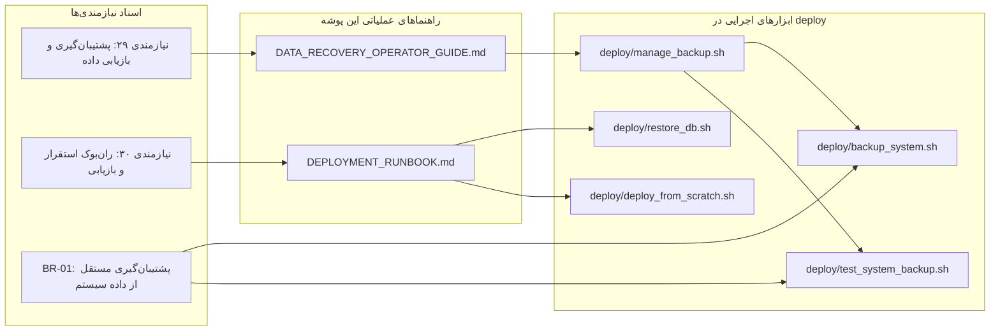

# مستندات و راهنماهای عملیاتی پشتیبان‌گیری و بازیابی سامانه
**سامانه بایگانی اسناد سازمانی بانک مسکن • نگارش v2.9.0**

این پوشه شامل کلیه راهنماهای فنی، اجرایی و عملیاتی استاندارد (SOP) مرتبط با چرخه حیات داده، پشتیبان‌گیری و بازیابی اطلاعات در سناریوهای بحران و استقرار است:

---

## تفکیک بنیادین سطوح پشتیبان‌گیری (Backup Tiers)

در معماری جدید سامانه، پشتیبان‌گیری به سطوح کاملاً تفکیک‌شده طبقه‌بندی شده است:

```text
┌────────────────────────────────────────────────────────────────────────────────────────┐
│                              سطوح پشتیبان‌گیری در سامانه                               │
├──────────────────────────┬─────────────────────────────────────────────────────────────┤
│ پشتیبان سیستم             │ Software State + Required Configuration + Identity Keys     │
│ (system_only - BR-01)    │ • سورس‌کد، کامیت گیت، داکر و کانفیگ لبه وب Nginx           │
│                          │ • تنظیمات هسته (config.php) و کلیدهای هویتی (salt, secret) │
│                          │ • اکیداً فاقد داده دیتابیس و اسناد کاربران (حجم ~250KB)    │
├──────────────────────────┼─────────────────────────────────────────────────────────────┤
│ پشتیبان داده‌های سازمانی │ Operational Database + User Data + Instance State           │
│ (instance_data - BR-02)  │ • کل دیتابیس اتمیک PostgreSQL + اسناد کاربران (data.tar.gz) │
│                          │ • اتصال شفاف به System Baseline (شناسه و کامیت سیستم مرجع) │
│                          │ • فاقد تکرار کدهای برنامه و کانفیگ سیستم (عدم ذخیره مجدد) │
├──────────────────────────┼─────────────────────────────────────────────────────────────┤
│ پشتیبان جامع سازمانی     │ Legacy/Compatibility Package (Combined Disaster Recovery)   │
│ (full_instance)          │ • بسته ترکیبی تک‌فایلی شامل دیتابیس، اسناد، کدهای سفارشی و   │
│                          │   کانفیگ کل سیستم جهت سازگاری و ریکاوری یکپارچه گذشته        │
└──────────────────────────┴─────────────────────────────────────────────────────────────┘
```

### معماری نهایی تفکیک پشتیبان و نقشه راه چرخه بازیابی (Backup & Recovery Roadmap)

سامانه چرخه استاندارد پنج‌مرحله‌ای زیر را برای تفکیک پشتیبان و بازیابی تعریف و پیاده‌سازی می‌کند:

```text
┌────────────────────────────────────────────────────────────────────────────────────────┐
│                              نقشه راه تفکیک و بازیابی (BR Roadmap)                     │
├──────────────────────────┬─────────────────────────────────────────────────────────────┤
│ BR-01: System Backup     │ تهیه پشتیبان مستقل از نرم‌افزار، کانفیگ، داکر و کلیدهای هویت │
│ (system_only - پیاده‌شده) │ بدون داده عملیاتی، ایجاد System Baseline مرجع               │
├──────────────────────────┼─────────────────────────────────────────────────────────────┤
│ BR-02: Instance Data     │ تهیه پشتیبان اتمیک از پایگاه داده و فایل‌های کاربری         │
│ (instance_data - پیاده‌شده)│ متصل به System Baseline، فاقد تکرار سورس و کانفیگ سیستمی   │
├──────────────────────────┼─────────────────────────────────────────────────────────────┤
│ BR-03: Sandbox Restore   │ بازسازی و آزمون بازیابی واقعی دیتابیس و فایل‌های کاربری در  │
│ (آزمون ایزوله - پیاده‌شده)│ محیط کاملاً ایزوله PostgreSQL موقت و ممیزی انطباق دوطرفه   │
│                          │ DB ↔ Filesystem بدون هیچ‌گونه دستکاری یا داون‌تایم پروداکشن │
├──────────────────────────┼─────────────────────────────────────────────────────────────┤
│ BR-04: Production Restore│ بازگردانی داده‌های عملیاتی روی سامانه سالم (Live Data Restore)│
│ (مقاوم‌سازی‌شده - Hardened) │ احیای دیتابیس و فایل‌ها به یک Recovery Point با حفظ کانفیگ   │
│                          │ مجهز به Pre-Restore Safety Backup خودکار و ممیزی DB ↔ Files │
│                          │ گیت‌های امنیتی Fail-Closed: Maintenance، Health Gate و CSRF │
├──────────────────────────┼─────────────────────────────────────────────────────────────┤
│ BR-05: Full DR on Lost   │ بازسازی و ریکاوری فاجعه روی سرور تخریب‌شده / جدید           │
│ (فاز آتی نقشه راه)       │ ترکیب System Backup + Instance Data برای استقرار کامل سرور  │
└──────────────────────────┴─────────────────────────────────────────────────────────────┘
```

```text
       ┌────────────────────────┐
       │     System Backup      │  (BR-01: Software + Config + Identity Keys)
       │    (system_only)       │  ID: SYS-123 | Git: ABCDEF
       └───────────┬────────────┘
                   │
                   ▼ (System Baseline Binding Reference)
       ┌────────────────────────┐
       │  Instance Data Backup  │  (BR-02: PostgreSQL Database Dump + User Data Files)
       │    (instance_data)     │  ID: DATA-456 | Baseline Ref: SYS-123
       └───────────┬────────────┘  Recovery Point: 2026-10-02T15:00
                   │
         ┌─────────┴──────────────────────────┐
         ▼                                    ▼
┌────────────────────────┐         ┌────────────────────────┐
│ Sandbox Restore Verify │         │   Production Restore   │
│  (BR-03: پیاده‌سازی‌شده) │         │  (BR-04: پیاده‌سازی‌شده) │
│ دیتابیس و فایل موقت     │         │ بازنشانی داده روی سرور │
│ انطباق دوطرفه DB↔Files │         │ حفظ کامل نرم‌افزار/کانفیگ│
│ صفر اثر بر پروداکشن     │         │ سپر Pre-Restore Safety │
└────────────────────────┘         └──────────┬─────────────┘
                                              │
                                              ▼ (ترکیب با BR-01 در فاز بعدی)
                                   ┌────────────────────────┐
                                   │ Full Disaster Recovery │
                                   │ (BR-05: سرور نابودشده) │
                                   └────────────────────────┘
```

---

### مشخصات مقاوم‌سازی امنیتی و گیت‌های ایمنی BR-04 (BR-04 Hardening Specification)

موتور بازیابی داده‌های سازمانی بر روی سامانه سالم (BR-04) مجهز به ۶ لایه حفاظتی Fail-Closed است:

1. **گیت ایمنی فعال‌سازی Maintenance Mode (Fail-Closed Maintenance ON):**
   - پیش از هرگونه دستکاری دیتابیس یا فایل‌ها، دستور `occ maintenance:mode --on` اجرا شده و وضعیت حقیقی سامانه با `occ status` اعتبارسنجی می‌شود (`maintenance: true`).
   - در صورت عدم موفقیت ورود به Maintenance Mode، عملیات فوراً لغو، وضعیت `FAILED` ثبت، لاگ ممیزی مستند و پیش‌پشتیبان امنیتی دست‌نخورده حفظ می‌گردد. هیچ عملیات مخربی آغاز نخواهد شد.

2. **حذف قطعی پسوردهای پیش‌فرض و Fallback (Zero Credential Fallback):**
   - هیچ‌گونه Credential پیش‌فرض یا hardcoded در اسکریپت وجود ندارد. مقادیر `POSTGRES_DB`، `POSTGRES_USER` و `POSTGRES_PASSWORD` صرفاً از فایل امن `.env` استخراج می‌شوند.
   - در صورت فقدان یا خالی بودن هر یک از متغیرهای احراز هویت، عملیات پیش از شروع متوقف می‌شود. رمزهای عبور هرگز در گیت، مانیفست، فایل وضعیت یا لاگ ممیزی ثبت نمی‌شوند.

3. **ثبت شناسه واقعی درخواست‌کننده در زنجیره ممیزی (Audit Requester Identity):**
   - شناسه کاربر مدیر ارشد از لایه رابط کاربری وب (`AdminBackupController` با متد هویتی کاربر جاری) یا خط فرمان CLI (`$SUDO_USER` / `$USER`) از طریق صف و دیمن تا موتور `deploy/restore_instance_data.sh` و لاگ `deploy/backups/restore_audit.jsonl` منتقل می‌شود.
   - مقدار ثابت `admin` جایگزین شناسه واقعی نمی‌شود مگر آنکه درخواست‌کننده واقعاً حساب کاربری `admin` باشد.

4. **دروازه قطعی ارزیابی سلامت پس از بازیابی (Strict Post-Restore Health Gate):**
   - موفقیت بازیابی داده‌ها منوط به شرط دوگانه است: `Restore Operations Success AND Post-Restore Health Check PASS`.
   - اجرای `deploy/check_health.sh` ارزیابی نهایی را رقم می‌زند؛ در صورت هرگونه وضعیت ناسالم یا degraded، نتیجه کلی `FAILED` ثبت شده و از ثبت موفقیت کاذب جلوگیری می‌شود.

5. **اعتبارسنجی قطعی خروج از Maintenance Mode (Verified Maintenance OFF):**
   - پس از اتمام بازیابی و موفقیت تست سلامت، خروج از حالت تعمیرات (`occ maintenance:mode --off`) اجرا و با استعلام مستقل `occ status` وضعیت `maintenance: false` احراز می‌گردد.
   - در صورت شکست خروج، عملیات `FAILED` تلقی شده و هشدارهای لازم ثبت می‌گردد.

6. **حفاظت ضد CSRF و اعتبارسنجی توکن درخواست (CSRF & Request Token Audit):**
   - کلیه متدهای حساس و تغییردهنده وضعیت (`runBackup`, `runRestore`, `runTest`, `saveConfig`) در `AdminBackupController` مجهز به اعتبارسنجی توکن امنیتی Nextcloud CSRF (`CsrfTokenManager`) هستند و درخواست‌های تغییر وضعیت بدون توکن معتبر با خطای ۴۰۳ ریجکت می‌شوند.

---

## فهرست مستندات مرجع این بخش

| سند عملیاتی | موضوع و محدوده عملکرد | مخاطبان هدف | پیوند مستقیم |
| :--- | :--- | :--- | :---: |
| **راهنمای جامع بازیابی اطلاعات در بحران (Disaster Recovery SOP)** | دستورالعمل گام‌به‌گام پشتیبان‌گیری و بازیابی (شامل System Backup و Full Instance) با ابزار وب و ترمینال (`manage_backup.sh`) | مدیران سیستم (SysAdmins) و اپراتورهای ارشد | [DATA_RECOVERY_OPERATOR_GUIDE.md](DATA_RECOVERY_OPERATOR_GUIDE.md) |
| **ران‌بوک جامع استقرار و بازیابی در سرور جدید (System Deployment & Recovery)** | دستورالعمل بازتولید کل سامانه روی سرور جدید (سناریوی A: بازسازی سامانه + ریستور / سناریوی B: استقرار از صفر) | کارشناسان DevOps و مهندسان زیرساخت | [DEPLOYMENT_RUNBOOK.md](DEPLOYMENT_RUNBOOK.md) |

---

## ارتباط با نیازمندی‌های مصوب و ابزارهای اجرایی


```mermaid
graph LR
    subgraph Requirements [اسناد نیازمندی‌ها]
        R29[نیازمندی ۲۹: پشتیبان‌گیری و بازیابی داده]
        R30[نیازمندی ۳۰: ران‌بوک استقرار و بازیابی]
        BR01[BR-01: پشتیبان‌گیری مستقل از داده سیستم]
    end

    subgraph SOPs [راهنماهای عملیاتی این پوشه]
        DRG[DATA_RECOVERY_OPERATOR_GUIDE.md]
        RUN[DEPLOYMENT_RUNBOOK.md]
    end

    subgraph Executables [ابزارهای اجرایی در deploy]
        MB[deploy/manage_backup.sh]
        BS[deploy/backup_system.sh]
        TS[deploy/test_system_backup.sh]
        RST[deploy/restore_db.sh]
        DPS[deploy/deploy_from_scratch.sh]
    end

    R29 --> DRG
    R30 --> RUN
    BR01 --> BS
    BR01 --> TS
    DRG --> MB
    RUN --> RST
    RUN --> DPS
    MB --> BS
    MB --> TS
```

---

## خط‌مشی اسناد زنده (Living Documentation Policy)
تمامی اسناد این پوشه به صورت کاملاً همگام با اسکریپت‌های اجرایی پوشه `deploy/` نگهداری می‌شوند. هرگونه تغییر در متغیرهای محیطی، سیاست‌های نگهداری (Retention) یا نسخه‌های کانتینرها مستلزم به‌روزرسانی آنی این اسناد است.
