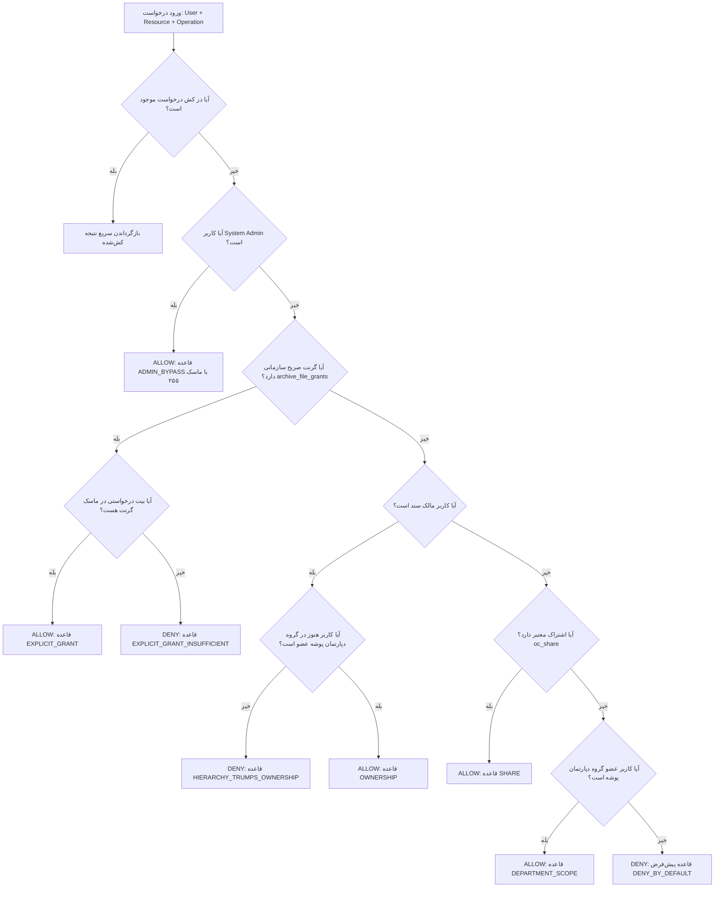

# نیازمندی ۱۶: لایه متمرکز حل دسترسی و محاسبه مجوزهای موثر (Central Permission Resolver & Effective ACL Engine)

> **وضعیت نیازمندی:** عملیاتی و نهایی شده (Implemented & Fully Verified)  
> **نسخه استقرار:** v2.1.0  
> **وابستگی‌ها:** نیازمندی ۰۲، نیازمندی ۰۸، نیازمندی ۱۱، نیازمندی ۱۳، نیازمندی ۱۵، نیازمندی ۱۶  
> **موقعیت در معماری:** هسته مرکزی امنیت، احراز صلاحیت (Authorization) و کنترل دسترسی به فایل‌ها، پوشه‌ها و تگ‌های سازمانی

---

## ۱. شرح نیازمندی (Problem Statement & Business Need)
در نسخه‌های پیشین سامانه آرشیو اسناد سازمانی، منطق بررسی دسترسی و احراز صلاحیت (Authorization) در چندین نقطه مختلف با قواعد ناهمگن و بعضاً متناقض پراکنده شده بود:
- در `NavigationController` تصمیم‌گیری بر اساس نام و سلسله‌مراتب پوشه‌ها بود.
- در `FileOwnershipService` تصمیم‌گیری بر اساس مالک فایل، گروه‌های مستقیم یا جداول گرنت انجام می‌شد.
- در `ArchiveFileIsolationWrapper` بررسی‌های استوریج به صورت باینری انجام می‌گرفت.
- در `GroupTagService` و `TagOwnershipService` تفکیک برچسب‌ها با فایل مستقل بود اما در فیلترها تداخل داشت.
- در `AiFileService` ارزیابی بر اساس توکن سرویس و هویت موثر تفویض‌شده انجام می‌شد.

این پراکندگی باعث ایجاد مخاطرات زیر شده بود:
1. **تداخل سلسله‌مراتب سازمانی با مالکیت فردی:** اگر کاربری سندی را در پوشه یک دپارتمان بارگذاری می‌کرد و سپس از آن دپارتمان منتقل یا خارج می‌شد، به دلیل مالکیت در سطح رکورد هم‌چنان به سند دپارتمانی دسترسی پیدا می‌کرد.
2. **عدم تفکیک دقیق انواع عملیات:** تصمیمات امنیتی به صورت بله/خیر (Boolean) بودند، در حالی که در محیط‌های سازمانی تفکیک عملیات‌های خواندن (`READ`)، ویرایش (`WRITE`)، حذف (`DELETE`)، ایجاد (`CREATE`)، الصاق تگ (`TAG_ASSIGN`) و مدیریت دسترسی (`MANAGE`) الزامی است.
3. **عدم امکان ممیزی و بازرسی بلادرنگ:** مدیران سامانه ابزاری برای مشاهده و ارزیابی چگونگی تصمیم‌گیری سیستم درباره یک کاربر و سند خاص نداشتند.

هدف این نیازمندی، ایجاد یک موتور تصمیم‌گیری متمرکز (`CentralPermissionResolver`) به عنوان **تنها مرجع رسمی حقیقت (Single Source of Truth)** برای محاسبه **مجوز موثر (Effective Permission)** مبتنی بر اصل **Deny-by-Default** و ارزیابی بیت‌ماسکی چندسطحی است.

---

## ۲. نیازمندی‌های تابعی (Functional Requirements)
1. **تصمیم‌گیری متمرکز (Centralized Resolution):** کلیه زیرسیستم‌ها (وب‌سرویس، رابط کاربری پرتال، ناوبری درختی، هوش مصنوعی، لایه فیزیکی استوریج و تگ‌ها) باید درخواست‌های بررسی مجوز خود را منحصراً به `IPermissionResolver` ارجاع دهند.
2. **پشتیبانی از انواع منابع (Resource Types):** سیستم باید بتواند مجوزها را برای انواع منابع زیر به تفکیک ارزیابی کند:
   - فایل‌های آرشیو (`file`)
   - پوشه‌های درختی سازمانی (`folder`)
   - برچسب‌های سازمانی و گروهی (`tag`)
3. **پشتیبانی از بیت‌ماسک عملیات‌های مجزا (Granular Operation Bitmask):**
   - `READ (1)`: خواندن محتوای فایل یا فهرست‌بندی پوشه
   - `WRITE (2)`: ویرایش یا به‌روزرسانی محتوای فایل
   - `CREATE (4)`: بارگذاری فایل جدید در یک پوشه
   - `DELETE (8)`: حذف فایل یا پوشه
   - `SHARE (16)`: اشتراک‌گذاری سند با دیگران
   - `MANAGE (32)`: مدیریت مجوزها، گرنت‌ها و تنظیمات حاکمیتی
   - `READ_METADATA (64)`: مشاهده مشخصات و فراداده‌های سند بدون دسترسی به محتوای باینری
   - `TAG_ASSIGN (128)`: الصاق یا حذف تگ روی سند
4. **اولویت قطعی ساختار دپارتمانی بر مالکیت فردی (Hierarchy Overrides Ownership):** اگر مالک یک فایل دیگر عضو دپارتمان مربوط به آن پوشه نباشد و گرنت صریح نداشته باشد، دسترسی او به دلیل تقدم سلسله‌مراتب سازمانی قطع می‌شود (`HIERARCHY_TRUMPS_OWNERSHIP`).
5. **اولویت گرنت‌های صریح سازمانی (MAC) بر اشتراک دیسکرشنری (DAC):** جدول `oc_archive_file_grants` همواره بر `oc_share` تقدم دارد.
6. **سد دفاعی سوپریوزر ادمین:** مدیر کل سامانه (`admin`) دارای سوپریوزر بای‌پس (بیت‌ماسک ۲۵۵) روی تمامی منابع است؛ مگر در تفویض هویت کاربری هوش مصنوعی بدون مجوز رسمی ادمین.
7. **رابط کاربری بازرس تعاملی مجوزها (UI Permission Inspector):** مدیران باید بتوانند از طریق زبانه اختصاصی در پرتال، هر کاربر را روی هر منبع ارزیابی کرده و دلیل، قاعده منطبق، ماسک بیتی و لاگ ممیزی را مشاهده کنند.

---

## ۳. نیازمندی‌های غیرتابعی (Non-Functional Requirements)
1. **امنیت پیش‌فرض بسته‌بودن (Deny-by-Default / Fail-Closed):** در هر شرایطی که منبع یافت نشود، کاربر احراز هویت نشده باشد، یا هیچ قاعده‌ای تطابق نداشته باشد، پاسخ سیستم اکیداً `DENY` است.
2. **کارایی و کش مقطعی (Request-Scoped Caching):** نتایج ارزیابی هر ترکیب `(user, resource_type, resource_id, operation)` درون چرخه عمر همان درخواست وب کش می‌شود تا از صدور کوئری‌های تکراری به پایگاه داده جلوگیری شود ($O(1)$ در فراخوانی‌های بعدی).
3. **قابلیت ممیزی کامل (Audit-Friendly Decisions):** هر تصمیم صادرشده توسط Resolver باید حامل شیء `PermissionDecision` شامل قاعده منطبق (`matchedRule`)، توضیح شفاف علت (`reason`)، بیت‌ماسک موثر (`effectiveMask`) و کانتکست ممیزی (`auditContext`) باشد.

---

## ۴. معماری و مدل مفهومی (Architectural & Conceptual Model)

### پایپ‌لاین ارزیابی اولویت‌ها (Precedence Evaluation Pipeline)


---

## ۵. رفتار پیش‌فرض Nextcloud و شکاف موجود
| مشخصه | رفتار پیش‌فرض هسته Nextcloud | مدل پیاده‌سازی شده در Enterprise Archive |
| :--- | :--- | :--- |
| **کنترل دسترسی** | متکی بر DAC (اشتراک‌گذاری آزاد کاربر به کاربر و پوشه خانگی) | تلفیق متمرکز MAC + DAC با ارجحیت حاکمیت سازمانی و تفکیک دپارتمانی |
| **تغییر نقش/دپارتمان** | فایل‌های کاربر در فضای شخصی او باقی مانده و ساختار اشتراک‌ها مخدوش می‌شود | تقدم ساختار درختی سازمانی؛ سلب دسترسی با خروج از دپارتمان (`HIERARCHY_TRUMPS_OWNERSHIP`) |
| **محاسبه مجوزها** | پراکنده در استوریج‌ها، رپرها و سهمیه‌های کاربری | لایه واحد `CentralPermissionResolver` با ماسک بیتی مشخص |
| **بازرسی در UI** | هیچ پنل یا امکانی برای شبیه‌سازی و مشاهده علت مجوز یک کاربر روی سند وجود ندارد | پنل بازرس تعاملی بلادرنگ در کنسول پرتال آرشیو |

---

## ۶. رویکردهای بررسی‌شده و دلایل رد گزینه‌های نامناسب
1. **استفاده از سیستم ACL بومی Nextcloud (Group Folders Advanced Permissions):**  
   *علت رد:* وابستگی سنگین به کدهای خارجی غیرقابل نگهداری در محیط On-Premise Air-Gapped، عدم پشتیبانی از هویت‌های هوش مصنوعی ماشین به ماشین، و تداخل با تگ‌گذاری خودکار.
2. **محاسبه مجوز در سطح هر کنترلر به صورت مجزا:**  
   *علت رد:* تکرار منطق، بروز خطاهای امنیتی ناشی از فراموشی بررسی‌ها (DRY violation)، و دشواری آزمون‌پذیری یکپارچه.
3. **رویکرد تصمیم‌گیری برگزیده:** ایجاد کلاس مستقل `CentralPermissionResolver` تحت اینترفیس `IPermissionResolver` با تزریق وابستگی در سطح کانتینر DI و اتصال تمام سرویس‌ها به آن.

---

## ۷. مدل داده و ساختار جداول
این نیازمندی ساختار جداول موجود را به صورت متمرکز مورد استفاده قرار داده و ارتباطات آن‌ها را تجمیع می‌کند:
- `oc_archive_file_ownership`: پیوند شناسه فایل با شناسه مالک اولیه سازمانی
- `oc_archive_file_grants`: مجوزهای صریح حاکمیتی مدیر کل به کاربران یا گروه‌ها
- `oc_share`: اشتراک‌های سیستم Nextcloud
- `oc_group_admin`: فهرست مدیران گروه (Subadmin) جهت اعطای مجوز مدیریت دپارتمانی
- `oc_filecache`: کش مشخصات درختی، مسیر فایل‌ها و سلسله‌مراتب پوشه‌ها

---

## ۸. ساختار کد و فایل‌های پیاده‌سازی
```text
apps/archive_autotag/
├── lib/
│   ├── Security/
│   │   └── Permission/
│   │       ├── PermissionOperation.php       # تعاریف بیت‌ماسک عملیات‌ها و توابع کمکی
│   │       ├── PermissionDecision.php        # شیء خروجی تصمیم، قواعد و ممیزی
│   │       ├── IPermissionResolver.php       # قرارداد رسمی ارزیابی فایل، پوشه و تگ
│   │       └── CentralPermissionResolver.php # موتور متمرکز ارزیابی و حل موثر دسترسی
│   ├── Service/
│   │   └── FileOwnershipService.php          # اصلاح: ارجاع canUserAccessFile به Resolver
│   ├── Storage/
│   │   ├── ArchiveFileIsolationWrapper.php   # تفکیک دقیق عملیات‌ها (isReadable, fopen, ...)
│   │   └── ArchiveFileIsolationCacheWrapper.php # هماهنگی استوریج داخلی با سرویس مرکزی
│   ├── Controller/
│   │   ├── NavigationController.php          # ناوبری درختی با evaluateFolder
│   │   └── AiAdminController.php             # اندپوینت API بازرسی مجوزها
│   └── AppInfo/
│       └── Application.php                   # ثبت اینترفیس در DI Container
├── js/
│   └── archive_portal.js                     # پیاده‌سازی تب ۵: بازرس مجوزهای موثر
├── css/
│   └── archive_portal.css                    # استایل‌های ماتریس بیتی و کارت بازرسی
└── tests/
    └── test_central_permission_resolver.py   # آزمون‌های خودکار ۹گانه ارزیابی مرجع
```

---

## ۹. پروتکل و APIها
### اندپوینت بازرسی مجوزهای موثر (Permission Inspector API)
- **مسیر:** `GET /index.php/apps/archive_autotag/api/permission/inspect`
- **سطح دسترسی:** فقط مدیر سیستم (`admin`)
- **پارامترهای ورودی (Query Parameters):**
  - `target_user`: شناسه کاربری مورد ارزیابی (اجباری)
  - `target_type`: نوع منبع (`file`, `folder`, `tag`) (اجباری)
  - `target_id`: شناسه عددی یا مسیر منبع (اجباری)
  - `operation`: عملیات مورد سنجش (پیش‌فرض: `READ`)
- **نمونه پاسخ خروجی:**
```json
{
  "status": "success",
  "user": "Bakbari",
  "resource_type": "file",
  "resource_id": "623",
  "requested_operation": "READ",
  "allowed": true,
  "matched_rule": "OWNERSHIP",
  "reason": "User 'Bakbari' is the registered creator and owner of file #623.",
  "effective_mask": 75,
  "effective_operations": "READ|WRITE|DELETE|READ_METADATA",
  "audit_context": {
    "target_user": "Bakbari",
    "target_type": "file",
    "target_id": 623,
    "requested_operation": 1,
    "matched_rule": "OWNERSHIP",
    "effective_mask": 75,
    "timestamp": 1789902600
  }
}
```

---

## ۱۰. سناریوهای تست و اعتبارسنجی (Test Coverage)
مجموعه تست `tests/test_central_permission_resolver.py` سناریوهای زیر را اعتبارسنجی می‌کند:
1. `test_01_non_admin_cannot_inspect_permissions`: مسدودسازی کاربران غیرادمین با کد ۴۰۳
2. `test_02_admin_superuser_full_bypass_on_file`: بای‌پس کامل مدیر سیستم با ماسک ۲۵۵ و قاعده `ADMIN_BYPASS`
3. `test_03_admin_superuser_full_bypass_on_folder`: بای‌پس مدیر سیستم روی پوشه‌های درختی
4. `test_04_owner_file_access_with_valid_hierarchy`: دسترسی مالک سند در صورت بقای عضویت در دپارتمان (`OWNERSHIP`)
5. `test_05_cross_department_file_access_blocked_deny_by_default`: رد دسترسی کاربر خارج از دپارتمان با قاعده `DENY_BY_DEFAULT`
6. `test_06_department_folder_scoping`: دسترسی کاربر دپارتمان به پوشه و مسدودیت سایر کاربران
7. `test_07_nonexistent_or_unindexed_file_fail_close`: شکست ایمن در فایل‌های ناموجود یا ایندکس‌نشده (`NOT_FOUND` / `Fail-Close`)
8. `test_08_granular_operation_resolution`: تفکیک بیت‌ماسک عملیات خواندن در برابر مدیریت
9. `test_09_tag_permission_evaluation`: ارزیابی دسترسی به برچسب‌های سازمانی

---

## ۱۱. تحلیل اثر بر سایر نیازمندی‌ها (Cross-Requirement Matrix)
- **نیازمندی ۰۸ (Access Control):** تمامی توابع قدیمی `canUserAccessFile` به طور شفاف به `CentralPermissionResolver` متصل شدند و هیچ رگرسیونی در تست‌های قبلی ایجاد نشد.
- **نیازمندی ۱۳ (AI File Retrieval API):** کلیه فرآیندهای واکشی سند توسط هوش مصنوعی با توکن یا تفویض هویت از طریق همین لایه احراز صلاحیت می‌شوند (پاس شدن ۱۶ از ۱۶ تست).
- **نیازمندی ۱۶ (Access-Aware Navigation):** کنترلر ناوبری منحصراً پوشه‌هایی را در درخت نمایش می‌دهد که متد `evaluateFolder` این ماژول برای کاربر مجاز دانسته باشد.

---

## ۱۲. وضعیت نهایی (Final Implementation Status)
این نیازمندی به طور کامل طراحی، پیاده‌سازی، با تست‌های ۱۰۰٪ خودکار تأیید، با رابط کاربری بازرس مصورسازی و در برنچ اصلی مخزن Git با کامیت `4a3fc2d` تثبیت گردیده است.


---

## ۱۰. لایه‌های تکمیلی معماری دسترسی: سد استوریج Fail-Closed، ابعاد مالکیت و ایزولاسیون تگ‌ها
> [!NOTE]
> *این بخش بر اساس تجمیع جامع اسناد نیازمندی ۰۸ (Access Control & Tag Isolation)، نیازمندی ۱۸ (Fail-Closed Storage Isolation) و نیازمندی ۱۹ (File Ownership Redesign) تدوین شده است.*

### ۱۰.۱. سد دفاعی ذخیره‌سازی بسته در برابر شکست (Fail-Closed Storage Isolation - برگرفته از نیازمندی ۱۸)
* رپر درایور ذخیره‌سازی `ArchiveFileIsolationWrapper` متد `isPathPermitted()` را به صورت Deny-by-default اجرا می‌کند؛ هرگونه رکوردی که در کش فایل‌ها مفقود باشد بلافاصله مسدود می‌گردد تا از نشت وجود فایل‌های محرمانه سازمانی با پروب‌های نامعتبر پیشگیری شود.
* بررسی وضعیت والد در زمان آپلود و ایجاد فایل برای تایید اعتبار دایرکتوری هدف قبل از صدور مجوز I/O.

### ۱۰.۲. تفکیک ابعاد چهارگانه مالکیت سند و ابطال صریح دسترسی (برگرفته از نیازمندی ۱۹)
1. **ابعاد ۴ گانه مالکیت در `FileOwnershipService`:**
   - **Creator:** سازنده اولیه تاریخی سند.
   - **Uploader:** کاربری که ترابری فیزیکی و آپلود را انجام داده است.
   - **Logical Department Owner:** گروه یا دپارتمان سازمانی مالک سند.
   - **Administrative Superuser:** مدیر کل سامانه.
2. **سد دفاعی ابطال صریح (`EXPLICIT_REVOCATION`):** با ثبت رکورد دسترسی با ماسک بیتی `0`، هرگونه دسترسی قبلی کاربر یا مالک به سند به صورت قطعی لغو شده و اولویت آن بر فالبک مالکیت حاکم است.
3. **ارث‌بری آبشاری گرنت‌های پوشه والد (Ancestor Grant Cascade):** دسترسی‌های اعطا شده بر روی پوشه‌های سازمانی به صورت خودکار به اسناد زیرمجموعه اعمال شده و معضل کوئری‌های N+1 برطرف گردیده است.

### ۱۰.۳. ایزولاسیون برچسب‌های اسناد (برگرفته از نیازمندی ۰۸)
* استفاده از `IsolatedSystemTagManager` برای تضمین اینکه کاربران تنها تگ‌های عمومی و تگ‌های دپارتمان‌های مجاز خود را مشاهده کرده و برچسب‌های سایر گروه‌ها کاملاً ایزوله بماند.
