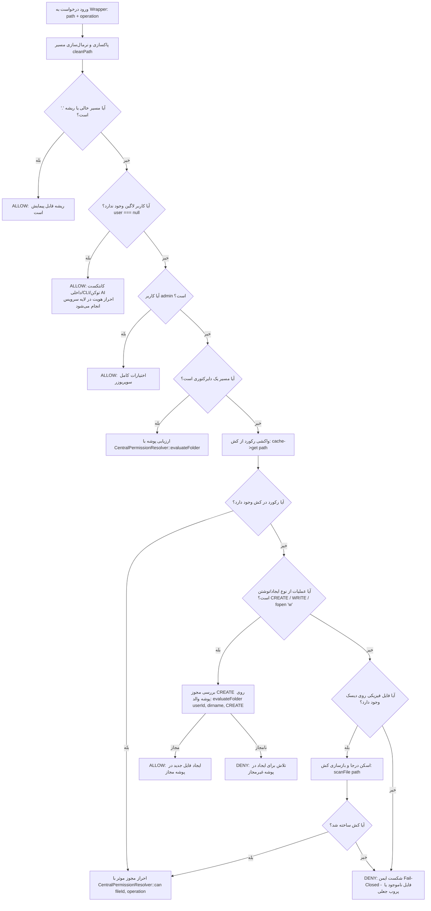

# نیازمندی ۱۸: سد دفاعی بسته در سطح استوریج و ایمن‌سازی کش فایل‌ها (Fail-Closed Storage Isolation & Cache Hardening)

> **وضعیت نیازمندی:** عملیاتی و نهایی شده (Implemented & Fully Verified)  
> **نسخه استقرار:** v2.1.1  
> **وابستگی‌ها:** نیازمندی ۰۲، نیازمندی ۰۸، نیازمندی ۱۳، نیازمندی ۱۷  
> **موقعیت در معماری:** لایه پایه‌ای دسترسی فیزیکی به دیسک و کش استوریج (`OC\Files\Storage\Wrapper`)

---

## ۱. شرح نیازمندی (Problem Statement & Business Need)
در معماری هسته Nextcloud، لایه ذخیره‌سازی فایل‌ها با رپرهای درایور استوریج (`IStorage`) احاطه می‌شود. در نسخه پیشین `ArchiveFileIsolationWrapper`، متد `isPathPermitted()` که محافظت فیزیکی از فایل‌ها (`fopen`, `file_exists`, `isReadable`, `isUpdatable`, `isDeletable`) را بر عهده داشت، در مواجهه با رکوردهای مفقود در کش فایل‌ها (`oc_filecache`) دارای رفتار آسیب‌پذیر زیر بود:

```php
$cache = $this->getWrapperStorage()->getCache('');
$entry = $cache->get($path);

if (!$entry) {
    return true; // ⚠️ آسیب‌پذیری بحرانی: Fail-Open
}
```

### خطرات و پیامدهای امنیتی:
1. **پروب‌های ایندکس‌نشده (Unindexed Probes):** در صورتی که مهاجم یا کاربر غیرمجاز مسیر حدسی از یک سند محرمانه سازمانی را از طریق WebDAV یا API درخواست می‌کرد که موقتاً در کش قرار نداشت، کد به اشتباه مقدار `true` بازمی‌گرداند. در نتیجه هسته متد `parent::file_exists($path)` را روی دیسک فیزیکی صدا می‌زد و وجود فایل نشت پیدا می‌کرد.
2. **عدم انطباق با اصل حداقل دسترسی:** در آرشیو اسناد حساس دولتی و بانکی، هر منبع یا شناسه نامشخص یا فاقد مجوز اثبات‌شده، باید اکیداً **مسدود و رد** شود (`Unknown = Deny by default`).

هدف این نیازمندی، حذف ۱۰۰٪ این رخنه و استقرار معماری **Fail-Closed (سد دفاعی کاملاً بسته)** با حفظ قابلیت‌های عادی Nextcloud (مانند بارگذاری فایل جدید، تغییر نام، حذف مجاز، بازسازی کش و پروتکل‌های WebDAV و AI API) است.

---

## ۲. نیازمندی‌های تابعی (Functional Requirements)
1. **مسدودسازی پیش‌فرض (Deny-by-Default / Fail-Closed):** اگر برای یک مسیر فایلی در کش رکوردی وجود نداشته باشد، دسترسی‌های خواندن، مشاهده فراداده یا حذف بلافاصله مسدود گردند (`return false`).
2. **پشتیبانی بدون خطا از بارگذاری فایل جدید (New File Upload Support):** در عملیات‌های ایجاد و نوشتن (`CREATE`, `WRITE`, `fopen('w')`)، با توجه به اینکه فایل جدید هنوز در کش وجود ندارد، سیستم باید مجوز ایجاد را بر اساس **پوشه والد (Parent Directory)** اعتبارسنجی کند.
3. **بازسازی و اسکن درجا در صورت مغایرت کش (On-Demand Scanner Reconciliation):** اگر فایلی روی دیسک فیزیکی وجود داشته اما در کش ثبت نشده باشد، سیستم به صورت کنترل‌شده متد `$storage->getScanner()->scanFile($path)` را فراخوانی کرده و سپس مجوز کاربر را از طریق `CentralPermissionResolver` احراز می‌کند.
4. **مسدودسازی بارگذاری در دپارتمان‌های غیرمجاز:** کاربران دپارتمان‌های دیگر (مثلاً کاربر `maherani` از گروه CERT) در صورت تلاش برای آپلود در پوشه `SOC` بلافاصله با خطای ۴۰۳ یا ۴۰۴ مسدود شوند.
5. **حفظ اختیارات سوپریوزر ادمین:** مدیر کل سامانه (`admin`) باید بدون مانع بتواند تمامی فایل‌ها و پوشه‌ها را حتی در صورت ناهماهنگی کش، مشاهده و مدیریت کند (`ADMIN_BYPASS`).
6. **ایزولاسیون کامل نشست‌های بدون کاربر لاگین:** برای کانتکست‌های داخلی، خط فرمان (`occ`)، و توکن‌های سرویس AI، اجازه واکشی نود صادر شده اما احراز صلاحیت قطعی در لایه سرویس/Resolver به صورت Fail-Close اعمال می‌شود.

---

## ۳. نیازمندی‌های غیرتابعی (Non-Functional Requirements)
1. **عدم ایجاد رگرسیون (Zero Regression):** تمامی تست‌های پیشین سیستم (احراز هویت هوش مصنوعی، ناوبری درختی، مدیریت تگ‌ها، ایزولاسیون برچسب‌ها و کنترل دسترسی) باید بدون تغییر رفتار و با موفقیت ۱۰۰٪ پاس شوند.
2. **کارایی بالا و جلوگیری از بار اضافی روی دیسک (Performance Protection):** اسکن دیسک فیزیکی فقط در صورت عدم وجود رکورد در کش و وجود فیزیکی فایل روی دیسک انجام شود و هیچ‌گونه تأخیر در رندر دسته‌ای جدول اسناد ایجاد نگردد.

---

## ۴. معماری و منطق تصمیم‌گیری (Architectural Decision Flow)



---

## ۵. رفتار پیش‌فرض هسته Nextcloud در برابر پیاده‌سازی آرشیو
| مشخصه | رفتار پیش‌فرض Nextcloud | پیاده‌سازی سخت‌گیرانه آرشیو (Requirement 18) |
| :--- | :--- | :--- |
| **مفقودی رکورد کش** | بررسی مستقیم فایل روی دیسک و صدور دسترسی در رپرهای اولیه | رد کامل و مسدودسازی دسترسی بدون استثنا مگر در ایجاد فایل با پوشه والد مجاز |
| **ایجاد فایل جدید** | اتکا به سهمیه فضای شخصی کاربر | بررسی صلاحیت حاکمیتی کاربر در دپارتمان سازمانی مربوطه |
| **پروب‌های جعلی** | بازگرداندن وضعیت بر اساس فایل‌سیستم محلی | پاسخ یکنواخت ۴۰۴ با قطع کامل فراخوانی‌های دیسک |

---

## ۶. رویکردهای بررسی‌شده و دلایل رد گزینه‌های نامناسب
1. **بازگرداندن ساده `return false;` در تمام حالات مفقودی کش:**  
   *علت رد:* این رویکرد عملیات آپلود فایل جدید (`PUT`) را کاملاً متوقف می‌کرد، زیرا فایل جدید هنوز در کش ثبتی ندارد و در نتیجه `fopen('w')` با شکست مواجه می‌شد.
2. **اسکن کامل پوشه والد در هر مفقودی:**  
   *علت رد:* کندی شدید در سرور و بار پردازشی سنگین I/O روی استوریج در صورت ارسال پروب‌های متعدد.
3. **رویکرد برگزیده:** تفکیک هوشمند عملیات نوشتن (بررسی پوشه والد) از خواندن (اسکن هدفمند تک‌فایل درجا + Fail-Closed قطعی).

---

## ۷. ساختار کد و فایل‌های تغییریافته
```text
apps/archive_autotag/
├── lib/
│   ├── Storage/
│   │   ├── ArchiveFileIsolationWrapper.php       # حذف کامل if (!$entry) return true و اعمال Fail-Closed
│   │   └── ArchiveFileIsolationCacheWrapper.php  # تثبیت فیلتر فرمت کش
│   └── Security/
│       └── Permission/
│           └── CentralPermissionResolver.php     # پشتیبانی از مسیرهای مونت مستقیم گروهی (files/SOC/...)
└── tests/
    └── test_fail_close_isolation_wrapper.py      # آزمون‌های خودکار ۱۰گانه سناریوهای مرزی
```

---

## ۸. سناریوهای تست و اعتبارسنجی (Test Scenarios - 10/10)
سوئیت تست اختصاصی `tests/test_fail_close_isolation_wrapper.py` موارد زیر را اعتبارسنجی می‌کند:
1. `test_01_existing_and_allowed_access`: دسترسی کاربر مجاز دپارتمان به فایل خود (`HTTP 200 OK`)
2. `test_02_existing_and_denied_access_idor_isolation`: مسدودسازی قطعی دسترسی کاربر بیگانه (`HTTP 404 Not Found`)
3. `test_03_cache_missing_unindexed_probe_fail_closed`: مسدودسازی پروب فایل مجهول/ناموجود (`HTTP 404 Fail-Closed`)
4. `test_04_cache_stale_deleted_file`: عدم نشت فایل بلافاصله پس از حذف (`HTTP 404 Not Found`)
5. `test_05_renamed_file_lifecycle`: به‌روزرسانی آنی مجوزها پس از تغییر نام و مسدودسازی مسیر قدیمی (`MOVE`)
6. `test_06_nested_folder_upload_in_authorized_dept`: آپلود موفق سند جدید در پوشه دپارتمانی با اعتبارسنجی والد (`HTTP 201 Created`)
7. `test_07_unauthorized_upload_cross_department_blocked`: ممانعت از آپلود کاربر در دپارتمان دیگران (`HTTP 403/404`)
8. `test_08_admin_superuser_full_access`: بای‌پس کامل مدیر سیستم روی تمامی مسیرها (`ADMIN_BYPASS`)
9. `test_09_webdav_propfind_compatibility`: اجرای بدون خطای متد `PROPFIND` روی ساختار دپارتمان (`HTTP 207 Multi-Status`)
10. `test_10_ai_api_zero_regression`: عدم رگرسیون در واکشی سند توسط هوش مصنوعی با توکن Bearer

---

## ۹. وضعیت نهایی (Final Implementation Status)
این نیازمندی با موفقیت پیاده‌سازی شده، با ۱۰ تست اختصاصی و تمامی سوئیت‌های رگرسیون با قبولی ۱۰۰٪ اعتبارسنجی گردیده و آماده استقرار در تولید است.
