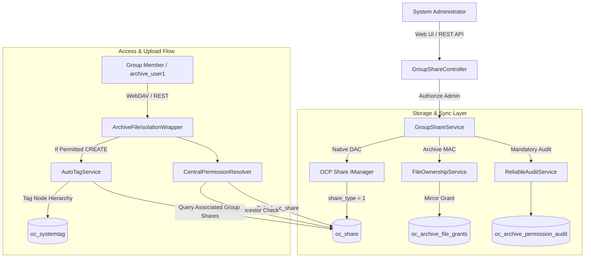

# Requirement 19: Admin Group Sharing, File Management & Isolated Group Tag Governance

## 1. Executive Summary & Architectural Overview

Requirement 24 establishes a secure, enterprise-grade mechanism enabling system administrators to dynamically share files and folders with user groups (e.g. `Compliance_Unit`, `SOC`, `CERT`, `NetWork`, `IncidentMNG`, `Office`) within the **Enterprise Archive System** (Nextcloud 34).

The design satisfies the following core architectural invariants:
1. **Dynamic Group Sharing**: Administrators can share any archive document or directory with target groups with granular permissions (`Read=1`, `Update=2`, `Create=4`, `Delete=8`, `Share=16`, `All=31`).
2. **Dual-Layer Access Control**: Integrates native Nextcloud DAC (`oc_share` where `share_type = 1` for `IShare::TYPE_GROUP`) with archive Mandatory Access Control (MAC in `oc_archive_file_grants`).
3. **Fail-Closed Permission Evaluation**: `CentralPermissionResolver` and `ArchiveFileIsolationWrapper` enforce that group shares strictly define permitted operations. Read-only shares forbid uploads and modifications with HTTP 403 Forbidden.
4. **Inheritance & Ancestor Cascading**: Files and subfolders created inside shared directories inherit group permissions down the hierarchy without requiring explicit per-file grants.
5. **Automatic Group Tagging**: Files uploaded to shared folders automatically receive the associated group tag via `AutoTagService`, reusing existing tags in `oc_systemtag` deterministically without duplicates.
6. **Cross-Group Tag Isolation & Zero-Bypass**: Group Admins manage tags within their own assigned group scope only. System administrators do not receive implicit bypass to manage group tags without assigned subadmin roles.
7. **Audit Reliability**: Every share lifecycle operation (`GROUP_SHARE_CREATED`, `GROUP_SHARE_UPDATED`, `GROUP_SHARE_REMOVED`) is recorded in `ReliableAuditService` (`oc_archive_permission_audit`).

---

## 2. System Architecture & Data Flow



---

## 3. Core Component Implementation Details

### 3.1 GroupShareService (`apps/archive_autotag/lib/Service/GroupShareService.php`)
- **`isSystemAdmin(string $userId): bool`**: Authoritative verification ensuring only system administrators can execute group share mutations and browse the group sharing catalog.
- **`getShareableGroups(string $actorUid): array`**: Retrieves available user groups and active member counts for the sharing dropdown.
- **`getResourceShares(int $fileId, string $actorUid): array`**: Returns all active shares for a given file or folder, parsing bitmasks into human-readable flags (`read`, `update`, `create`, `delete`, `share`).
- **`createOrUpdateGroupShare(...)`**:
  - Deterministically creates a new share or updates permissions on existing shares without duplicate rows or HTTP 409 conflicts.
  - Updates native `oc_share` via `OCP\Share\IManager`.
  - Mirrors grants to `oc_archive_file_grants`.
  - Records audit trail in `ReliableAuditService`.
- **`removeGroupShare(...)`**:
  - Removes the share entry from `oc_share` and purges the grant from `oc_archive_file_grants`.
  - **Preserves underlying physical resource**: The physical file/folder and its filecache metadata remain completely intact.

### 3.2 CentralPermissionResolver (`apps/archive_autotag/lib/Security/Permission/CentralPermissionResolver.php`)
- **Rule 4 (Native Group Share DAC)**:
  - Queries `oc_share` where `share_type = 1` and `share_with IN (:userGroups)`.
  - Evaluates both `$fileId` and `$ancestorIds` so inherited folder shares apply to all child resources.
  - Normalizes bitmasks to `PermissionOperation` constants.
  - Returns `PermissionDecision::allow('SHARE', ...)` if the requested operation is permitted; otherwise falls through to fail-closed default.
- **`evaluateFolder` Extension**:
  - Checks if non-department shared folders have an active file/folder grant or group share before falling back to `DENY_BY_DEFAULT`.

### 3.3 AutoTagService (`apps/archive_autotag/lib/Service/AutoTagService.php`)
- **`getAssociatedGroupNames(Node $node): array`**:
  - Inspects `oc_share` on the uploaded file and all ancestor directories for `share_type = 1`.
  - Extracts distinct group names (e.g. `Compliance_Unit`, `SOC`).
- **`tagNodeHierarchy`**:
  - Applies parent folder tags.
  - Automatically queries and applies group tags via `getOrCreateRestrictedTag($groupName)`.
  - Reuses existing tag IDs without creating duplicate tag rows in `oc_systemtag` or `oc_vtags`.

---

## 4. REST API Specification

| Endpoint | Method | Role | Description |
|---|---|---|---|
| `/api/share/groups` | `GET` | System Admin | List all user groups and member counts |
| `/api/share/resource` | `GET` | System Admin | Get active group shares for a resource (`file_id` or `resource_id`) |
| `/api/share/group` | `POST` | System Admin | Create or update group share (`resource_id`, `group_id`, `permissions`) |
| `/api/share/group/delete` | `POST` | System Admin | Remove group share (`resource_id`, `group_id` or `share_id`) |

### Example Request & Response
```http
POST /index.php/apps/archive_autotag/api/share/group
Content-Type: application/json
OCS-APIRequest: true

{
  "resource_id": 2135,
  "group_id": "Compliance_Unit",
  "permissions": 31
}
```
```json
{
  "status": "success",
  "message": "Resource shared with group successfully",
  "share_id": 43,
  "action": "GROUP_SHARE_CREATED",
  "data": {
    "status": "success",
    "action": "GROUP_SHARE_CREATED",
    "share_id": 43,
    "file_id": 2135,
    "group_id": "Compliance_Unit",
    "permissions": 31,
    "node_path": "/admin/files/Test_Admin_Share_Folder"
  }
}
```

---

## 5. Frontend Integration (`archive_portal.js` & `archive_portal.css`)

1. **Table View Action**:
   - For system administrators (`state.userRole.is_admin`), each file row in table view renders an action button:
     `<button class="ea-icon-btn ea-table-share" title="اشتراک با گروه">👥</button>`
2. **Quick View Drawer Action**:
   - Quick view drawer includes the button `<button class="ea-btn ea-btn-secondary" id="ea-drawer-share-btn">👥 <span>اشتراک با گروه</span></button>`.
3. **Interactive `GroupShareModal` (`#ea-group-share-modal`)**:
   - Displays modal header with resource name.
   - Lists active shares with permission pills (`خواندن`, `ایجاد`, `ویرایش`, `حذف`, `اشتراک`).
   - Provides group selection dropdown loaded dynamically from `/api/share/groups`.
   - Granular permission checkboxes with Quick Presets ("فقط خواندنی", "مشارکت کامل").
   - Inline share revocation with instant table refresh.
4. **Strict Non-Admin Isolation**:
   - For regular users and group admins who are not system admins, the sharing action buttons and modal triggers are completely absent from the DOM.

---

## 6. Verification & Test Matrix

### 6.1 Security & Functional Test Suite (`tests/test_admin_group_sharing.py`)

| Test # | Test Name | Expected Result | Status |
|---|---|---|---|
| 01 | `test_01_admin_shares_file_with_group` | Share created in `oc_share` and mirrored in `oc_archive_file_grants` | **PASS** |
| 02 | `test_02_admin_shares_folder_with_group` | Folder shared with permissions=31 | **PASS** |
| 03 | `test_03_group_member_accesses_shared_folder` | Group member accesses folder via WebDAV PROPFIND (HTTP 207) | **PASS** |
| 04 | `test_04_dynamic_membership_add_user_gains_access` | Adding user to group immediately grants access (HTTP 207) | **PASS** |
| 05 | `test_05_dynamic_membership_remove_user_loses_access` | Removing user from group revokes access (HTTP 404/403) | **PASS** |
| 06 | `test_06_readonly_group_cannot_upload` | Read-only group upload blocked with HTTP 403 Forbidden | **PASS** |
| 07 | `test_07_create_perm_group_can_upload` | Group member with Create permission uploads file (HTTP 201/204) | **PASS** |
| 08 | `test_08_uploaded_file_receives_group_tag` | Uploaded file automatically receives group tag | **PASS** |
| 09 | `test_09_existing_tag_reused_no_duplicates` | Tag reused without creating duplicate rows in `oc_systemtag` | **PASS** |
| 10 | `test_10_group_admin_manages_own_tags` | Group Admin creates/assigns tags within their own group scope | **PASS** |
| 11 | `test_11_cross_group_tag_operation_forbidden` | Cross-group tag operations blocked with HTTP 403 Forbidden | **PASS** |
| 12 | `test_12_admin_membership_does_not_leak_cross_group_tag` | System Admin blocked from group tags without subadmin role | **PASS** |
| 13 | `test_13_unauthorized_user_cannot_share_resources` | Non-admin resource sharing rejected with HTTP 403 Forbidden | **PASS** |
| 14 | `test_14_unauthorized_tag_operations_rejected` | Unauthorized tag mutations rejected with HTTP 403 Forbidden | **PASS** |
| 15 | `test_15_duplicate_share_updates_permissions_deterministically` | Duplicate share updates permissions without duplicate rows | **PASS** |
| 16 | `test_16_removing_share_does_not_delete_physical_resource` | Share removed while physical file remains intact on storage | **PASS** |

### 6.2 Playwright E2E Browser Test Suite (`tests/e2e/test_07_group_sharing_and_management.py`)

| Test # | Scenario | Status |
|---|---|---|
| E2E-01 | Admin logs in, verifies share buttons, opens modal, shares with SOC, deletes share | **PASS** |
| E2E-02 | Non-admin user (Bakbari) logs in, verifies share buttons and modals are strictly absent | **PASS** |

---

## 7. Operational Runbook & Compliance Notes

1. **Permissions Bitmask Standard**:
   - `1`: Read (`PermissionOperation::READ | READ_METADATA`)
   - `2`: Update (`PermissionOperation::WRITE`)
   - `4`: Create (`PermissionOperation::CREATE`)
   - `8`: Delete (`PermissionOperation::DELETE`)
   - `16`: Share (`PermissionOperation::SHARE`)
   - `31`: Full Access (`PermissionOperation::ALL`)
2. **Audit Verification Command**:
   ```bash
   docker exec archive_db psql -U nextcloud_user -d nextcloud -c \
     "SELECT actor_uid, grantee_id, action, permissions, result FROM oc_archive_permission_audit ORDER BY id DESC LIMIT 10;"
   ```
3. **App Deployment & Synchronization**:
   ```bash
   docker cp apps/archive_autotag/. archive_app:/var/www/html/custom_apps/archive_autotag/
   docker exec -u root archive_app chown -R www-data:www-data /var/www/html/custom_apps/archive_autotag
   docker exec archive_app apache2ctl graceful
   ```
