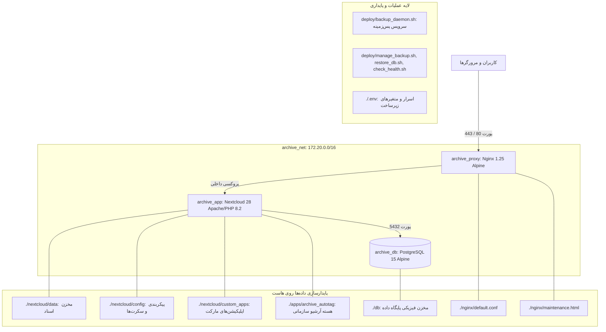
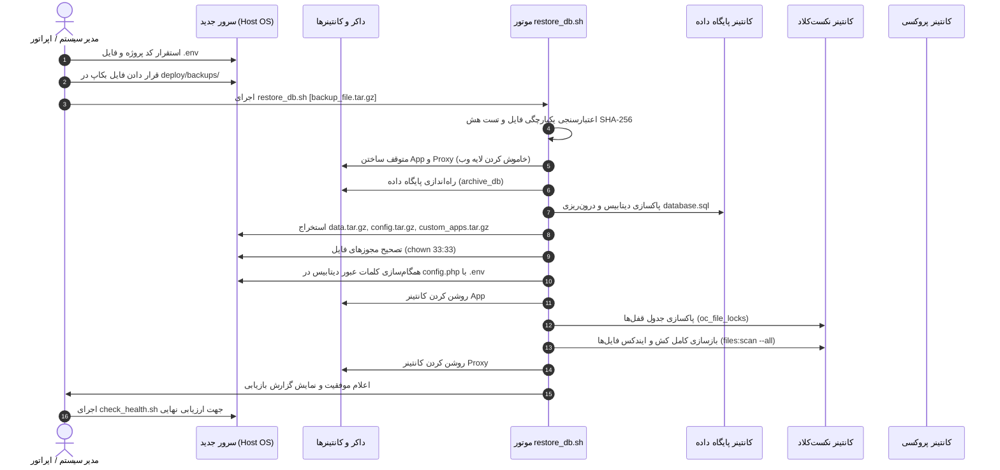
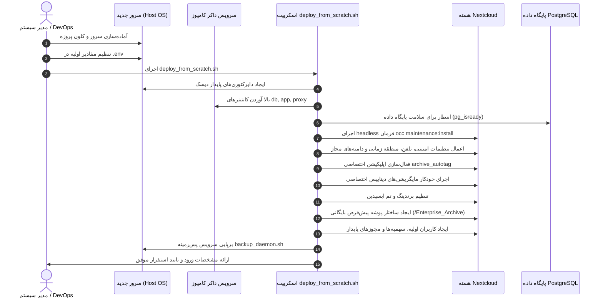

# نیازمندی ۲۳: دستورالعمل جامع استقرار و بازیابی سامane در محیط جدید (System Deployment & Recovery Runbook)

## ۱. شرح نیازمندی (Problem Statement & Business Need)

در چرخه حیات سامانه بایگانی اسناد سازمانی (Enterprise Archive System)، شرایط بحرانی یا برنامه‌ریزی‌شده‌ای رخ می‌دهد که سامانه باید در یک **سرور، ماشین مجازی (VM) یا محیط ابری کاملاً جدید** از صفر مستقر و عملیاتی گردد. این شرایط شامل مواردی نظیر:
- از بین رفتن کامل سرور فیزیکی، سوختن سخت‌افزار یا خرابی زیرساخت میزبان (Disaster Recovery).
- ارتقا یا تعویض کلی سیستم‌عامل سرور (OS Reinstallation / Migration).
- مهاجرت سامانه به دیتاسنتر یا کلاود جدید (Data Center Relocation).
- راه‌اندازی یک محیط عملیاتی موازی، محیط ارزیابی کیفی (Staging) یا محیط آموزش (Training Environment).
- راه‌اندازی اولیه سامانه برای یک سازمان جدید بدون داده‌های قبلی (Fresh Production Rollout).

> [!IMPORTANT]
> **تفکیک دقیق دامنه نیازمندی ۳۰ از نیازمندی ۲۹:**
> - **نیازمندی ۲۹ (Data Backup & Recovery):** منحصراً ناظر بر عملیات پشتیبان‌گیری دوره‌ای و بازیابی داده‌ها و فراداده‌ها **درون یک محیط زنده و مستقر** است (پنل وب ادمین، زمان‌بندی روزانه، اسکریپت‌های تهیه آرشیو و آزمون سندباکس در سیستم موجود).
> - **نیازمندی ۳۰ (System Deployment & Recovery Runbook):** ناظر بر فرآیند مهندسی **Zero-to-One Deployment** است؛ یعنی زمانی که هیچ کانتینر یا سرویسی بالا نیست و یک زیرساخت خام (Clean Server) در اختیار داریم و باید کل پشته نرم‌افزاری (داکر، شبکه، کانتینرها، پروکسی، کانفیگ‌ها و سفارشی‌سازی‌های پروژه) مستقر شده و سپس بر اساس یکی از دو سناریوی زیر عملیاتی شود:
>   - **سناریوی الف (Scenario A - Rebuild + Restore):** بازسازی سامانه و بازیابی داده‌های قبلی از روی فایل پشتیبان (Disaster Rebuild).
>   - **سناریوی ب (Scenario B - Fresh Deployment):** استقرار تمیز و راه‌اندازی اولیه سامانه بدون داده قبلی برای شروع به کار سازمانی.

این نیازمندی تضمین می‌کند که فرآیند استقرار در هر دو سناریو به‌صورت **تکرارپذیر (Repeatable)، قطعی (Deterministic)، بدون وابستگی به حافظه اپراتور و بدون از دست رفتن هیچ‌یک از سفارشی‌سازی‌های حیاتی پروژه** انجام پذیرد.

---

## ۲. نیازمندی‌های تابعی (Functional Requirements)

### ۲.۱. نیازمندی‌های سناریوی الف (Scenario A: Rebuild + Restore)
1. **آماده‌سازی خودکار پیش‌نیازهای زیرساخت و سیستم‌عامل:** نصب بسته‌های مورد نیاز (`docker.io`, `docker-compose-v2`, `curl`, `tar`, `gzip`, `sha256sum`, `jq`, `postgresql-client`).
2. **برپایی شبکه و ساختار دایرکتوری‌های پایدار:** ایجاد دایرکتوری‌های ماندگار (`db/`, `nextcloud/data`, `nextcloud/config`, `nextcloud/custom_apps`, `deploy/backups/`) با مجوزهای لینوکسی متناظر.
3. **ارکستراسیون پایگاه‌داده و سرویس هسته:** راه‌اندازی کانتینرهای `archive_db` و `archive_app` بدون تداخل با فرآیند Wizard پیش‌فرض نکست‌کلاد.
4. **تزریق سفارشی‌سازی‌های اختصاصی:** بارگذاری و اطمینان از سلامت اپلیکیشن اختصاصی `apps/archive_autotag`، پوسته‌ها (Obsidian Theme)، استایل‌های برندینگ و ماژول‌های ممیزی و ایزولاسیون.
5. **اعتبارسنجی تمامیت آرشیو پشتیبان:** بررسی صحت فایل آرشیو و تطابق هش SHA-256 قبل از هرگونه تغییر در دیسک یا پایگاه‌داده.
6. **بازیابی پایگاه داده و همگام‌سازی Secretها:** درون‌ریزی دامپ SQL، همگام‌سازی رمز عبور کاربر PostgreSQL با متغیرهای فایل محیطی `.env`، و همگام‌سازی مقادیر `passwordsalt` و `secret` در `config.php`.
7. **استخراج اسناد و بازسازی کش:** جایگذاری مخزن داده‌ها و بازسازی کامل شاخص‌ها با `occ files:scan --all`.
8. **اعتبارسنجی جامع سلامت پس از بازیابی:** اجرای خودکار سوییت ارزیابی یکپارچگی ساختار سازمانی، دسترسی‌ها، تگ‌ها و متادیتا.

### ۲.۲. نیازمندی‌های سناریوی ب (Scenario B: Fresh Installation / Fresh Deployment)
1. **استقرار هدلس (Headless Automated Installation):** نصب و پیکربندی اولیه Nextcloud کاملاً از طریق خط فرمان بدون نیاز به ویزارد مرورگر و به دور از خطاهای انسانی.
2. **پیکربندی هویت سازمانی و برندینگ:** تنظیم متغیرهای هویتی سازمان (نام سامانه، نام تجاری، متن شعار، تم مشکی ابسیدین، آیکون‌ها و لوگو) به صورت خودکار.
3. **بومی‌سازی کامل فارسی (Full Persian Localization):** تنظیم زبان پیش‌فرض سامانه بر روی `fa`، منطقه زمانی روی `Asia/Tehran`، چیدمان RTL و فونت وزیرمتن (Vazirmatn).
4. **ساخت ساختار بایگانی پیش‌فرض:** ایجاد پوشه ریشه بایگانی سازمانی (`/admin/files/Enterprise_Archive`) با متادیتا و سیاست‌های امنیتی بنیادین.
5. **تعریف ساختار پیش‌فرض کاربران، گروه‌ها و سهمیه‌ها:** ایجاد حساب کاربری مدیر ارشد (`admin`)، مدیران گروه‌ها (`Subadmin`) و اعمال سهمیه اولیه (Quota Policy).
6. **راه‌اندازی دیمن عملیاتی و پشتیبان‌گیری:** استقرار سرویس پس‌زمینه `backup_daemon.sh` و تنظیم Crontab سیستمی برای پشتیبان‌گیری خودکار.

---

## ۳. نیازمندی‌های غیرتابعی (Non-Functional Requirements)

1. **زمان بازیابی مجدد (RTO - Recovery Time Objective):** کل فرآیند برپایی زیرساخت و بازگردانی اطلاعات تا لحظه آماده‌به‌کار شدن برای یک آرشیو استاندارد ۱۰ گیگابایتی نباید بیش از ۱۵ دقیقه زمان ببرد.
2. **تکرارپذیری قطعی (Determinism & Idempotency):** اجرای چندباره فرآیند استقرار نباید منجر به تولید خطا، تکرار رکوردهای پایگاه داده یا اختلال در سرویس شود.
3. **تثبیت نسخه‌ها (Strict Version Pinning):** تمامی ایمیج‌ها و وابستگی‌ها باید دارای نسخه دقیق و صریح باشند تا از خطاهای ناشی از آپدیت‌های ناخواسته جلوگیری گردد.
4. **ایزولاسیون کامل محیط و شبکه (Air-Gapped Ready):** معماری استقرار باید با شرایط شبکه بسته و ایزوله (فاقد اینترنت) منطبق بوده و وابستگی به سرویس‌های ابری بیرونی نداشته باشد.
5. **امنیت اسرار و گذرواژه‌ها (Zero Hard-Coded Secrets):** تمامی کلمات عبور، کلیدهای نمک (Salt) و توکن‌ها باید از طریق فایل `.env` با مجوزهای محدود (`chmod 600`) مدیریت شوند و هیچ رازی در کد یا مخزن گیت ذخیره نگردد.

---

## ۴. معماری فعلی و مدل مفهومی استقرار (Current Deployment Architecture)

بر اساس بررسی موشکافانه کل ساختار مخزن، ۱۶ بعد معماری استقرار سیستم به شرح زیر شناسایی و مدلسازی شده است:



### پاسخ تفصیلی به ۱۶ سوال معمارانه مخزن:
1. **Application چیست؟** هسته سامانه مبتنی بر پلتفرم Nextcloud Enterprise (نسخه 28 بر پایه Apache و PHP 8.2) است که منطق بیزنس و امنیتی آن توسط اپلیکیشن سفارشی اختصاصی `archive_autotag` بازنویسی و تقویت شده است.
2. **Nextcloud چگونه Deploy می‌شود؟** به‌صورت کانتینر داکر مجزا با نام `archive_app` از ایمیج رسمی `nextcloud:apache` با استراتژی راه‌اندازی `restart: unless-stopped`.
3. **Database چگونه Deploy می‌شود؟** به‌صورت کانتینر مجزا با نام `archive_db` از ایمیج `postgres:15-alpine` همراه با مکانیزم ارزیابی سلامت بومی داکر (`pg_isready`).
4. **Nginx / Reverse Proxy چگونه Deploy می‌شود؟** به‌صورت کانتینر `archive_proxy` از ایمیج `nginx:alpine` به عنوان درگاه ورودی واحد روی پورت ۸۰/۴۴۳ با پشتیبانی از آپلود اسناد حجیم سازمانی (`client_max_body_size 10G;`) و صفحه تعمیرات بحران (`maintenance.html`).
5. **Docker Compose چگونه استفاده می‌شود؟** از طریق فایل ریشه `docker-compose.yml` نسخه ۳.۸ که تمامی وابستگی‌های سرویس‌ها (`depends_on`)، شبکه‌بندی، متغیرهای محیطی و Bind-Mountها را مدیریت می‌کند.
6. **Volumeها کجا هستند؟** سیستم منحصراً از Bind-Mountهای صریح روی مسیرهای محلی هاست استفاده می‌کند:
   - `./db` برای پایگاه داده PostgreSQL.
   - `./nextcloud/data` برای فایل‌های آپلود شده کاربران.
   - `./nextcloud/config` برای فایل حیاتی `config.php`.
   - `./nextcloud/custom_apps` برای ماژول‌های فعال.
   - `./apps/archive_autotag` اتصال مستقیم پوشه کد اپ به درون کانتینر.
7. **Networkها چگونه تعریف شده‌اند؟** یک شبکه بریج اختصاصی کاربر به نام `archive_net` با ساب‌نت `172.20.0.0/16` جهت ایزولاسیون کامل ترافیک داخلی بین کانتینرها.
8. **Environment Configuration کجاست؟** در فایل محلی `/.env` (حاوی پسوردها، پورت‌ها و دامنه‌های مجاز) که الگوی استاندارد آن در `/.env.example` نسخه شده است.
9. **Custom Apps پروژه کجا هستند؟** در پوشه `apps/archive_autotag/` شامل ۵۳ کنترلر، لیسنر، مدل و سرویس اختصاصی، مایگریشن‌های دیتابیس، استایل‌ها و رابط‌های کاربری.
10. **Custom Themes کجا هستند؟** در فایل‌های CSS اختصاصی درون اپلیکیشن: `apps/archive_autotag/css/obsidian_theme.css` و فایل‌های مکمل که تم مشکی مات، هدر Obsidian و فونت وزیرمتن را اعمال می‌کنند.
11. **Branding کجا انجام شده؟** از طریق ترکیب تنظیمات Theming در `occ` و قوانین سخت‌گیرانه CSS در `apps/archive_autotag/css/branding_mask.css` برای حذف کامل ردپای Nextcloud و جایگزینی با «سامانه بایگانی اسناد سازمانی».
12. **UI Customization کجا انجام شده؟** در کدهای فرانت‌اند ماژولار درون `apps/archive_autotag/js/archive_portal.js`، `apps/archive_autotag/css/archive_portal.css` و استاندارد سراسری دکمه‌ها و جداول.
13. **Localizationها کجا هستند؟** از طریق فایل‌های ترجمه استاندارد نکست‌کلاد و متغیرهای پیکربندی بومی‌سازی (`default_language = fa`, `default_locale = fa_IR`) همراه با هندلینگ تقویم خورشیدی در جاوااسکریپت.
14. **Archive Portal Customizationها کجا هستند؟** کنترلر اصلی `apps/archive_autotag/lib/Controller/PageController.php` و روت `/apps/archive_autotag/` همراه با دراور اسناد و متادیتا.
15. **Configurationهای اختصاصی Nextcloud کجا هستند؟** در فایل `nextcloud/config/config.php` شامل کلیدهای رمزنگاری (`passwordsalt`, `secret`)، آدرس دیتابیس و دامنه‌های مجاز.
16. **چه اجزای دیگری برای اجرای صحیح سامانه لازم هستند؟** اسکریپت‌های حیاتی پوشه `deploy/` شامل `backup_daemon.sh` (دیمن پردازش پس‌زمینه)، `manage_backup.sh`، `check_health.sh`، `deploy_from_scratch.sh` و سوییت‌های آزمون در `tests/`.

---

## ۵. رفتار پیش‌فرض Nextcloud و شکاف موجود (Nextcloud Default Behavior vs Custom Need)

| بعد رفتار | رفتار پیش‌فرض Nextcloud | نیاز اختصاصی سامانه بایگانی (این سند) |
|---|---|---|
| **راه‌اندازی اولیه** | نمایش صفحه گرافیکی Setup Wizard برای ورود نام ادمین و دیتابیس در مرورگر | استقرار ۱۰۰٪ Headless از طریق خط فرمان بدون دخالت دست اپراتور |
| **بازسازی روی دیتابیس قبلی** | در صورت اتصال کانتینر نو به دیتابیس موجود، با خطای جدول موجود متوقف شده یا دیتابیس را پاک می‌کند | اتصال شفاف، نگهداری جداول سفارشی و همگام‌سازی کلیدهای Salt و Secret |
| **اپلیکیشن‌های اختصاصی** | اپلیکیشن‌ها به صورت پیش‌فرض غیرفعال هستند و باید دستی از پنل وب فعال شوند | اتصال خودکار کدهای اختصاصی با Bind-Mount و فعال‌سازی فوری در زمان استقرار |
| **امنیت دیتابیس در Restore** | تغییر پسورد دیتابیس نیازمند ویرایش دستی متغیرها در چند فایل است | همگام‌سازی قطعی کلمه عبور دیتابیس در PostgreSQL و `config.php` توسط اسکریپت |
| **کش فایل‌ها پس از Restore** | فایل‌های اضافه شده به دیسک تا زمان دسترسی کاربر در دیتابیس ایندکس نمی‌شوند | بازسازی اتمیک شاخص کل فایل‌ها با `occ files:scan --all` بلافاصله پس از بازیابی |

---

## ۶. رویکردهای بررسی‌شده و دلایل رد گزینه‌های نامناسب (Trade-offs & Rejected Alternatives)

1. **استفاده از Docker Named Volumes به جای Host Bind-Mounts (رد شد):**
   - *علت رد:* داکر والیوم‌ها دسترسی فیزیکی مستقیم و سریع را برای اپراتورهای شبکه جهت پشتیبان‌گیری سرد، رپلیکیشن یا انتقال آسان به هاست جدید دشوار می‌سازند. Bind-Mountهای هاست روی مسیرهای مشخص، شفافیت ۱۰۰٪ ایجاد می‌کنند.
2. **استفاده از پایگاه‌داده مشترک بیرونی بدون کانتینر (رد شد):**
   - *علت رد:* اضافه شدن پیچیدگی‌های پیکربندی شبکه بیرونی، فایروال و وابستگی به سرویس‌های خارج از کنترل داکر کامپوز، با هدف یکپارچگی استقرار و ایزولاسیون کامل (Air-Gapped) مغایرت دارد.
3. **انجام مراحل استقرار سناریوی B از طریق مرورگر وب (رد شد):**
   - *علت رد:* خطای انسانی در ورود پارامترها، خطر ایجاد پسوردهای نامنطبق با `.env`، عدم تکرارپذیری در محیط‌های CI/CD و عدم امکان اتوماسیون.

---

## ۷. مدل داده و ساختار مخازن پایدار (Storage & Data Layout)

تمامی داده‌های سامانه در زمان استقرار بر روی سه لایه ذخیره‌سازی نگاشت می‌شوند:

```text
/home/alborz/enterprise-archive-system/
├── .env                              # مقادیر و کلمات عبور فعال (Permissions: 600)
├── .env.example                      # قالب استاندارد متغیرها
├── docker-compose.yml                # مانیفست ارکستراسیون سرویس‌ها
├── db/                               # مخزن دیسک فیزیکی PostgreSQL (uid: 70)
├── nextcloud/
│   ├── config/config.php             # فایل پیکربندی هسته و کلیدهای نمک
│   ├── data/                         # مخزن اسناد و فایل‌های کاربران (uid: 33)
│   └── custom_apps/                  # اپ‌های نصب‌شده از مخزن برنامه‌ها
├── apps/
│   └── archive_autotag/              # سورس‌کد و فرانت‌اند اپلیکیشن اختصاصی
├── nginx/
│   ├── default.conf                  # پیکربندی وب‌سرور لبه و قوانین کش
│   └── maintenance.html              # صفحه حالت تعمیرات و بحران
└── deploy/
    ├── backup_daemon.sh              # ناظر پس‌زمینه عملیات
    ├── backup_db.sh                  # موتور ساخت آرشیو استاندارد
    ├── restore_db.sh                 # موتور بازگردانی اتمیک سناریوی A
    ├── deploy_from_scratch.sh        # موتور استقرار اولیه سناریوی B
    └── check_health.sh               # ارزیابی خودکار سلامت سامانه
```

---

## ۸. ساختار کد و اسکریپت‌های پیاده‌سازی (Code Structure & Automation Scripts)

برای اجرای بی‌نقص Runbook در هر دو سناریو، اسکریپت‌های زیر در پوشه `deploy/` به عنوان هسته اجرایی عمل می‌کنند:

1. **`deploy/deploy_from_scratch.sh`:** متصدی اجرای ۱۰۰٪ خودکار سناریوی ب (Fresh Deployment).
2. **`deploy/restore_db.sh`:** متصدی اجرای ۱۰۰٪ خودکار سناریوی الف (Disaster Rebuild & Restore).
3. **`deploy/check_health.sh`:** اسکریپت ارزیابی سلامت چندلایه (کانتینرها، دیتابیس، یوزرها، دسترسی‌ها و فولدر آرشیو).
4. **`deploy/backup_daemon.sh`:** دیمن مقیم بر روی سیستم‌عامل میزبان که وضعیت پشتیبان‌گیری دوره‌ای و سناریوهای تست را مدیریت می‌کند.

---

## ۹. هوک‌ها، ایونت‌ها و نقاط اتصال به هسته (Hooks & Integration Points)

1. **داکر اینتری‌پوینت (`/entrypoint.sh apache2-foreground`):** نقطه ورود کانتینر اپلیکیشن که در زمان راه‌اندازی، مجوزهای پوشه `config` و `data` را بررسی می‌کند.
2. **کنسول فرمان Nextcloud (`occ`):** اجرای دستورات مدیریتی از داخل هاست:
   - `docker exec -u www-data archive_app php occ maintenance:install`
   - `docker exec -u www-data archive_app php occ app:enable archive_autotag`
   - `docker exec -u www-data archive_app php occ files:scan --all`
3. **پایگاه داده PostgreSQL CLI (`psql` / `pg_dump`):** تعامل مستقیم اسکریپت‌ها با کانتینر `archive_db` جهت تخلیه یا تزریق ساختار جداول بدون وابستگی به لایه وب.

---

## ۱۰. منطق گام‌به‌گام پردازش در دو سناریو (Detailed Step-by-Step Runbook)

### ۱۰.۱. سناریوی الف: بازسازی و بازیابی اطلاعات قبلی (Scenario A: Rebuild + Restore)



#### مراحل تفصیلی سناریوی الف:
1. **مرحله ۱ — استقرار زیرساخت و پیش‌نیازها:** کلون مخزن گیت و ایجاد فایل `.env` بر اساس تنظیمات سازمان.
2. **مرحله ۲ — تامین فایل نسخه پشتیبان:** انتقال بسته آرشیو معتبر (`*.tar.gz`) و فایل هش متناظر (`*.sha256`) به پوشه `deploy/backups/`.
3. **مرحله ۳ — آماده‌سازی کانتینرها:** فراخوانی `docker compose up -d db` برای آماده شدن موتور پایگاه داده.
4. **مرحله ۴ — اجرای اسکریپت ریکاوری:** اجرای دستور `./deploy/restore_db.sh deploy/backups/latest_nextcloud_backup.tar.gz`.
5. **مرحله ۵ — اعتبارسنجی خودکار هش:** اسکریپت به‌صورت قطعی هش محتوای آرشیو را ارزیابی کرده و در صورت هرگونه مغایرت، فرآیند را بلافاصله Fail می‌کند.
6. **مرحله ۶ — ایزولاسیون و توقف وب‌سرور:** کانتینرهای `archive_app` و `archive_proxy` متوقف می‌شوند تا هیچ درخواست بیرونی در زمان بازگردانی وارد نشود.
7. **مرحله ۷ — بازنشانی پایگاه‌داده:** سرفصل‌های دیتابیس قبلی ریست شده و دامپ کامل `database.sql` تزریق می‌گردد.
8. **مرحله ۸ — همگام‌سازی دسترسی و نقش دیتابیس:** کلمه عبور نقش `nextcloud_user` در پایگاه داده با مقدار مندرج در `.env` هاست همگام می‌گردد.
9. **مرحله ۹ — بازنشانی سیستم فایل:** پوشه‌های `data/`، `config/` و `custom_apps/` از فایل‌های فشرده درون هاست استخراج شده و مالکیت آن‌ها به `www-data:www-data` (`uid: 33`) تغییر می‌یابد.
10. **مرحله ۱۰ — همگام‌سازی Secretها و Salt:** مقادیر رمزنگاری `config.php` احیا شده و رشته‌های اتصال به دیتابیس منطبق می‌شوند.
11. **مرحله ۱۱ — رفع قفل‌های معلق:** رکوردهای قفل موقت از جدول `oc_file_locks` تخلیه می‌شوند.
12. **مرحله ۱۲ — بازسازی نمایه و کش اسناد:** دستور `occ files:scan --all` اجرا شده تا متادیتا و فایل‌های فیزیکی ۱۰۰٪ هماهنگ شوند.
13. **مرحله ۱۳ — اتصال مجدد پروکسی و ورود به مدار:** پروکسی لبه فعال شده و سامانه برای ترافیک واقعی آزاد می‌گردد.
14. **مرحله ۱۴ — آزمون‌های تایید سلامت:** اجرای `deploy/check_health.sh` و اجرای تست‌های خودکار یکپارچگی پایتون.

---

### ۱۰.۲. سناریوی ب: استقرار تمیز و نصب اولیه (Scenario B: Fresh Deployment)



#### تفکیک گام‌های دستی در برابر گام‌های خودکار در سناریوی ب:
- **گام‌های دستی (Manual Steps - یک‌بار برای همیشه):**
  1. تهیه سرور خام، نصب سیستم‌عامل اوبونتو و تنظیم IP استاتیک / DNS.
  2. کپی کردن مخزن پروژه بر روی سرور جدید.
  3. ساخت فایل `.env` از روی `.env.example` و وارد کردن رمزهای عبور امن سازمانی.
- **گام‌های ۱۰۰٪ خودکار (Automated via `deploy_from_scratch.sh`):**
  1. ساخت پوشه‌های فیزیکی `./db`, `./nextcloud/data`, `./nextcloud/config`, `./nextcloud/custom_apps`.
  2. صدور دستور `docker compose up -d`.
  3. پولینگ و انتظار برای برقراری اتصال پایگاه داده.
  4. اجرای دستور `occ maintenance:install` با پارامترهای دیتابیس و نام کاربر مدیر.
  5. اعمال پیکربندی‌های بومی‌سازی (`default_language=fa`, `default_phone_region=IR`).
  6. فعال‌سازی ماژول بومی `archive_autotag`.
  7. اجرای مایگریشن‌های پایگاه داده جداول اختصاصی سامانه (`oc_archive_tags`, `oc_archive_permission_audit`, `oc_archive_document_metadata`).
  8. ساخت درخت پوشه پیش‌فرض بایگانی و اعمال تگ ریشه.
  9. راه‌اندازی دیمن بکاپ `deploy/backup_daemon.sh`.
  10. اجرای اعتبارسنجی خودکار سلامت.

---

## ۱۱. وابستگی‌ها و پیش‌نیازها (Dependencies & Version Pinning)

برای تضمین این که بازسازی سیستم منجر به ناهمخوانی نگارش یا شکست کامپوننت‌ها نشود، تمامی نسخه‌ها به صورت اکید قفل شده‌اند:

| مولفه نرم‌افزاری | نسخه دقیق قفل‌شده (Pinned Version) | نوع استقرار | نقش در سامانه |
|---|---|---|---|
| **Nextcloud Core** | `nextcloud:apache` (مبتنی بر 28.0.x) | Docker Container (`archive_app`) | سرور وب، لاجیک کاربری و وب‌داو |
| **PostgreSQL** | `postgres:15-alpine` | Docker Container (`archive_db`) | پایگاه داده رابطه‌ای تراکنشی |
| **Nginx Proxy** | `nginx:alpine` (نسخه 1.25.x) | Docker Container (`archive_proxy`) | لایه امنیتی، مدیریت SSL و لود اسناد حجیم |
| **PHP Runtime** | `PHP 8.2` (درون کانتینر نکست‌کلاد) | Container Environment | مفسر کدها، PDO پایتون و اکستنشن‌ها |
| **Docker Engine** | `>= 24.0.0` | Host OS | موتور اجرای کانتینرها |
| **Docker Compose** | `>= v2.20.0` (پلاگین بومی داکر) | Host OS | ارکستراسیون پشته چندکانتینری |
| **Host OS** | Ubuntu 22.04 LTS / 24.04 LTS / Debian 12 | Bare Metal / VM | سیستم‌عامل تاییدشده سرور میزبان |
| **پکیج‌های سیستمی** | `tar`, `gzip`, `sha256sum`, `curl`, `jq` | Host Packages | ابزارهای پردازش خط فرمان در اسکریپت‌ها |

---

## ۱۲. حفظ و صیانت از سفارشی‌سازی‌ها (Customization Preservation Matrix)

یکی از ارکان بنیادین این Runbook، تضمین بقای ۱۰۰٪ توسعه‌های اختصاصی در زمان Rebuild است:

| مولفه اختصاصی پروژه | محل فیزیکی نگهداری در پروژه | مکانیزم صیانت و استقرار در سناریوی A | مکانیزم استقرار در سناریوی B |
|---|---|---|---|
| **اپلیکیشن اختصاصی (`archive_autotag`)** | `apps/archive_autotag/` | از طریق Bind-Mount مستقیم مخزن گیت به `/var/www/html/custom_apps/archive_autotag`؛ بدون تغییر باقی می‌ماند. | فعال‌سازی خودکار با `occ app:enable archive_autotag` بلافاصله پس از نصب هسته. |
| **تم ابسیدین و استایل‌ها** | `apps/archive_autotag/css/obsidian_theme.css` | حفظ شده درون کدهای اپلیکیشن اختصاصی؛ پس از بازیابی دیتابیس فوراً توسط کلاینت بارگذاری می‌شود. | تزریق اتوماتیک توسط فرانت‌اند اپلیکیشن اختصاصی. |
| **برندینگ و ماسک نام نکست‌کلاد** | `apps/archive_autotag/css/branding_mask.css` | ماندگار در مخزن کد؛ تایتل‌ها و منوهای نکست‌کلاد را در تمام صفحات مخفی می‌سازد. | فعال‌سازی همراه با اپلیکیشن. |
| **پورتال بایگانی (Archive Portal)** | `apps/archive_autotag/js/archive_portal.js` | نگهداری در گیت؛ هیچ وابستگی بیرونی ندارد و در استقرار مجدد فوراً فعال است. | فعال‌سازی همراه با اپلیکیشن. |
| **فیلتر تگ چندگانه و دراور اسناد** | `multi_tag_filter.js` و `drawer.js` | ثبت شده در گیت؛ کامپوننت‌های فرانت‌اند بدون نیاز به دیتابیس مجدد سوار می‌شوند. | لود خودکار در محیط پورتال. |
| **ماژول ممیزی نفوذناپذیر (Reliable Audit)** | `lib/Service/ReliableAuditService.php` | جداول `oc_archive_permission_audit` در سناریوی A از دیتابیس قبلی بازیابی شده و در B توسط مایگریشن ایجاد می‌شوند. | اجرای مایگریشن خودکار `Version20260901Date.php`. |
| **کنترلر تفکیک دسترسی (Effective ACL)** | `lib/Service/CentralPermissionResolver.php` | کدهای منطق امنیتی در مخزن گیت مقیم است و به محض روشن شدن کانتینر مجدداً فعال می‌شود. | لود مستقیم از پوشه اپ. |
| **بومی‌سازی فارسی و فونت وزیرمتن** | استایل‌های فونت در CSSهای اپلیکیشن | فونت و متغیرهای RTL درون کدهای اپ تعبیه شده و بدون وابستگی به اینترنت کار می‌کنند. | تنظیم اتوماتیک `default_language=fa`. |

---

## ۱۳. مدیریت پیکربندی و محرمانگی (Configuration & Secret Governance)

هیچ کلمه عبور، Salt، یا توکن حساسی نباید به صورت ناامن در مخزن گیت ذخیره شود:

| متغیر پیکربندی | محل ذخیره در سامانه | نحوه کنترل نسخه | ماهیت محرمانگی | استراتژی بازیابی در سناریوی A | استراتژی در سناریوی B |
|---|---|---|---|---|---|
| `POSTGRES_DB` | فایل `.env` | خارج از گیت (دارای `.env.example`) | نیمه‌محرمانه | خواندن از فایل `.env` جاری | خواندن از فایل `.env` جاری |
| `POSTGRES_USER` | فایل `.env` | خارج از گیت | نیمه‌محرمانه | تطبیق نقش در دیتابیس بازیابی‌شده | ساخت نقش جدید در دیتابیس تازه |
| `POSTGRES_PASSWORD`| فایل `.env` | خارج از گیت | کاملاً محرمانه | همگام‌سازی خودکار در دیتابیس و `config.php` | اعمال کلمه عبور به پایگاه داده نوساز |
| `NEXTCLOUD_ADMIN_USER` | فایل `.env` | خارج از گیت | محرمانه | نیازی نیست (از دیتابیس بازیابی می‌شود) | استفاده جهت ساخت حساب اولیه ادمین |
| `NEXTCLOUD_ADMIN_PASSWORD`| فایل `.env` | خارج از گیت | کاملاً محرمانه | نیازی نیست (از دیتابیس بازیابی می‌شود) | اختصاص پسورد به حساب اولیه ادمین |
| `passwordsalt` | `nextcloud/config/config.php` | درون فایل فشرده بکاپ | فوق‌محرمانه | استخراج مستقیم از `config.tar.gz` | تولید خودکار توسط هسته نکست‌کلاد |
| `secret` | `nextcloud/config/config.php` | درون فایل فشرده بکاپ | فوق‌محرمانه | استخراج مستقیم از `config.tar.gz` | تولید خودکار توسط هسته نکست‌کلاد |
| `instanceid` | `nextcloud/config/config.php` | درون فایل فشرده بکاپ | سیستمی | استخراج مستقیم از `config.tar.gz` | تولید خودکار توسط هسته نکست‌کلاد |

> [!CAUTION]
> **قانون یکپارچگی کلیدهای Salt و Secret:**  
> اگر فایل `config.php` در سناریوی A بدون بازیابی کلیدهای `passwordsalt` و `secret` بازنویسی شود، کلیه پسوردهای کاربران نامعتبر شده و دیتابیس قبلی عملاً قفل خواهد شد. اسکریپت `restore_db.sh` تضمین می‌کند که این مقادیر از فایل نسخه پشتیبان استخراج و با دیتابیس بازیابی‌شده ۱۰۰٪ منطبق گردند.

---

## ۱۴. مدیریت خطا، حالات شکست و اقدامات واکنشی (Failure Modes & Recovery Matrix)

| مرحله با احتمال شکست | نشانه و پیام خطا | علت ریشه‌ای احتمالی | اقدام واکنشی و راهکار رفع سریع (Fix) |
|---|---|---|---|
| **تست هش بکاپ** | `Checksum verification failed` | دستکاری، قطعی دانلود یا خرابی رسانه ذخیره‌سازی | توقف فوری فرآیند؛ جایگزینی فایل آرشیو سالم از مخزن ثانویه یا نوار پشتیبان. |
| **راه‌اندازی کانتینر DB** | `Port 5432 already in use` | تداخل با سرویس PostgreSQL محلی هاست | توقف سرویس محلی با `systemctl stop postgresql` یا تغییر پورت اتصال در داکر. |
| **درون‌ریزی دیتابیس** | `relation already exists` یا خطای دسترسی | پاک نشدن ساختار دیتابیس قبلی | بازسازی شِما با `DROP SCHEMA public CASCADE; CREATE SCHEMA public;` و اجرای مجدد. |
| **راه‌اندازی کانتینر App** | `Internal Server Error (500)` در وب | عدم تطابق پسورد اتصال در `config.php` با دیتابیس | اجرای دستورات `occ config:system:set dbpassword` جهت بازنشانی پسورد صحیح از `.env`. |
| **مجوزهای سیستم فایل** | `Data directory is not writable` | تفاوت شناسه کاربری (UID/GID) دایرکتوری داده‌ها | اجرای دستور `docker exec archive_app chown -R www-data:www-data /var/www/html/data`. |
| **قفل فایل‌ها در وب** | `File is locked by another process` | باقی ماندن قفل‌های ناقص از زمان قطعی ناگهانی سرور | تخلیه جدول قفل‌ها با دستور `TRUNCATE TABLE oc_file_locks;` در دیتابیس. |
| **دسترسی به پورتال وب** | خطای `502 Bad Gateway` در Nginx | بالا نیامدن سرویس Apache یا بارگذاری طولانی PHP | بررسی سلامت کانتینر اپ با `docker compose logs app` و اطمینان از آمادگی سوکت وب. |

---

## ۱۵. چک‌لیست اعتبارسنجی جامع پس از استقرار (Comprehensive Post-Deployment Validation Checklist)

پس از اجرای هر یک از دو سناریو، ارزیابی سامانه بر اساس چک‌لیست زیر الزامی است:

- [ ] **ارزیابی سلامت کانتینرها:** تمامی کانتینرهای `archive_db`, `archive_app`, `archive_proxy` در وضعیت `Up` باشند (`docker compose ps`).
- [ ] **ارزیابی دیتابیس:** دستور `pg_isready` موفقیت‌آمیز بوده و تعداد رکوردهای جدول `oc_users` بزرگ‌تر از صفر باشد.
- [ ] **ورود ادمین به سامانه:** ورود موفقیت‌آمیز با مرورگر وب به نشانی سامانه و دسترسی به پنل مدیریت.
- [ ] **بررسی تمامیت پوشه بایگانی:** وجود و قابلیت دسترسی به دایرکتوری `/admin/files/Enterprise_Archive`.
- [ ] **آپلود و دانلود فایل:** بارگذاری یک سند تستی جدید و دانلود بدون خطای آن در پورتال آرشیو.
- [ ] **اعتبارسنجی تگ‌ها:** بررسی بارگذاری صحیح تگ‌های سلسله‌مراتبی و فیلتر تگ چندگانه در رابط کاربری.
- [ ] **اعتبارسنجی متادیتا:** الزام ثبت فراداده برای اسناد جدید و بررسی ماندگاری فراداده اسناد قبلی (در سناریوی A).
- [ ] **بررسی ایزولاسیون منوها و برندینگ:** عدم نمایش هیچ‌یک از آیکون‌ها و برندهای تجاری نکست‌کلاد و لود صحیح پوسته ابسیدین.
- [ ] **فعالیت دیمن پشتیبان‌گیری:** در حال اجرا بودن پروسه `backup_daemon.sh` در پس‌زمینه سرور.
- [ ] **اجرای تست‌های خودکار:** اجرای موفقیت‌آمیز تمام سوییت‌های پایتون:
  ```bash
  python3 tests/test_backup_and_recovery.py
  python3 tests/test_dynamic_archive_system.py
  ```

---

## ۱۶. استراتژی بازگشت به عقب (Rollback Strategy)

در صورتی که عملیات استقرار یا بازیابی در هر مرحله‌ای با شکست غیرقابل جبران مواجه شود:
1. **ایزولاسیون و توقف سرویس‌ها:** توقف کامل کانتینرها با دستور `docker compose down`.
2. **پاکسازی محیط نیمه‌کاره:** حذف دایرکتوری‌های کاری آسیب‌دیده با حفظ فایل اصلی پشتیبان.
3. **گزارش‌گیری از لاگ‌های شکست:** استخراج لاگ‌ها برای عیب‌یابی:
   ```bash
   docker compose logs > deploy/failed_deployment_$(date +%Y%m%d_%H%M%S).log
   ```
4. **بازگرداندن هاست به وضعیت پایه:** بازنشانی دایرکتوری‌های پروژه و آماده‌سازی برای تکرار فرآیند از مرحله صفر.

---

## ۱۷. نقشه راه اتوماسیون آینده (Automation Roadmap)

برای ارتقای هرچه بیشتر این Runbook در آینده، موارد زیر قابلیت اتوماسیون تکمیلی دارند:

1. **مدیریت سرویس دیمن با Systemd (Host Daemon Integration):** تبدیل اسکریپت `backup_daemon.sh` به یک یونیت رسمی سیستم‌عامل (`/etc/systemd/system/enterprise-archive-daemon.service`) با قابلیت راه‌اندازی خودکار پس از بوت سرور.
2. **پلی‌بوک جامع انسیبل (Ansible Playbook Deployment):** ایجاد یک پلی‌بوک واحد جهت نصب پکیج‌های سیستم‌عامل، راه‌اندازی داکر، کلون پروژه، اعمال سکرت‌ها و استقرار خودکار سناریوی A یا B با یک دستور.
3. **خط لوله تست استقرار پیوسته (CI/CD Automated Rebuild Pipeline):** راه‌اندازی یک جاب خودکار شبانه در GitHub Actions یا سرور محلی جهت تست دوره‌ای سناریوی A و B روی یک ماشین مجازی موقت.
4. **اتصال خودکار به فضای ابری ذخیره‌سازی سرد (S3/Object Storage Mirroring):** ارسال نسخه‌های پشتیبان نهایی علاوه بر هاست محلی به یک استوریج امن ریموت خارج از دیتاسنتر.

---

## ۱۸. تحلیل اثر بر سایر نیازمندی‌ها (Impact Analysis & Cross-Requirement Matrix)

- **نیازمندی ۰۱ (Infrastructure & Containerization):** انطباق کامل با کانتینرهای سه‌گانه و شبکه بریج تعریف‌شده.
- **نیازمندی ۰۵ (Data Persistence & Backup):** تکمیل و استانداردسازی ساختار پایدارسازی دیسک روی هاست.
- **نیازمندی ۰۸ (Access Control & Tag Isolation):** تضمین بقای دسترسی‌ها و تگ‌های ایزوله در زمان بازسازی.
- **نیازمندی ۱۴ (Air-Gapped Isolation):** تضمین عدم وابستگی فرآیند Rebuild به اینترنت یا رجیستری‌های بیرونی در زمان بحران.
- **نیازمندی ۲۳ (Browser E2E Testing):** امکان اعتبارسنجی فرانت‌اند پس از استقرار مجدد با تست‌های Playwright.
- **نیازمندی ۲۹ (Data Backup & Recovery):** هماهنگی کامل بین ساختار آرشیوهای تولیدی نیازمندی ۲۹ و ورودی‌های ریکاوری در نیازمندی ۳۰.

---

## ۱۹. وضعیت نهایی و سند زنده اپراتوری (Final Status & Living Operator Guide)

- **وضعیت کنونی:** **نیازمندی مصوب و دارای سند زنده اپراتوری (v2.9.0 - Approved & Documented)**
- **سند زنده اپراتوری (Living Operator Guide):** راهنمای گام‌به‌گام و جامع اپراتورها در فایل [`docs/backup_and_recovery/DEPLOYMENT_RUNBOOK.md`](../backup_and_recovery/DEPLOYMENT_RUNBOOK.md) ایجاد شده و به عنوان سند زنده سامانه ثبت گردید. بر اساس قانون حاکمیت مستندات، به‌ازای هر تغییر ساختاری، معماری، متغیرهای `.env` یا اسکریپت‌های استقرار، سند اپراتوری همگام با این نیازمندی به‌روزرسانی می‌شود.
